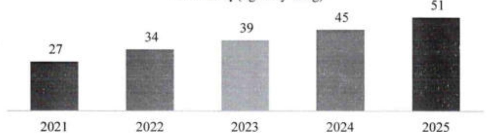

#### 3.2.2.b Tình hình vốn tự có

Vốn điều lệ ACB cuối năm 2025 đạt hơn 51 nghìn tỷ đồng, tăng 15% so với 2024.

Vốn điều lệ (nghin tỷ đồng)

Đến cuối năm 2025, tỷ lệ an toàn vốn hợp nhất theo Thông tư số 14/2025/TT-NHNN ở mức 12,5%, cao hơn mức quy định tối thiểu 8,6%. Tổng vốn tự có đạt 95 nghìn tỷ đồng, tăng 19% so với năm 2024. Năm 2025, ACB công bố hoàn thành dự án xây dựng nền tàng tính vốn cho rùi ro tín dụng trên phương pháp xếp hàng nội bộ (Internal Ratings-Based IRB), bao gồm cả hai cấp độ cơ bản (FIRB) và nâng cao (AIRB), thể hiện vai trò tiên phong của Ngân hàng trong việc triển khai các chuẩn mực tiên tiến Basel tại Việt Nam.

<table border=1 style='margin: auto; word-wrap: break-word;'><tr><td style='text-align: center; word-wrap: break-word;'>Chỉ tiêu</td><td style='text-align: center; word-wrap: break-word;'>2021</td><td style='text-align: center; word-wrap: break-word;'>2022</td><td style='text-align: center; word-wrap: break-word;'>2023</td><td style='text-align: center; word-wrap: break-word;'>2024</td><td style='text-align: center; word-wrap: break-word;'>2025(*)</td></tr><tr><td style='text-align: center; word-wrap: break-word;'>An toàn vốn (%)</td><td style='text-align: center; word-wrap: break-word;'>11,23</td><td style='text-align: center; word-wrap: break-word;'>12,80</td><td style='text-align: center; word-wrap: break-word;'>12,48</td><td style='text-align: center; word-wrap: break-word;'>11,82</td><td style='text-align: center; word-wrap: break-word;'>12,46</td></tr><tr><td style='text-align: center; word-wrap: break-word;'>An toàn vốn cấp 1 (%)</td><td style='text-align: center; word-wrap: break-word;'>11,26</td><td style='text-align: center; word-wrap: break-word;'>12,69</td><td style='text-align: center; word-wrap: break-word;'>12,94</td><td style='text-align: center; word-wrap: break-word;'>12,29</td><td style='text-align: center; word-wrap: break-word;'>12,08</td></tr><tr><td style='text-align: center; word-wrap: break-word;'>Tổng tài sản có rủi ro (tỷ đồng)</td><td style='text-align: center; word-wrap: break-word;'>395.018</td><td style='text-align: center; word-wrap: break-word;'>457.049</td><td style='text-align: center; word-wrap: break-word;'>545.026</td><td style='text-align: center; word-wrap: break-word;'>675.593</td><td style='text-align: center; word-wrap: break-word;'>762.909</td></tr><tr><td style='text-align: center; word-wrap: break-word;'>Vốn tự có (tỷ đồng)</td><td style='text-align: center; word-wrap: break-word;'>44.374</td><td style='text-align: center; word-wrap: break-word;'>58.519</td><td style='text-align: center; word-wrap: break-word;'>68.029</td><td style='text-align: center; word-wrap: break-word;'>79.862</td><td style='text-align: center; word-wrap: break-word;'>95.055</td></tr></table>

(*): Theo quy định Thông tư số 14/2025/TT-NHNN ngày 30/06/2025.