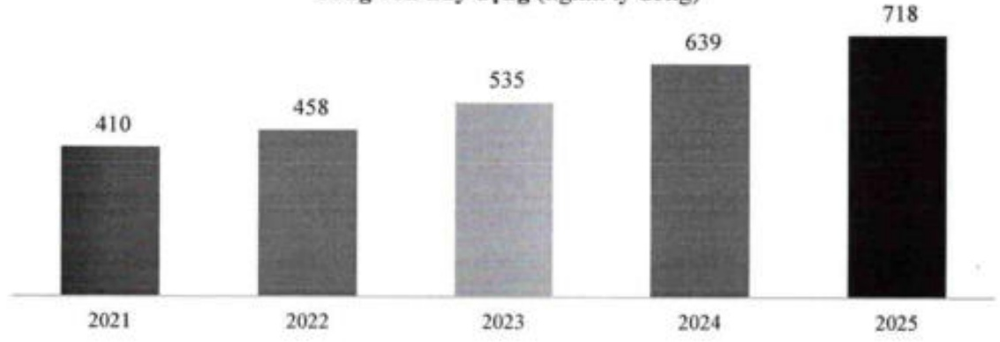
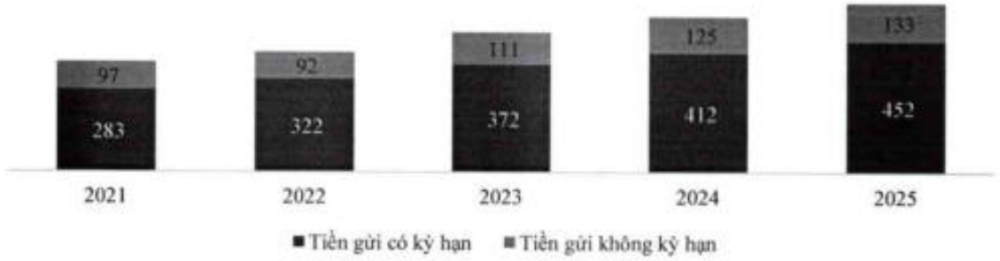

### 3.2.2.c Tình hình nợ phải trả

Huy động tiền gửi và phát hành giấy tờ có giá trị trưởng động nhịp với tính dụng, đạt 718 nghìn tỷ đồng, tăng 12,4%. Trong đó tiền gửi khách hàng chiếm hơn 585 nghìn tỷ đồng, tăng 8,9% so với năm 2024, với tỷ trọng tiền gửi từ khách hàng cá nhân lên đến gần 80% tổng tiền gửi.

Tổng vốn huy động (nghin tỷ đồng)

Tỷ lệ CASA của ACB đạt 23% vào cuối năm 2025. Đóng góp lớn vào đà tăng trưởng CASA chính là sự gia tăng khối lượng giao dịch trực tuyến (tăng 30% so với cùng kỳ), và số khách hàng sử dụng ứng dụng ACBO tăng hơn 13%.

Tiền gửi khách hàng theo kỳ hạn (nghin tỷ đồng)

#### 3.2.2.d Các tỷ lệ an toàn trong hoạt động/của Ngân hàng

ACB luôn đảm bảo tuần thù và vượt các quy định về tỷ lệ an toàn thanh khoản theo quy định của NHNN.

<table border=1 style='margin: auto; word-wrap: break-word;'><tr><td style='text-align: center; word-wrap: break-word;'>TT</td><td style='text-align: center; word-wrap: break-word;'>Chỉ tiêu (%)</td><td style='text-align: center; word-wrap: break-word;'>2023</td><td style='text-align: center; word-wrap: break-word;'>2024</td><td style='text-align: center; word-wrap: break-word;'>2025</td><td style='text-align: center; word-wrap: break-word;'>Quy định</td></tr><tr><td style='text-align: center; word-wrap: break-word;'>1</td><td style='text-align: center; word-wrap: break-word;'>Tỷ lệ dự trữ thanh khoản</td><td style='text-align: center; word-wrap: break-word;'>16,7</td><td style='text-align: center; word-wrap: break-word;'>14,9</td><td style='text-align: center; word-wrap: break-word;'>14,7</td><td style='text-align: center; word-wrap: break-word;'>≥ 10</td></tr><tr><td style='text-align: center; word-wrap: break-word;'>2</td><td style='text-align: center; word-wrap: break-word;'>Khả năng chỉ trả trong 30 ngày</td><td style='text-align: center; word-wrap: break-word;'></td><td style='text-align: center; word-wrap: break-word;'></td><td style='text-align: center; word-wrap: break-word;'></td><td style='text-align: center; word-wrap: break-word;'></td></tr><tr><td style='text-align: center; word-wrap: break-word;'>2a</td><td style='text-align: center; word-wrap: break-word;'>VND</td><td style='text-align: center; word-wrap: break-word;'>66,1</td><td style='text-align: center; word-wrap: break-word;'>61,9</td><td style='text-align: center; word-wrap: break-word;'>64,4</td><td style='text-align: center; word-wrap: break-word;'>≥50</td></tr><tr><td style='text-align: center; word-wrap: break-word;'>2b</td><td style='text-align: center; word-wrap: break-word;'>Ngoại tế khác</td><td style='text-align: center; word-wrap: break-word;'>206,5</td><td style='text-align: center; word-wrap: break-word;'>198,0</td><td style='text-align: center; word-wrap: break-word;'>1.014,3</td><td style='text-align: center; word-wrap: break-word;'>≥10</td></tr><tr><td style='text-align: center; word-wrap: break-word;'>3</td><td style='text-align: center; word-wrap: break-word;'>Tỷ lệ của nguồn vốn ngắn hạn được sử dụng cho vay trung hạn và dài hạn</td><td style='text-align: center; word-wrap: break-word;'>17,3</td><td style='text-align: center; word-wrap: break-word;'>18,8</td><td style='text-align: center; word-wrap: break-word;'>24,4</td><td style='text-align: center; word-wrap: break-word;'>≤30</td></tr><tr><td style='text-align: center; word-wrap: break-word;'>4</td><td style='text-align: center; word-wrap: break-word;'>Tổng dư nợ cho vay/Tổng tiền gửi</td><td style='text-align: center; word-wrap: break-word;'>78,1</td><td style='text-align: center; word-wrap: break-word;'>78,0</td><td style='text-align: center; word-wrap: break-word;'>79,1</td><td style='text-align: center; word-wrap: break-word;'>≤85</td></tr></table>