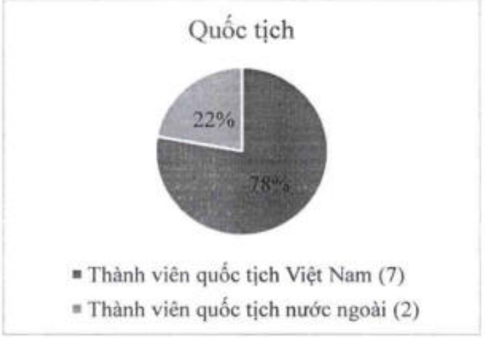

Trình độ học vấn: Tốt nghiệp thạc sĩ ngữ văn của Trường Đại học Khoa học xã hội và Nhân văn TP. Hồ Chí Minh, cử nhân kinh tế của Trường Đại học Kinh tế TP. Hồ Chí Minh, và thạc sĩ tài chính ngân hàng của Trường Đại học Khoa học ứng dụng Tây Bắc Thụy Sĩ.

### 5.2.1.b HDQT da dạng

Đa dạng về thành phần: HĐQT ACB nhiệm kỳ 2023 – 2028 có 9 thành viên.

2/9 thành viên điều hành, chiếm 22,2% tổng số thành viên HDQT;

7/9 thành viên không điều hành, chiếm 77,8% tổng số thành viên HDQT; trong đó có 1 thành viên độc lập, chiếm 11,1% tổng số thành viên HDQT.

Vai trò của Chủ tịch HDQT và TGD được tách bạch, thể hiện phần định rõ ràng giữa quản trị và điều hành.

Đa dạng về quốc tịch: HĐQT ACB gồm 7/9 thành viên là người quốc tịch Việt Nam và 2/9 thành viên là người quốc tịch nước ngoài, cho thấy sự da dạng về cách tiếp cận vấn đề trong thảo luận của HĐQT.

Thành viên quốc tịch Việt Nam: 7

Thành viên quốc tịch nước ngoài: 2

Đa dạng về giới tính: HĐQT ACB có 2 thành viên nữ và 7 thành viên nam.