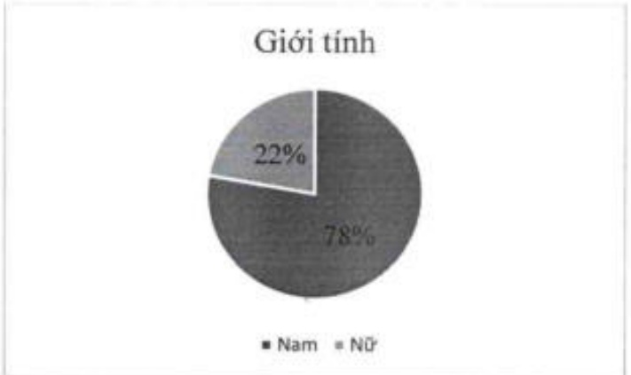
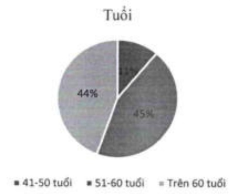
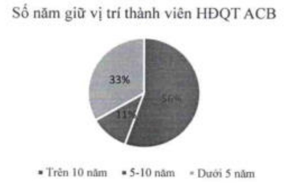

Đa dạng về độ tuổi: HDQT ACB gồm có 1 thành viên trong nhóm tuổi 41-50, 4 thành viên trong nhóm tuổi 51-60 và 4 thành viên thuộc nhóm tuổi trên 60.

Đa dạng về kinh nghiệm: HĐQT ACB bao gồm cả các thành viên HĐQT lâu năm, những người có hiểu biết sâu sắc về ngân hàng, và những thành viên có thời gian tham gia HĐQT dưới 5 năm. Cụ thể, có 5 thành viên HĐQT dương nhiệm đã có trên 10 năm giữ vị trí thành viên HĐQT ACB, 1 thành viên tham gia vào HĐQT ACB trong khoảng từ 5-10 năm, và 3 thành viên tham gia vào HĐQT ACB dưới 5 năm.

