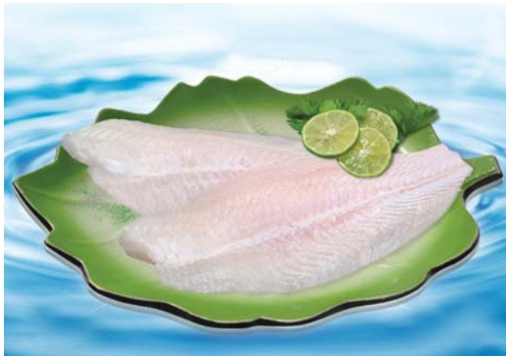
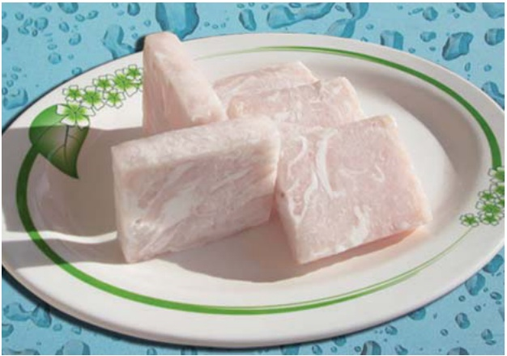

2.2-Định hướng: Trước tình hình đó, Hội đồng quản trị định hướng như sau:

##### -Trong năm 2010

a-Chấm dứt tình trạng thua lỗ trong kinh doanh

b-Khai thác mạnh thị trường để tăng sản lượng xuất khẩu từ đó tăng sản lượng sản xuất

c-Quản lý một cách tiết kiệm chi phí trong sản xuất và cả chi phí quản lý

d-Hoàn thành và đưa vào sản xuất nhà máy chế biến Fero chrome

e-Đào tạo nguồn nhân lực phục vụ cho phát triển đa ngành, đa lĩnh vực của Công ty.

##### -Từ 2010 đến 2013

a-Có nguồn nhân lực đủ mạnh vừa đáp ứng cho hoạt động đa lĩnh vực như thủy sản, khai khoáng và phân bón vừa đáp ứng cho các thị trường trong và ngoài nước

b-Mở các văn phòng đại diện hoặc Công ty con tại một số nước có tỷ trọng bán hàng lớn

c-Phục hồi lại doanh thu, lợi nhuận mà Navico đã từng đạt được

