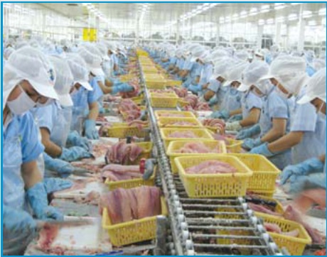

Về công tác tổ chức bộ máy và cán bộ quản lý:

## II. Báo cáo kết quả hoạt động sản xuất kinh doanh:

Sắp xếp lại bộ máy và nhân sự phù hợp với quy mô sản xuất và quản lý của Công ty :

-Sắp xếp lại và tăng cường bộ phận bán hàng

-Xúc tiến bán hàng tại các thị trường ngoài nước

-Thành lập Ban Thanh tra - pháp chế

○ Kết quả hoạt động sản xuất kinh doanh

Là năm Công ty không đặt các chỉ tiêu kế hoạch đã được đại hội cổ động thông qua

- Sản lượng sản xuất năm 2009 trên 38 nghìn tấn sản phẩm

Trong đó,

+ 42,24% tra fillet thịt đỏ;

+ 37,94% tra fillet thịt trắng;

+ Còn lại 19,82% các sản phẩm khác.

<table border=1 style='margin: auto; word-wrap: break-word;'><tr><td style='text-align: center; word-wrap: break-word;'>Chỉ tiêu</td><td style='text-align: center; word-wrap: break-word;'>Đơn vị tính</td><td style='text-align: center; word-wrap: break-word;'>Kế hoạch</td><td style='text-align: center; word-wrap: break-word;'>Thực hiện</td><td style='text-align: center; word-wrap: break-word;'>Thực hiện/Kế hoạch</td></tr><tr><td style='text-align: center; word-wrap: break-word;'></td><td style='text-align: center; word-wrap: break-word;'></td><td style='text-align: center; word-wrap: break-word;'>2009</td><td style='text-align: center; word-wrap: break-word;'>2009</td><td style='text-align: center; word-wrap: break-word;'>(%)</td></tr><tr><td style='text-align: center; word-wrap: break-word;'>Sản lượng xuất khẩu</td><td style='text-align: center; word-wrap: break-word;'>Tấn</td><td style='text-align: center; word-wrap: break-word;'>77.548</td><td style='text-align: center; word-wrap: break-word;'>41.531</td><td style='text-align: center; word-wrap: break-word;'>53,56</td></tr><tr><td style='text-align: center; word-wrap: break-word;'>Doanh thu</td><td style='text-align: center; word-wrap: break-word;'>Triệu USD</td><td style='text-align: center; word-wrap: break-word;'>150</td><td style='text-align: center; word-wrap: break-word;'>84</td><td style='text-align: center; word-wrap: break-word;'>56,16</td></tr><tr><td style='text-align: center; word-wrap: break-word;'>Lợi nhuận</td><td style='text-align: center; word-wrap: break-word;'>Tỷ đồng</td><td style='text-align: center; word-wrap: break-word;'>91</td><td style='text-align: center; word-wrap: break-word;'>-176</td><td style='text-align: center; word-wrap: break-word;'>-</td></tr></table>

