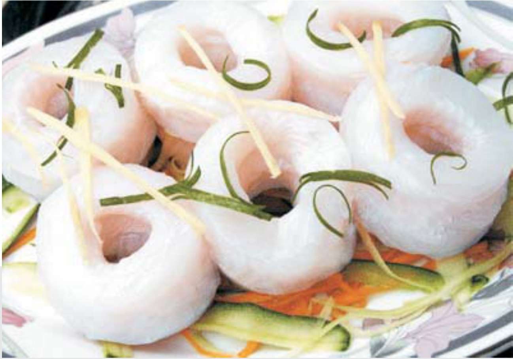

##### ○ Thực hiện các dự án đầu tư

Để đa dạng hóa ngành nghề, hạn chế rủi ro và nâng cao lợi nhuận, Công ty đã xúc tiến đầu tư vào một số lĩnh vực khác như khai thác mở Cromic và góp vốn vào nhà máy sản xuất phân bón DAP.

-Xây dựng và lắp đặt thiết bị nhà máy chế biến fero chrome đạt 40% tiến độ, Tổng chi phí đã đầu tư vào dự án Crômit là 72 tỷ đồng, dự kiến hoàn thành đưa vào sử dụng quý 4-2010

-Góp 18 tỷ đồng vào dự án DAP Lào Cai, dự kiến góp vốn trong năm 2010 là 50 tỷ đồng, từ 2011 đến 2013 góp hết phần vốn còn lại theo tiến độ cho đủ 290 tỷ đồng tương ứng với 29% vốn điều lệ của nhà máy DAP.

