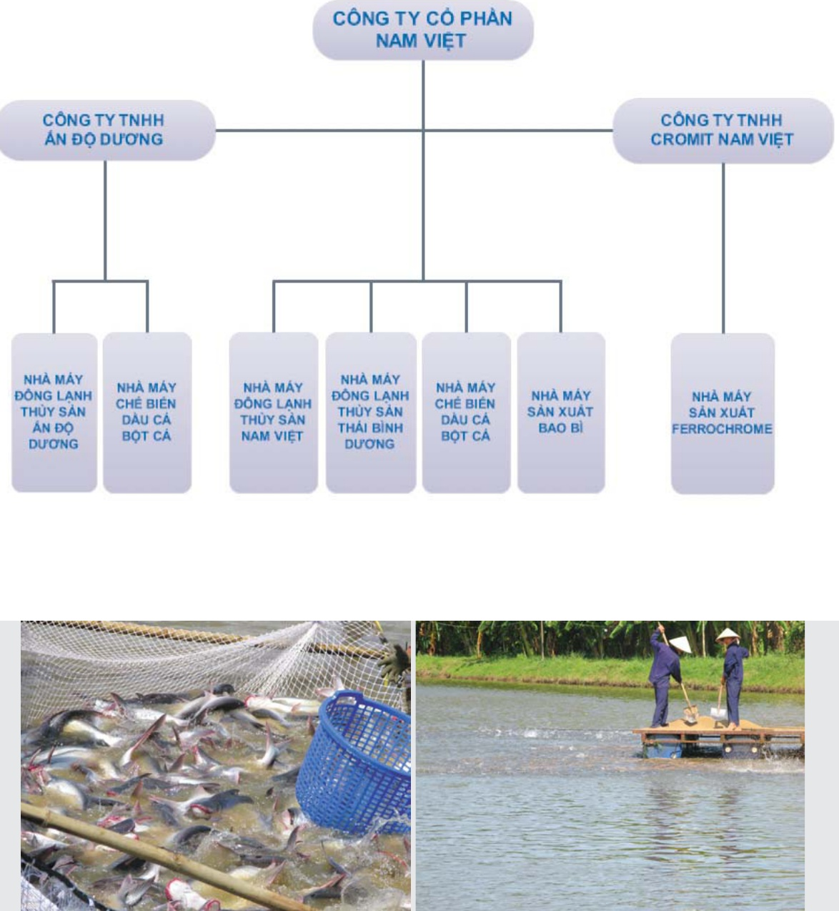

### 3. Chính sách đối với người lao động

Thực hiện đầy đủ các chế độ chính sách về bảo hiểm y tế, bảo hiểm xã hội, ốm đau, thai sản theo quy định của Nhà nước.

Thực hiện chế độ bảo hộ lao động, ăn giữa ca cho Cán bộ - công nhân

Đã đưa đi đào tạo 9 thạc sự quản trị kinh doanh để đáp ứng các nhiệm vụ dài hạn cho sự phát triển của Công ty

