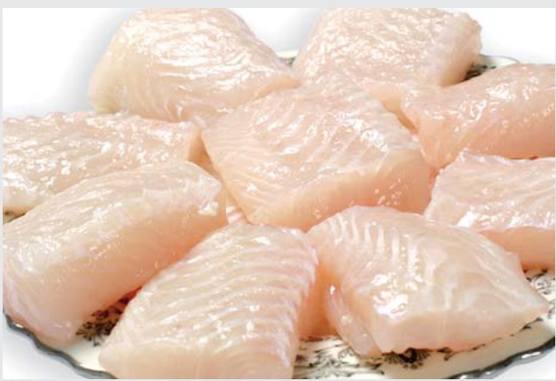
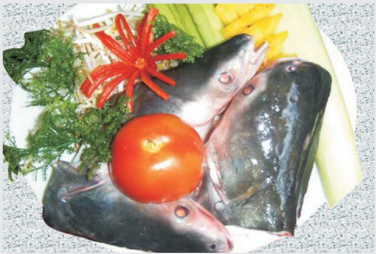

### 2-Ông Trần Ánh

<table border=1 style='margin: auto; word-wrap: break-word;'><tr><td style='text-align: center; word-wrap: break-word;'>Họ và tên</td><td style='text-align: center; word-wrap: break-word;'>Trần Ánh</td></tr><tr><td style='text-align: center; word-wrap: break-word;'>Chức vụ</td><td style='text-align: center; word-wrap: break-word;'>Thành viên</td></tr><tr><td style='text-align: center; word-wrap: break-word;'>Giới tính</td><td style='text-align: center; word-wrap: break-word;'>Nam</td></tr><tr><td style='text-align: center; word-wrap: break-word;'>Ngày tháng năm sinh</td><td style='text-align: center; word-wrap: break-word;'>11/03/1975</td></tr><tr><td style='text-align: center; word-wrap: break-word;'>Trình độ chuyên môn</td><td style='text-align: center; word-wrap: break-word;'>Kỹ sư chế biến thủy sản</td></tr><tr><td style='text-align: center; word-wrap: break-word;'>Số cổ phiếu nắm giữ</td><td style='text-align: center; word-wrap: break-word;'>5.000</td></tr><tr><td style='text-align: center; word-wrap: break-word;'>Người có liên quan nắm giữ cổ phiếu</td><td style='text-align: center; word-wrap: break-word;'>Không</td></tr></table>

Số lượng thành viên Ban kiểm soát đến 31/12/2009 là 2 người do trong năm Bà Đỗ Thị Thanh Thủy - thành viên ban kiểm soát có đơn xin từ nhiệm.

c. Ban Tổng Giám Đốc :

1. Ông Doãn Tối : Tổng Giám Đốc

2. Bà Dương Thị Kim Hương : Phó Tổng Giám Đốc

3. Ông Nguyễn Duy Nhút : Phó Tổng Giám Đốc

