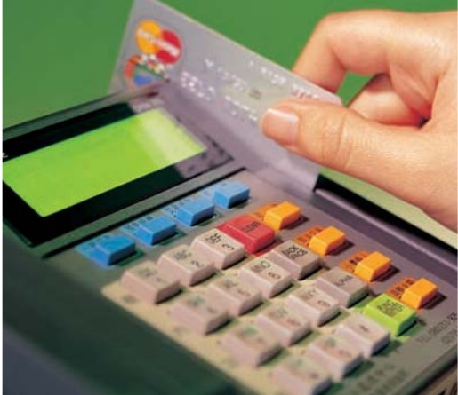

# NAM VIET CORPORATION

##### BÁO CÁO CỦA KIỂM TOÁN VIÊN ĐỘC LẬP

Kính gửi Các Cổ đông

Công ty Cổ phần Nam Việt

Phạm vi kiểm toán

Chúng tôi đã kiểm toán bảng cân đối kế toán hợp nhất định kèm của Công ty Cổ phần Nam Việt ("Công ty") và các công ty con (sau đây được gọi là "Tập đoàn") tại ngày 31 tháng 12 năm 2009 và báo cáo kết quả hoạt động kinh doanh hợp nhất. báo cáo thay đổi vốn chủ sở hữu hợp nhất và báo cáo lưu chuyển tiền tệ hợp nhất liên quan cho năm tài chính kết thúc cùng ngày và các thuyết minh định kèm. Việc lập và trình bày báo cáo tài chính hợp nhất này thuộc trách nhiệm của Ban Giám đốc Công ty. Trách nhiệm của chúng tôi là đưa ra ý kiến về báo cáo tài chính hợp nhất này căn cứ trên kết quả kiểm toán của chúng tôi.

Chúng tôi đã thực hiện công việc kiểm toán theo các Chuẩn mực Kiểm toán Việt Nam. Các chuẩn mực này yêu cầu chúng tôi phải lập kế hoạch và thực hiện công việc kiểm toán để có được sự đảm bảo hợp lý rằng các bảo cáo tài chính không có các sai sót trọng yếu. Công việc kiểm toán bao gồm việc kiểm tra. trên cơ sở chọn mẫu. các bằng chứng xác minh cho các số liệu và các thuyết minh trên các bảo cáo tài chính. Công việc kiểm toán cũng bao gồm việc đánh giá các nguyên tắc kế toán được áp dụng và các ước tính trọng yếu của Ban Giám đốc. cũng như việc đánh giá cách trình bày tổng quan của bảo cáo tài chính. Chúng tôi tin rằng công việc kiểm toán đã cung cấp những cơ sở hợp lý làm căn cứ cho ý kiến của chúng tôi.

##### Ý kiến kiểm toán

Theo ý kiến của chúng tôi, báo cáo tài chính hợp nhất đã phần ánh trung thực và hợp lý. trên các khía cạnh trọng yếu. về tình hình tài chính của Tập đoàn tại ngày 31 tháng 12 năm 2009 và kết quả hoạt động kinh doanh và các lưỡng lưu chuyển tiền tệ cho năm kết thúc cùng ngày. phù hợp với các Chuẩn mực Kế toán Việt Nam. Hệ thống Kế toán Việt Nam và các nguyên tắc kế toán được chấp nhận chung tại Việt Nam.

