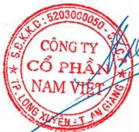
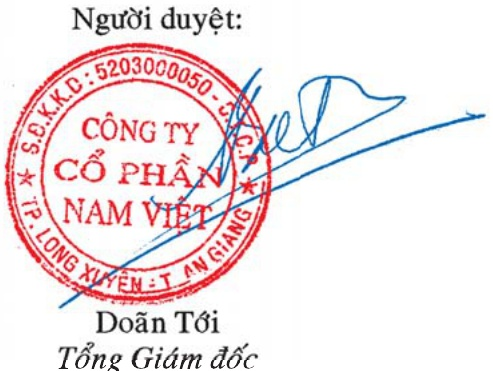

# NAM VIET CORPORATION

<table border=1 style='margin: auto; word-wrap: break-word;'><tr><td style='text-align: center; word-wrap: break-word;'></td><td style='text-align: center; word-wrap: break-word;'>Mã số</td><td style='text-align: center; word-wrap: break-word;'>Thuyết minh</td><td style='text-align: center; word-wrap: break-word;'>31/12/2009 VND&#x27;000</td><td style='text-align: center; word-wrap: break-word;'>31/12/2008 VND&#x27;000</td></tr><tr><td style='text-align: center; word-wrap: break-word;'>VỐN CHỮ SỞ HỮU</td><td style='text-align: center; word-wrap: break-word;'>400</td><td style='text-align: center; word-wrap: break-word;'></td><td style='text-align: center; word-wrap: break-word;'>1.470.025.670</td><td style='text-align: center; word-wrap: break-word;'>1.601.476.557</td></tr><tr><td style='text-align: center; word-wrap: break-word;'>Vốn chủ sở hữu</td><td style='text-align: center; word-wrap: break-word;'>410</td><td style='text-align: center; word-wrap: break-word;'></td><td style='text-align: center; word-wrap: break-word;'>1.454.764.962</td><td style='text-align: center; word-wrap: break-word;'>1.585.462.952</td></tr><tr><td style='text-align: center; word-wrap: break-word;'>Vốn cổ phần</td><td style='text-align: center; word-wrap: break-word;'>411</td><td style='text-align: center; word-wrap: break-word;'>0</td><td style='text-align: center; word-wrap: break-word;'>660.000.000</td><td style='text-align: center; word-wrap: break-word;'>660.000.000</td></tr><tr><td style='text-align: center; word-wrap: break-word;'>Thặng dư vốn cổ phần</td><td style='text-align: center; word-wrap: break-word;'>412</td><td style='text-align: center; word-wrap: break-word;'>20</td><td style='text-align: center; word-wrap: break-word;'>611.965.459</td><td style='text-align: center; word-wrap: break-word;'>611.965.459</td></tr><tr><td style='text-align: center; word-wrap: break-word;'>Cổ phiếu ngân quỹ</td><td style='text-align: center; word-wrap: break-word;'>414</td><td style='text-align: center; word-wrap: break-word;'>20</td><td style='text-align: center; word-wrap: break-word;'>(27.417.630)</td><td style='text-align: center; word-wrap: break-word;'>(27.417.630)</td></tr><tr><td style='text-align: center; word-wrap: break-word;'>Chênh lệch tỷ giá</td><td style='text-align: center; word-wrap: break-word;'>416</td><td style='text-align: center; word-wrap: break-word;'></td><td style='text-align: center; word-wrap: break-word;'>(988.442)</td><td style='text-align: center; word-wrap: break-word;'>-</td></tr><tr><td style='text-align: center; word-wrap: break-word;'>Lợi nhuận chưa phân phối</td><td style='text-align: center; word-wrap: break-word;'>420</td><td style='text-align: center; word-wrap: break-word;'></td><td style='text-align: center; word-wrap: break-word;'>211.205.575</td><td style='text-align: center; word-wrap: break-word;'>340.915.123</td></tr><tr><td style='text-align: center; word-wrap: break-word;'></td><td style='text-align: center; word-wrap: break-word;'></td><td style='text-align: center; word-wrap: break-word;'></td><td style='text-align: center; word-wrap: break-word;'></td><td style='text-align: center; word-wrap: break-word;'></td></tr><tr><td style='text-align: center; word-wrap: break-word;'>Quỹ khác</td><td style='text-align: center; word-wrap: break-word;'>430</td><td style='text-align: center; word-wrap: break-word;'></td><td style='text-align: center; word-wrap: break-word;'>15.260.708</td><td style='text-align: center; word-wrap: break-word;'>16.013.605</td></tr><tr><td style='text-align: center; word-wrap: break-word;'>Quỹ khen thưởng và phúc lợi</td><td style='text-align: center; word-wrap: break-word;'>431</td><td style='text-align: center; word-wrap: break-word;'></td><td style='text-align: center; word-wrap: break-word;'>15.260.708</td><td style='text-align: center; word-wrap: break-word;'>16.013.605</td></tr><tr><td style='text-align: center; word-wrap: break-word;'></td><td style='text-align: center; word-wrap: break-word;'></td><td style='text-align: center; word-wrap: break-word;'></td><td style='text-align: center; word-wrap: break-word;'></td><td style='text-align: center; word-wrap: break-word;'></td></tr><tr><td style='text-align: center; word-wrap: break-word;'>LỘI ICH CỔ ĐÔNG THIỂU SỐ</td><td style='text-align: center; word-wrap: break-word;'>439</td><td style='text-align: center; word-wrap: break-word;'>21</td><td style='text-align: center; word-wrap: break-word;'>3.400.000</td><td style='text-align: center; word-wrap: break-word;'>-</td></tr><tr><td style='text-align: center; word-wrap: break-word;'></td><td style='text-align: center; word-wrap: break-word;'></td><td style='text-align: center; word-wrap: break-word;'></td><td style='text-align: center; word-wrap: break-word;'></td><td style='text-align: center; word-wrap: break-word;'></td></tr><tr><td style='text-align: center; word-wrap: break-word;'>TỔNG NGUÔN VỐN</td><td style='text-align: center; word-wrap: break-word;'>440</td><td style='text-align: center; word-wrap: break-word;'></td><td style='text-align: center; word-wrap: break-word;'>2.200.098.168</td><td style='text-align: center; word-wrap: break-word;'>2.659.846.087</td></tr></table>

Người lập:

Doãn Văn Nho Kế toán trưởng

Người duyệt:

Doãn Tôi

Tổng Giám đốc

