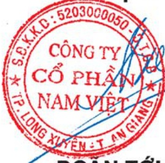

# THÔNG ĐIỆP CỦA CHỦ TỘCH HỘI ĐỒNG QUẢN TRỊ

Thuận lợi trong năm 2010 phát sinh mang đậm nét từ cái khó khăn đi lên và cũng chính từ những khó khăn mà nhận ra để có sự điều chỉnh phù hợp, đó là sự điều chỉnh và quản lý tốt hơn các chi phí sản xuất điều kiện tiên quyết để hạ giá thành sản phẩm nâng hiệu quả trong kinh doanh, mở rộng và đa dạng hóa thị trường, tránh tập trung quá cao vào một thị trường, các thị trường chính trong năm 2010 sẽ là thị trường EU, các nước SNG, thị trường Trung đông, Thị trường Nam Mỹ và thị trường Châu Á, đa dạng hóa các lĩnh vực để vừa tránh rủi ro về ngành nghề vừa hỗ trợ bổ sung lợi ích giữa các lĩnh vực với nhau, dự án khai thác chế biến fero crome hoàn thành đưa vào sản xuất trong quý 4 năm nay sẽ có sự đóng góp đáng kể vào doanh thu và lợi nhuận từ năm 2011, tiếp tục góp vốn theo tiến độ trong tổng số 29% vốn điều lệ của nhà máy sản xuất phân DAP dự kiến hoàn thành đưa vào vận hành năm 2013.

Khó khăn và thách thức rồi cũng qua đi, cơ hội mới, thuận lợi mới tiếp tục được tập thể cán bộ công nhân Công ty Cổ phần Nam Việt nắm bắt, đón lấy với một quyết tâm cao để lại vườn tới những thành quả mà navico đã từng gặt hái trong thời gian qua

Thay mặt Hội đồng Quản trị, Ban Tổng giảm đốc Công ty Cổ phần Nam Việt kính chúc toàn thể cổ động, tất cả cán bộ, công nhân và gia đình hạnh phúc thành đạt.

Trân trọng kính chào!

TM/ HỘI ĐỒNG QUẢN TRỊ

CHỦ TÍCH

DOẤN TỐI