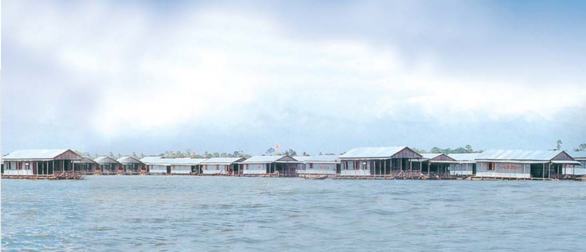

# NAM VIET CORPORATION

Tại ngày 31 tháng 12 năm 2009 chi phí xây dựng cơ bản đồ dang có giá trị ghi số là 10.889 triệu VND (31/12/2008: không) được thể chấp tại các ngân hàng để bảo đảm cho các khoản vay của Tập đoàn.

### 10.Các khoản đầu tư dài hạn

<table border=1 style='margin: auto; word-wrap: break-word;'><tr><td style='text-align: center; word-wrap: break-word;'></td><td style='text-align: center; word-wrap: break-word;'>31/12/2009 VND&#x27;000</td><td style='text-align: center; word-wrap: break-word;'>31/12/2008 VND&#x27;000</td></tr><tr><td style='text-align: center; word-wrap: break-word;'></td><td style='text-align: center; word-wrap: break-word;'></td><td style='text-align: center; word-wrap: break-word;'></td></tr><tr><td style='text-align: center; word-wrap: break-word;'>Đầu từ vào công ty liên kết</td><td style='text-align: center; word-wrap: break-word;'></td><td style='text-align: center; word-wrap: break-word;'></td></tr><tr><td style='text-align: center; word-wrap: break-word;'>■ DAP2 - Công ty Cổ phần Vinachem</td><td style='text-align: center; word-wrap: break-word;'>17.400.000</td><td style='text-align: center; word-wrap: break-word;'>-</td></tr><tr><td style='text-align: center; word-wrap: break-word;'></td><td style='text-align: center; word-wrap: break-word;'></td><td style='text-align: center; word-wrap: break-word;'></td></tr><tr><td style='text-align: center; word-wrap: break-word;'>Đầu từ dài hạn khác vào:</td><td style='text-align: center; word-wrap: break-word;'></td><td style='text-align: center; word-wrap: break-word;'></td></tr><tr><td style='text-align: center; word-wrap: break-word;'>■ Ngân hàng Phát triển Mê Kông</td><td style='text-align: center; word-wrap: break-word;'>135.000.000</td><td style='text-align: center; word-wrap: break-word;'>135.000.000</td></tr><tr><td style='text-align: center; word-wrap: break-word;'>■ Công ty cổ phần Quản Lý Quỹ Đầu Tư Chứng Khoản Việt Long</td><td style='text-align: center; word-wrap: break-word;'>20.200.000</td><td style='text-align: center; word-wrap: break-word;'>20.200.000</td></tr><tr><td style='text-align: center; word-wrap: break-word;'>■ Công ty cổ phần Quản Lý Quỹ Đầu Tư Chứng Khoản Bản Việt</td><td style='text-align: center; word-wrap: break-word;'>20.000.000</td><td style='text-align: center; word-wrap: break-word;'>20.000.000</td></tr><tr><td style='text-align: center; word-wrap: break-word;'>■ Công ty Cổ phần Bảo hiểm Hàng không</td><td style='text-align: center; word-wrap: break-word;'>43.200.000</td><td style='text-align: center; word-wrap: break-word;'>43.200.000</td></tr><tr><td style='text-align: center; word-wrap: break-word;'>■ Công ty TNHH Sản xuất Thương mại và Xây dựng Tài Nguyên</td><td style='text-align: center; word-wrap: break-word;'>-</td><td style='text-align: center; word-wrap: break-word;'>65.780.500</td></tr><tr><td style='text-align: center; word-wrap: break-word;'>■ Công ty Tài chính Cổ phần Hóa Chất Việt Nam</td><td style='text-align: center; word-wrap: break-word;'>10.000.000</td><td style='text-align: center; word-wrap: break-word;'>10.000.000</td></tr><tr><td style='text-align: center; word-wrap: break-word;'>■ Công ty Cổ phần Quản lý Quỹ Hùng Việt</td><td style='text-align: center; word-wrap: break-word;'>5.000.000</td><td style='text-align: center; word-wrap: break-word;'>5.000.000</td></tr><tr><td style='text-align: center; word-wrap: break-word;'>■ Trái phiếu kho bạc dài hạn</td><td style='text-align: center; word-wrap: break-word;'>10.000</td><td style='text-align: center; word-wrap: break-word;'>10.000</td></tr><tr><td style='text-align: center; word-wrap: break-word;'></td><td style='text-align: center; word-wrap: break-word;'></td><td style='text-align: center; word-wrap: break-word;'></td></tr><tr><td style='text-align: center; word-wrap: break-word;'></td><td style='text-align: center; word-wrap: break-word;'>233.410.000</td><td style='text-align: center; word-wrap: break-word;'>299.190.500</td></tr><tr><td style='text-align: center; word-wrap: break-word;'></td><td style='text-align: center; word-wrap: break-word;'></td><td style='text-align: center; word-wrap: break-word;'></td></tr><tr><td style='text-align: center; word-wrap: break-word;'></td><td style='text-align: center; word-wrap: break-word;'>250.810.000</td><td style='text-align: center; word-wrap: break-word;'>299.190.500</td></tr><tr><td style='text-align: center; word-wrap: break-word;'>Dự phòng giảm giá các khoản đầu từ dài hạn</td><td style='text-align: center; word-wrap: break-word;'>(7.219.480)</td><td style='text-align: center; word-wrap: break-word;'>(11.239.280)</td></tr><tr><td style='text-align: center; word-wrap: break-word;'></td><td style='text-align: center; word-wrap: break-word;'>243.590.520</td><td style='text-align: center; word-wrap: break-word;'>287.951.220</td></tr></table>

