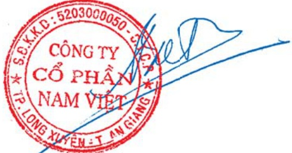

### 29. Cam kết chi tiêu vốn

Tại ngày 31 tháng 12 năm 2009 Tập đoàn có các cam kết vốn sau đã được duyệt nhưng chưa được phần ánh trong bảng cân đối kế toán:

<table border=1 style='margin: auto; word-wrap: break-word;'><tr><td style='text-align: center; word-wrap: break-word;'></td><td style='text-align: center; word-wrap: break-word;'>31/12/2009VND&#x27;000</td><td style='text-align: center; word-wrap: break-word;'>31/12/2008VND&#x27;000</td></tr><tr><td style='text-align: center; word-wrap: break-word;'></td><td style='text-align: center; word-wrap: break-word;'></td><td style='text-align: center; word-wrap: break-word;'></td></tr><tr><td style='text-align: center; word-wrap: break-word;'>Đã được duyệt và đã ký kết hợp đồng</td><td style='text-align: center; word-wrap: break-word;'>107.466.097</td><td style='text-align: center; word-wrap: break-word;'>13.581.600</td></tr></table>

### 30. Chi phí sản xuất và kinh doanh theo yếu tố

<table border=1 style='margin: auto; word-wrap: break-word;'><tr><td style='text-align: center; word-wrap: break-word;'></td><td style='text-align: center; word-wrap: break-word;'>2009VND&#x27;000</td><td style='text-align: center; word-wrap: break-word;'>2008VND&#x27;000</td></tr><tr><td style='text-align: center; word-wrap: break-word;'>Chi phí nguyên vật liệu bao gồm trong chi phí sản xuất</td><td style='text-align: center; word-wrap: break-word;'>1.276.398.749</td><td style='text-align: center; word-wrap: break-word;'>2.652.482.347</td></tr><tr><td style='text-align: center; word-wrap: break-word;'>Chi phí nhân công và nhân viên</td><td style='text-align: center; word-wrap: break-word;'>128.808.602</td><td style='text-align: center; word-wrap: break-word;'>121.271.574</td></tr><tr><td style='text-align: center; word-wrap: break-word;'>Chi phí khẩu hao và phân bổ</td><td style='text-align: center; word-wrap: break-word;'>94.125.090</td><td style='text-align: center; word-wrap: break-word;'>56.336.958</td></tr><tr><td style='text-align: center; word-wrap: break-word;'>Chi phí dịch vụ mua ngoài</td><td style='text-align: center; word-wrap: break-word;'>292.004.474</td><td style='text-align: center; word-wrap: break-word;'>206.853.335</td></tr><tr><td style='text-align: center; word-wrap: break-word;'>Các chi phí khác</td><td style='text-align: center; word-wrap: break-word;'>16.461.995</td><td style='text-align: center; word-wrap: break-word;'>7.275.730</td></tr></table>

Người lập:

Doãn Văn Nho Kế toán trưởng

Người duyệt:

Doãn Tối

Tổng Giám đốc

