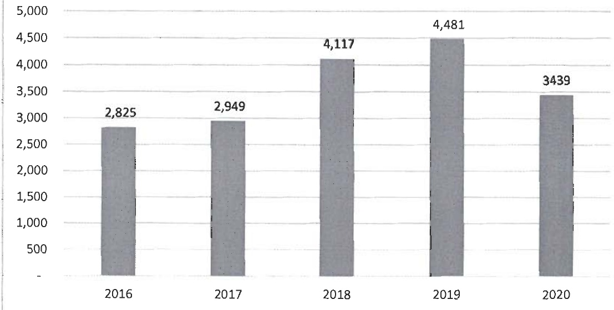
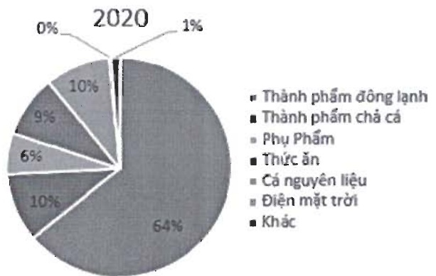
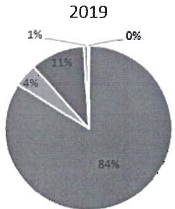

Biểu đồ cơ cấu doanh thu:

- Chi tiết doanh thu năm 2020 (thay đổi theo số liệu kiểm toán)

<table border=1 style='margin: auto; word-wrap: break-word;'><tr><td style='text-align: center; word-wrap: break-word;'>STT</td><td style='text-align: center; word-wrap: break-word;'>Doanh Thu</td><td style='text-align: center; word-wrap: break-word;'>Loại tiền</td><td style='text-align: center; word-wrap: break-word;'>Tỷ lệ 2019</td><td style='text-align: center; word-wrap: break-word;'>Tỷ lệ 2020</td></tr><tr><td style='text-align: center; word-wrap: break-word;'>1</td><td style='text-align: center; word-wrap: break-word;'>Thành phẩm đông lạnh</td><td style='text-align: center; word-wrap: break-word;'>VND</td><td style='text-align: center; word-wrap: break-word;'>84.00%</td><td style='text-align: center; word-wrap: break-word;'>63.88%</td></tr><tr><td style='text-align: center; word-wrap: break-word;'>2</td><td style='text-align: center; word-wrap: break-word;'>Thành phẩm chả cá</td><td style='text-align: center; word-wrap: break-word;'>VND</td><td style='text-align: center; word-wrap: break-word;'></td><td style='text-align: center; word-wrap: break-word;'>10.21%</td></tr><tr><td style='text-align: center; word-wrap: break-word;'>3</td><td style='text-align: center; word-wrap: break-word;'>Phụ Phẩm</td><td style='text-align: center; word-wrap: break-word;'>VND</td><td style='text-align: center; word-wrap: break-word;'>4.50%</td><td style='text-align: center; word-wrap: break-word;'>6.05%</td></tr><tr><td style='text-align: center; word-wrap: break-word;'>4</td><td style='text-align: center; word-wrap: break-word;'>Thức ăn</td><td style='text-align: center; word-wrap: break-word;'>VND</td><td style='text-align: center; word-wrap: break-word;'>10.50%</td><td style='text-align: center; word-wrap: break-word;'>9.01%</td></tr><tr><td style='text-align: center; word-wrap: break-word;'>5</td><td style='text-align: center; word-wrap: break-word;'>Cá nguyên liệu</td><td style='text-align: center; word-wrap: break-word;'>VND</td><td style='text-align: center; word-wrap: break-word;'>0.80%</td><td style='text-align: center; word-wrap: break-word;'>9.35%</td></tr><tr><td style='text-align: center; word-wrap: break-word;'>6</td><td style='text-align: center; word-wrap: break-word;'>Điện mặt trời</td><td style='text-align: center; word-wrap: break-word;'>VND</td><td style='text-align: center; word-wrap: break-word;'></td><td style='text-align: center; word-wrap: break-word;'>0.20%</td></tr><tr><td style='text-align: center; word-wrap: break-word;'>7</td><td style='text-align: center; word-wrap: break-word;'>Khác</td><td style='text-align: center; word-wrap: break-word;'>VND</td><td style='text-align: center; word-wrap: break-word;'>0.20%</td><td style='text-align: center; word-wrap: break-word;'>1.29%</td></tr><tr><td style='text-align: center; word-wrap: break-word;'></td><td style='text-align: center; word-wrap: break-word;'>Tổng công VND</td><td style='text-align: center; word-wrap: break-word;'></td><td style='text-align: center; word-wrap: break-word;'>100.00%</td><td style='text-align: center; word-wrap: break-word;'>100.00%</td></tr></table>

Doanh thu bán thành phẩm động lạnh vẫn chiếm tỷ trọng cao nhất trong cơ cấu doanh thu của Navico chiếm 63,88%, năm 2020 có thêm sản phẩm mới là Chả cá, chiếm tỷ trọng 10,2%.

Về cơ cấu chỉ phí hoạt động

- Biểu đồ cơ cấu chi phí hoạt động của Navico