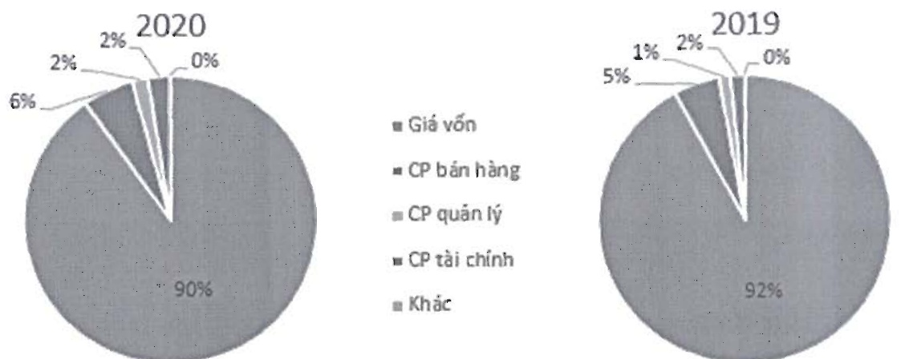

<table border=1 style='margin: auto; word-wrap: break-word;'><tr><td style='text-align: center; word-wrap: break-word;'>STT</td><td style='text-align: center; word-wrap: break-word;'>Doanh Thu</td><td style='text-align: center; word-wrap: break-word;'>Loại tiền</td><td style='text-align: center; word-wrap: break-word;'>Tỷ lệ 2019</td><td style='text-align: center; word-wrap: break-word;'>Tỷ lệ 2020</td></tr><tr><td style='text-align: center; word-wrap: break-word;'>1</td><td style='text-align: center; word-wrap: break-word;'>Giá vốn</td><td style='text-align: center; word-wrap: break-word;'>VND</td><td style='text-align: center; word-wrap: break-word;'>92.01%</td><td style='text-align: center; word-wrap: break-word;'>90.15%</td></tr><tr><td style='text-align: center; word-wrap: break-word;'>2</td><td style='text-align: center; word-wrap: break-word;'>CP bán hàng</td><td style='text-align: center; word-wrap: break-word;'>VND</td><td style='text-align: center; word-wrap: break-word;'>5.10%</td><td style='text-align: center; word-wrap: break-word;'>5.65%</td></tr><tr><td style='text-align: center; word-wrap: break-word;'>3</td><td style='text-align: center; word-wrap: break-word;'>CP quản lý</td><td style='text-align: center; word-wrap: break-word;'>VND</td><td style='text-align: center; word-wrap: break-word;'>1.25%</td><td style='text-align: center; word-wrap: break-word;'>1.73%</td></tr><tr><td style='text-align: center; word-wrap: break-word;'>4</td><td style='text-align: center; word-wrap: break-word;'>CP tài chính</td><td style='text-align: center; word-wrap: break-word;'>VND</td><td style='text-align: center; word-wrap: break-word;'>1.61%</td><td style='text-align: center; word-wrap: break-word;'>2.44%</td></tr><tr><td style='text-align: center; word-wrap: break-word;'>5</td><td style='text-align: center; word-wrap: break-word;'>Khác</td><td style='text-align: center; word-wrap: break-word;'>VND</td><td style='text-align: center; word-wrap: break-word;'>0.03%</td><td style='text-align: center; word-wrap: break-word;'>0.03%</td></tr><tr><td style='text-align: center; word-wrap: break-word;'></td><td style='text-align: center; word-wrap: break-word;'>Tổng cộng VND</td><td style='text-align: center; word-wrap: break-word;'></td><td style='text-align: center; word-wrap: break-word;'>100.00%</td><td style='text-align: center; word-wrap: break-word;'>100.00%</td></tr></table>

Giá vốn hàng bán vẫn là khoản mục chiếm tỷ trọng cao nhất trong cơ cấu chi phí của Navico. Chi phí giá vốn hàng bán trong năm 2020 chiếm 90,15% tổng chi phí, giảm nhẹ 1,86% trong cơ cấu chi phí so với năm 2019.

##### Tình hình tài sản

Tính đến 31/12/2020, giá trị tổng tài sản đạt 4.834 tỷ đồng, cao hơn 16,9% so với năm 2019. Tỷ trọng tài sản ngắn hạn chiếm 58%, tăng 3,5% trong cơ cấu tài sản so với năm 2019.

Trong cơ cấu tài sản ngắn hạn, hàng tồn kho của Công ty chiếm tỷ trọng lớn nhất, đạt 68%, tiếp đến là các khoản phải thu ngắn hạn và đầu tư tài chính ngắn hạn là lượt chiếm 16% và 11,5%.

Đối với tài sản dài hạn, tài sản cố định là khoản mục chiếm tỷ trọng cao nhất, đạt 49,7% đến từ dự án khu nuôi trồng thủy sản Bình Phú. Ngoài ra, các khoản tài sản đở dang dài hạn và mục đâu tư tài chính dài hạn cũng chiếm phần lớn trong cơ cấu tài sản dài hạn, tương ứng 38,19% và 7,17%.

Các chỉ tiêu về năng lực hoạt động của Navico trong năm 2020 có thay đổi so với năm 2019, trong đó:

Vòng quay tổng tài sản giảm từ 1,19 xuống 0,77 vòng.

Vòng quay hàng tồn kho giảm từ 2,7 vòng xuống 1,7 vòng.

#### Tình hình nợ phải trả

Tại thời điểm 31/12/2020, Tổng nợ phải trả của Công ty là 2.500 tỷ đồng, chiếm 52% cơ cấu nguồn vốn (nợ phải trả /tổng nguồn vốn).

Nhìn chung, cơ cấu nợ này ở mức tốt so với các doanh nghiệp trong cùng ngành.