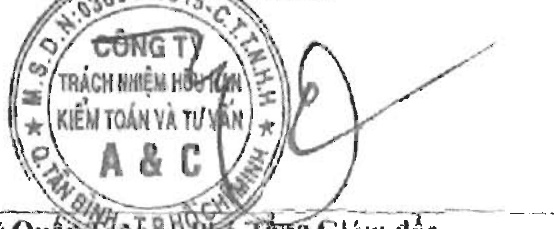
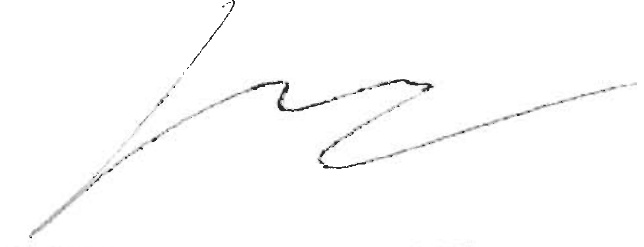

Số: 1.0683/21/TC-AC

#### BÁO CÁO KIỂM TOÁN ĐỘC LẬP

### Kính gửi: CÁC CÓ ĐÔNG, HỘI ĐÔNG QUẬN TRỊ BAN TÓNG GIẢM ĐỐC CÔNG TY CÓ PHẠN NAM VIỆT

Chúng tôi đã kiêm toán Báo cáo tài chính hợp nhất kèm theo của Công ty Cỏ phần Nam Việt (sau đây gọi tắt là "Công ty") và các công ty con (gọi chung là "Tập đoàn"). được lập ngày 26 tháng 3 năm 2021, từ trang 06 đến trang 43, bao gồm Bang cân đối kế toán hợp nhất tại ngày 31 tháng 12 năm 2020. Báo cáo kết qua hoạt động kinh doanh hợp nhất, Báo cáo lưu chuyển tiền tệ hợp nhất cho năm tài chính kết thúc cùng ngày và Ban thuyết minh Báo cáo tài chính hợp nhất.

##### Trách nhiệm của Ban Tổng Giám dốc

Ban Tống Giám độc Công ty chịu trách nhiệm về việc lập và trình bày trung thực và hợp lý Báo cáo tài chính hợp nhất của Tập đoàn theo các Chuẩn mực Kế toán Việt Nam, Chế độ Kế toán doanh nghiệp Việt Nam và các quy định pháp lý có liên quan đến việc lập và trình bày Báo cáo tài chính hợp nhất và chịu trách nhiệm về kiểm soát nội bộ mà Ban Tống Giám độc xác định là cần thiết để đảm bao cho việc lập và trình bày Báo cáo tài chính hợp nhất không có sai sót trọng yếu do gian lận hoặc nhằm lẫn.

##### Trách nhiệm của Kiểm toán viên

Trách nhiệm của chúng tôi là dua ra ý kiến về Báo cáo tài chính hợp nhất dựa trên kết quả của cuộc kiểm toàn. Chúng tôi đã tiến hành kiểm toàn theo các Chuẩn mực Kiểm toàn Việt Nam. Các chuẩn mực này yêu cầu chúng tôi tuân thủ chuẩn mực và các quy định về đạo dức nghề nghiệp, lập kế hoạch và thực hiện cuộc kiểm toàn để đạt được sự đảm bảo hợp lý về việc liệu Báo cáo tài chính hợp nhất của Tập đoàn có còn sai sót trọng yếu hay không.

Công việc kiểm toán bao gồm thực hiện các thú tục nhằm thu thập các bằng chứng kiểm toán về các số liệu và thuyết minh trên Báo cáo tài chính hợp nhất. Các thú tục kiểm toán được lựa chọn dựa trên xét đoạn của kiểm toán viện, bao gồm đánh giá rủi ro có sai sót trọng yếu trong Báo cáo tài chính hợp nhất do gian lận hoặc nhằm lần. Khi thực hiện dánh giá các rủi ro này, kiểm toán viện đã xem xét kiểm soát nội bộ của Tập đoán liên quan đến việc lập và trình bày Báo cáo tài chính hợp nhất trung thực, hợp lý nhằm thiết kế các thu tục kiểm toán phù hợp với tính hình thực tế, tuy nhiên không nhằm mục đích dựa ra ý kiến về hiệu quả của kiểm soát nội bộ của Tập đoán. Công việc kiểm toán cũng bao gồm dánh giá tính thích hợp của các chính sách kế toán được áp dụng và tính hợp lý của các ước tính kế toán của Ban Tổng Giám đốc cũng như dánh giá việc trình bày tổng thể Báo cáo tài chính hợp nhất.

Chúng tôi tin tưởng rằng các bảng chúng kiểm toán mà chúng tôi đã thu thập được là dày đủ và thích hợp để làm cơ sở cho ý kiến kiểm toán của chúng tôi.

##### Ý kiến của Kiểm toán viên

Theo ý kiến của chúng tôi, Báo cáo tài chính hợp nhất đã phân ánh trung thực và hợp lý, trên các khía cạnh trọng yếu tinh hình tài chính hợp nhất của Tập đoàn tại ngày 31 tháng 12 năm 2020, cũng như kết qua hoạt động kinh doanh hợp nhất và tính hình lưu chuyển tiền tệ hợp nhất cho năm tài chính kết thúc cùng ngày, phù hợp với các Chuẩn mực Kế toán Việt Nam, Chế độ Kế toán doanh nghiệp Việt Nam và các quy định pháp lý có liên quan đến việc lập và trình bày Báo cáo tài chính hợp nhất.

Công ty Tưới Kếm toán và Tư vấn A&C

Lý Quốc Kế Chỉ Tổng Glám độ

Số Gấy CNDKHẢN kiểm toán: 0099-2018-008-1

TP. Hồ Chí Minh, ngày 27 tháng 3 năm 2021

Phan Vũ Công Bá - Kiểm toán viễn

Số Giấy CND KHN kiểm toán: 0197-2018-008-1