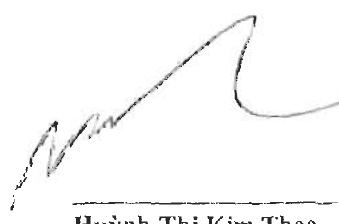
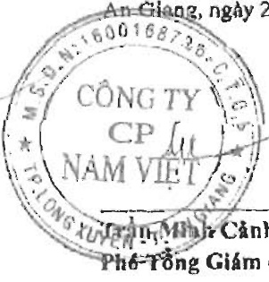

##### CÔNG TY CỔ PHẦN NAM VIỆT

<table border=1 style='margin: auto; word-wrap: break-word;'><tr><td style='text-align: center; word-wrap: break-word;'>CHỈ TIÊU</td><td style='text-align: center; word-wrap: break-word;'>MẠSỐ</td><td style='text-align: center; word-wrap: break-word;'>Thuyết minh</td><td style='text-align: center; word-wrap: break-word;'>Số cuối năm</td><td style='text-align: center; word-wrap: break-word;'>Số đầu năm</td></tr><tr><td style='text-align: center; word-wrap: break-word;'>D-VỐN CHỮ SỞ HỮU</td><td style='text-align: center; word-wrap: break-word;'>400</td><td style='text-align: center; word-wrap: break-word;'></td><td style='text-align: center; word-wrap: break-word;'>2.333.974.303.420</td><td style='text-align: center; word-wrap: break-word;'>2.386.059.762.491</td></tr><tr><td style='text-align: center; word-wrap: break-word;'>1. Vốn chủ sở hữu</td><td style='text-align: center; word-wrap: break-word;'>410</td><td style='text-align: center; word-wrap: break-word;'></td><td style='text-align: center; word-wrap: break-word;'>2.333.974.303.420</td><td style='text-align: center; word-wrap: break-word;'>2.386.059.762.491</td></tr><tr><td style='text-align: center; word-wrap: break-word;'>1. Vốn góp của chủ sở hữu</td><td style='text-align: center; word-wrap: break-word;'>411</td><td style='text-align: center; word-wrap: break-word;'>V.24</td><td style='text-align: center; word-wrap: break-word;'>1.275.396.250.000</td><td style='text-align: center; word-wrap: break-word;'>1.275.396.250.000</td></tr><tr><td style='text-align: center; word-wrap: break-word;'>- Cổ phiếu phổ thông có quyền biểu quyết</td><td style='text-align: center; word-wrap: break-word;'>411a</td><td style='text-align: center; word-wrap: break-word;'></td><td style='text-align: center; word-wrap: break-word;'>1.275.396.250.000</td><td style='text-align: center; word-wrap: break-word;'>1.275.396.250.000</td></tr><tr><td style='text-align: center; word-wrap: break-word;'>- Cổ phiếu uẩn đại</td><td style='text-align: center; word-wrap: break-word;'>411b</td><td style='text-align: center; word-wrap: break-word;'></td><td style='text-align: center; word-wrap: break-word;'>-</td><td style='text-align: center; word-wrap: break-word;'>-</td></tr><tr><td style='text-align: center; word-wrap: break-word;'>2. Thắng dư vốn cổ phần</td><td style='text-align: center; word-wrap: break-word;'>412</td><td style='text-align: center; word-wrap: break-word;'>V.24</td><td style='text-align: center; word-wrap: break-word;'>21.489.209.100</td><td style='text-align: center; word-wrap: break-word;'>21.489.209.100</td></tr><tr><td style='text-align: center; word-wrap: break-word;'>3. Quyền chọn chuyển đổi trái phiếu</td><td style='text-align: center; word-wrap: break-word;'>413</td><td style='text-align: center; word-wrap: break-word;'></td><td style='text-align: center; word-wrap: break-word;'>-</td><td style='text-align: center; word-wrap: break-word;'>-</td></tr><tr><td style='text-align: center; word-wrap: break-word;'>4. Vốn khác của chủ sở hữu</td><td style='text-align: center; word-wrap: break-word;'>414</td><td style='text-align: center; word-wrap: break-word;'></td><td style='text-align: center; word-wrap: break-word;'>-</td><td style='text-align: center; word-wrap: break-word;'>-</td></tr><tr><td style='text-align: center; word-wrap: break-word;'>5. Cổ phiếu quỹ</td><td style='text-align: center; word-wrap: break-word;'>415</td><td style='text-align: center; word-wrap: break-word;'>V.24</td><td style='text-align: center; word-wrap: break-word;'>(27.587.629.848)</td><td style='text-align: center; word-wrap: break-word;'>(27.587.629.848)</td></tr><tr><td style='text-align: center; word-wrap: break-word;'>6. Chênh lệch đánh giá lại tài sản</td><td style='text-align: center; word-wrap: break-word;'>416</td><td style='text-align: center; word-wrap: break-word;'></td><td style='text-align: center; word-wrap: break-word;'>-</td><td style='text-align: center; word-wrap: break-word;'>-</td></tr><tr><td style='text-align: center; word-wrap: break-word;'>7. Chênh lệch tỷ giá hối đoái</td><td style='text-align: center; word-wrap: break-word;'>417</td><td style='text-align: center; word-wrap: break-word;'></td><td style='text-align: center; word-wrap: break-word;'>-</td><td style='text-align: center; word-wrap: break-word;'></td></tr><tr><td style='text-align: center; word-wrap: break-word;'>8. Quỹ đầu tư phát triển</td><td style='text-align: center; word-wrap: break-word;'>418</td><td style='text-align: center; word-wrap: break-word;'></td><td style='text-align: center; word-wrap: break-word;'>-</td><td style='text-align: center; word-wrap: break-word;'></td></tr><tr><td style='text-align: center; word-wrap: break-word;'>9. Quỹ hỗ trợ sắp xếp doanh nghiệp</td><td style='text-align: center; word-wrap: break-word;'>419</td><td style='text-align: center; word-wrap: break-word;'></td><td style='text-align: center; word-wrap: break-word;'>-</td><td style='text-align: center; word-wrap: break-word;'>-</td></tr><tr><td style='text-align: center; word-wrap: break-word;'>10. Quỹ khác thuộc vốn chủ sở hữu</td><td style='text-align: center; word-wrap: break-word;'>420</td><td style='text-align: center; word-wrap: break-word;'></td><td style='text-align: center; word-wrap: break-word;'>-</td><td style='text-align: center; word-wrap: break-word;'></td></tr><tr><td style='text-align: center; word-wrap: break-word;'>11. Lợi nhuận sau thuế chưa phân phối</td><td style='text-align: center; word-wrap: break-word;'>421</td><td style='text-align: center; word-wrap: break-word;'>V.24</td><td style='text-align: center; word-wrap: break-word;'>1.064.676.474.168</td><td style='text-align: center; word-wrap: break-word;'>1.116.761.933.239</td></tr><tr><td style='text-align: center; word-wrap: break-word;'>- Lợi nhuận sau thuế chưa phân phối lũy kế đến cưới kỳ trước</td><td style='text-align: center; word-wrap: break-word;'>421a</td><td style='text-align: center; word-wrap: break-word;'></td><td style='text-align: center; word-wrap: break-word;'>862.506.183.239</td><td style='text-align: center; word-wrap: break-word;'>1.116.761.933.239</td></tr><tr><td style='text-align: center; word-wrap: break-word;'>- Lợi nhuận sau thuế chưa phân phối kỳ này</td><td style='text-align: center; word-wrap: break-word;'>421b</td><td style='text-align: center; word-wrap: break-word;'></td><td style='text-align: center; word-wrap: break-word;'>202.170.290.929</td><td style='text-align: center; word-wrap: break-word;'>-</td></tr><tr><td style='text-align: center; word-wrap: break-word;'>12. Ngườn vốn đầu tư xây dựng cơ bản</td><td style='text-align: center; word-wrap: break-word;'>422</td><td style='text-align: center; word-wrap: break-word;'></td><td style='text-align: center; word-wrap: break-word;'>-</td><td style='text-align: center; word-wrap: break-word;'>-</td></tr><tr><td style='text-align: center; word-wrap: break-word;'>13. Lợi ích cổ đồng không kiểm soát</td><td style='text-align: center; word-wrap: break-word;'>429</td><td style='text-align: center; word-wrap: break-word;'></td><td style='text-align: center; word-wrap: break-word;'>-</td><td style='text-align: center; word-wrap: break-word;'>-</td></tr><tr><td style='text-align: center; word-wrap: break-word;'>II. Ngườn kinh phí và quỹ khác</td><td style='text-align: center; word-wrap: break-word;'>430</td><td style='text-align: center; word-wrap: break-word;'></td><td style='text-align: center; word-wrap: break-word;'>-</td><td style='text-align: center; word-wrap: break-word;'>-</td></tr><tr><td style='text-align: center; word-wrap: break-word;'>1. Ngườn kinh phí</td><td style='text-align: center; word-wrap: break-word;'>431</td><td style='text-align: center; word-wrap: break-word;'></td><td style='text-align: center; word-wrap: break-word;'>-</td><td style='text-align: center; word-wrap: break-word;'>-</td></tr><tr><td style='text-align: center; word-wrap: break-word;'>2. Ngườn kinh phí đã hình thành tài sản cổ định</td><td style='text-align: center; word-wrap: break-word;'>432</td><td style='text-align: center; word-wrap: break-word;'></td><td style='text-align: center; word-wrap: break-word;'>-</td><td style='text-align: center; word-wrap: break-word;'>-</td></tr><tr><td style='text-align: center; word-wrap: break-word;'>TỔNG CỘNG NGUỒN VỐN</td><td style='text-align: center; word-wrap: break-word;'>440</td><td style='text-align: center; word-wrap: break-word;'></td><td style='text-align: center; word-wrap: break-word;'>4.834.079.659.323</td><td style='text-align: center; word-wrap: break-word;'>4.134.597.620.335</td></tr></table>

Cao Thị Kim Thơ

An Giọng, ngày 26 tháng 3 năm 2021

Người lập biểu

Huỳnh Thị Kim Thoa

Kế toán trưởng

Phó Tổng Giám đốc

