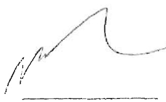
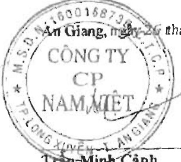

#### BÁO CÁO KẾT QUẢ HOẠT ĐỒNG KINH DOANH HỢP NHẤT Cho năm tài chính kết thúc ngày 31 tháng 12 năm 2020

<table border=1 style='margin: auto; word-wrap: break-word;'><tr><td style='text-align: center; word-wrap: break-word;'></td><td style='text-align: center; word-wrap: break-word;'>CHỈ TIÊU</td><td style='text-align: center; word-wrap: break-word;'>Mã số</td><td style='text-align: center; word-wrap: break-word;'>Thuyết minh</td><td style='text-align: center; word-wrap: break-word;'>Năm nay</td><td style='text-align: center; word-wrap: break-word;'>Năm trước</td></tr><tr><td style='text-align: center; word-wrap: break-word;'>1.</td><td style='text-align: center; word-wrap: break-word;'>Doanh thu bán hàng và cung cấp dịch vụ</td><td style='text-align: center; word-wrap: break-word;'>01</td><td style='text-align: center; word-wrap: break-word;'>VI.1</td><td style='text-align: center; word-wrap: break-word;'>3,477,498,386,090</td><td style='text-align: center; word-wrap: break-word;'>4,519,152,777,149</td></tr><tr><td style='text-align: center; word-wrap: break-word;'>2.</td><td style='text-align: center; word-wrap: break-word;'>Các khoản giảm trừ doanh thu</td><td style='text-align: center; word-wrap: break-word;'>02</td><td style='text-align: center; word-wrap: break-word;'>VI.2</td><td style='text-align: center; word-wrap: break-word;'>38,834,026,406</td><td style='text-align: center; word-wrap: break-word;'>38,286,310,524</td></tr><tr><td style='text-align: center; word-wrap: break-word;'>3.</td><td style='text-align: center; word-wrap: break-word;'>Doanh thu thuần về bán hàng và cung cấp dịch vụ</td><td style='text-align: center; word-wrap: break-word;'>10</td><td style='text-align: center; word-wrap: break-word;'></td><td style='text-align: center; word-wrap: break-word;'>3,438,664,359,684</td><td style='text-align: center; word-wrap: break-word;'>4,480,866,466,625</td></tr><tr><td style='text-align: center; word-wrap: break-word;'>4.</td><td style='text-align: center; word-wrap: break-word;'>Giá vốn hàng bán</td><td style='text-align: center; word-wrap: break-word;'>11</td><td style='text-align: center; word-wrap: break-word;'>VI.3</td><td style='text-align: center; word-wrap: break-word;'>2,953,993,101,824</td><td style='text-align: center; word-wrap: break-word;'>3,438,294,141,749</td></tr><tr><td style='text-align: center; word-wrap: break-word;'>5.</td><td style='text-align: center; word-wrap: break-word;'>Lợi nhuận gộp về bán hàng và cung cấp dịch vụ</td><td style='text-align: center; word-wrap: break-word;'>20</td><td style='text-align: center; word-wrap: break-word;'></td><td style='text-align: center; word-wrap: break-word;'>484,671,257,860</td><td style='text-align: center; word-wrap: break-word;'>1,042,572,324,876</td></tr><tr><td style='text-align: center; word-wrap: break-word;'>6.</td><td style='text-align: center; word-wrap: break-word;'>Doanh thu hoạt động tài chính</td><td style='text-align: center; word-wrap: break-word;'>21</td><td style='text-align: center; word-wrap: break-word;'>VI.4</td><td style='text-align: center; word-wrap: break-word;'>42,934,983,445</td><td style='text-align: center; word-wrap: break-word;'>52,427,826,708</td></tr><tr><td style='text-align: center; word-wrap: break-word;'>7.</td><td style='text-align: center; word-wrap: break-word;'>Chi phí tài chính</td><td style='text-align: center; word-wrap: break-word;'>22</td><td style='text-align: center; word-wrap: break-word;'>VI.5</td><td style='text-align: center; word-wrap: break-word;'>80,030,865,651</td><td style='text-align: center; word-wrap: break-word;'>60,121,583,999</td></tr><tr><td style='text-align: center; word-wrap: break-word;'></td><td style='text-align: center; word-wrap: break-word;'>Trong đó: chi phí lãi vay</td><td style='text-align: center; word-wrap: break-word;'>23</td><td style='text-align: center; word-wrap: break-word;'></td><td style='text-align: center; word-wrap: break-word;'>61,916,606,514</td><td style='text-align: center; word-wrap: break-word;'>48,824,417,551</td></tr><tr><td style='text-align: center; word-wrap: break-word;'>8.</td><td style='text-align: center; word-wrap: break-word;'>Phần lãi hoặc lỗ trong công ty liên doanh, liên kết</td><td style='text-align: center; word-wrap: break-word;'>24</td><td style='text-align: center; word-wrap: break-word;'>V.2b</td><td style='text-align: center; word-wrap: break-word;'>(292,321,801)</td><td style='text-align: center; word-wrap: break-word;'>-</td></tr><tr><td style='text-align: center; word-wrap: break-word;'>9.</td><td style='text-align: center; word-wrap: break-word;'>Chi phí bán hàng</td><td style='text-align: center; word-wrap: break-word;'>25</td><td style='text-align: center; word-wrap: break-word;'>VI.6</td><td style='text-align: center; word-wrap: break-word;'>185,263,413,739</td><td style='text-align: center; word-wrap: break-word;'>190,709,050,070</td></tr><tr><td style='text-align: center; word-wrap: break-word;'>10.</td><td style='text-align: center; word-wrap: break-word;'>Chi phí quản lý doanh nghiệp</td><td style='text-align: center; word-wrap: break-word;'>26</td><td style='text-align: center; word-wrap: break-word;'>VI.7</td><td style='text-align: center; word-wrap: break-word;'>56,561,834,630</td><td style='text-align: center; word-wrap: break-word;'>46,560,789,498</td></tr><tr><td style='text-align: center; word-wrap: break-word;'>11.</td><td style='text-align: center; word-wrap: break-word;'>Lợi nhuận thuần từ hoạt động kinh doanh</td><td style='text-align: center; word-wrap: break-word;'>30</td><td style='text-align: center; word-wrap: break-word;'></td><td style='text-align: center; word-wrap: break-word;'>205,457,805,484</td><td style='text-align: center; word-wrap: break-word;'>797,608,728,017</td></tr><tr><td style='text-align: center; word-wrap: break-word;'>12.</td><td style='text-align: center; word-wrap: break-word;'>Thu nhập khác</td><td style='text-align: center; word-wrap: break-word;'>31</td><td style='text-align: center; word-wrap: break-word;'>VI.8</td><td style='text-align: center; word-wrap: break-word;'>35,047,702,141</td><td style='text-align: center; word-wrap: break-word;'>33,906,212,682</td></tr><tr><td style='text-align: center; word-wrap: break-word;'>13.</td><td style='text-align: center; word-wrap: break-word;'>Chi phí khác</td><td style='text-align: center; word-wrap: break-word;'>32</td><td style='text-align: center; word-wrap: break-word;'>VI.9</td><td style='text-align: center; word-wrap: break-word;'>873,665,396</td><td style='text-align: center; word-wrap: break-word;'>1,010,913,607</td></tr><tr><td style='text-align: center; word-wrap: break-word;'>14.</td><td style='text-align: center; word-wrap: break-word;'>Lợi nhuận khác</td><td style='text-align: center; word-wrap: break-word;'>40</td><td style='text-align: center; word-wrap: break-word;'></td><td style='text-align: center; word-wrap: break-word;'>34,174,036,745</td><td style='text-align: center; word-wrap: break-word;'>32,895,299,075</td></tr><tr><td style='text-align: center; word-wrap: break-word;'>15.</td><td style='text-align: center; word-wrap: break-word;'>Tổng lợi nhuận kế toán trước thuế</td><td style='text-align: center; word-wrap: break-word;'>50</td><td style='text-align: center; word-wrap: break-word;'></td><td style='text-align: center; word-wrap: break-word;'>239,631,842,229</td><td style='text-align: center; word-wrap: break-word;'>830,504,027,092</td></tr><tr><td style='text-align: center; word-wrap: break-word;'>16.</td><td style='text-align: center; word-wrap: break-word;'>Chi phí thuế thu nhập doanh nghiệp hiện hành</td><td style='text-align: center; word-wrap: break-word;'>51</td><td style='text-align: center; word-wrap: break-word;'>V.17</td><td style='text-align: center; word-wrap: break-word;'>39,060,382,565</td><td style='text-align: center; word-wrap: break-word;'>127,359,652,858</td></tr><tr><td style='text-align: center; word-wrap: break-word;'>17.</td><td style='text-align: center; word-wrap: break-word;'>Chi phí thuế thu nhập doanh nghiệp hoản lại</td><td style='text-align: center; word-wrap: break-word;'>52</td><td style='text-align: center; word-wrap: break-word;'>V.14, V.23</td><td style='text-align: center; word-wrap: break-word;'>(1,598,831,265)</td><td style='text-align: center; word-wrap: break-word;'>(900,000,000)</td></tr><tr><td style='text-align: center; word-wrap: break-word;'>18.</td><td style='text-align: center; word-wrap: break-word;'>Lợi nhuận sau thuế thu nhập doanh nghiệp</td><td style='text-align: center; word-wrap: break-word;'>60</td><td style='text-align: center; word-wrap: break-word;'></td><td style='text-align: center; word-wrap: break-word;'>202,170,290,929</td><td style='text-align: center; word-wrap: break-word;'>704,044,374,234</td></tr><tr><td style='text-align: center; word-wrap: break-word;'>19.</td><td style='text-align: center; word-wrap: break-word;'>Lợi nhuận sau thuế của công ty mẹ</td><td style='text-align: center; word-wrap: break-word;'>61</td><td style='text-align: center; word-wrap: break-word;'></td><td style='text-align: center; word-wrap: break-word;'>202,170,290,929</td><td style='text-align: center; word-wrap: break-word;'>704,044,374,234</td></tr><tr><td style='text-align: center; word-wrap: break-word;'>20.</td><td style='text-align: center; word-wrap: break-word;'>Lợi nhuận sau thuế của cổ đồng không kiểm soát</td><td style='text-align: center; word-wrap: break-word;'>62</td><td style='text-align: center; word-wrap: break-word;'></td><td style='text-align: center; word-wrap: break-word;'>-</td><td style='text-align: center; word-wrap: break-word;'>-</td></tr><tr><td style='text-align: center; word-wrap: break-word;'>21.</td><td style='text-align: center; word-wrap: break-word;'>Lãi cơ bản trên cổ phiếu</td><td style='text-align: center; word-wrap: break-word;'>70</td><td style='text-align: center; word-wrap: break-word;'>V1.10</td><td style='text-align: center; word-wrap: break-word;'>1,590</td><td style='text-align: center; word-wrap: break-word;'>5,541</td></tr><tr><td style='text-align: center; word-wrap: break-word;'>22.</td><td style='text-align: center; word-wrap: break-word;'>Lãi suy giảm trên cổ phiếu</td><td style='text-align: center; word-wrap: break-word;'>71</td><td style='text-align: center; word-wrap: break-word;'>VI.10</td><td style='text-align: center; word-wrap: break-word;'>1,590</td><td style='text-align: center; word-wrap: break-word;'>5,541</td></tr></table>

Cao Thị Kim Thơ

Người lập biểu

Huỳnh Thị Kim Thoa

Kế toán trưởng

Tran Minh Cành

Phó Tổng Giám dốc

Báo cáo này phải được độc cùng với Bản thuyết minh Báo cáo tài chính hợp nhất