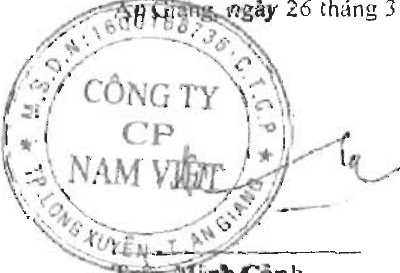

<table border=1 style='margin: auto; word-wrap: break-word;'><tr><td style='text-align: center; word-wrap: break-word;'>CHI TIÊU</td><td style='text-align: center; word-wrap: break-word;'>Mã số</td><td style='text-align: center; word-wrap: break-word;'>Thuyết minh</td><td style='text-align: center; word-wrap: break-word;'>Năm nay</td><td style='text-align: center; word-wrap: break-word;'>Năm trước</td></tr><tr><td style='text-align: center; word-wrap: break-word;'>III. Lưu chuyển tiền từ hoạt động tài chính</td><td style='text-align: center; word-wrap: break-word;'></td><td style='text-align: center; word-wrap: break-word;'></td><td style='text-align: center; word-wrap: break-word;'></td><td style='text-align: center; word-wrap: break-word;'></td></tr><tr><td style='text-align: center; word-wrap: break-word;'>1. Tiền thu từ phát hành cổ phiếu, nhận vốn góp của chủ sở hữu</td><td style='text-align: center; word-wrap: break-word;'>31</td><td style='text-align: center; word-wrap: break-word;'>V.24a</td><td style='text-align: center; word-wrap: break-word;'>-</td><td style='text-align: center; word-wrap: break-word;'>24,920,000,000</td></tr><tr><td style='text-align: center; word-wrap: break-word;'>2. Tiền trả lại vốn góp cho các chủ sở hữu, mua lại cổ phiếu của doanh nghiệp đã phát hành</td><td style='text-align: center; word-wrap: break-word;'>32</td><td style='text-align: center; word-wrap: break-word;'>V.24a</td><td style='text-align: center; word-wrap: break-word;'>-</td><td style='text-align: center; word-wrap: break-word;'>(170,000,000)</td></tr><tr><td style='text-align: center; word-wrap: break-word;'>3. Tiền thu từ di vay</td><td style='text-align: center; word-wrap: break-word;'>33</td><td style='text-align: center; word-wrap: break-word;'>V.21, V.II</td><td style='text-align: center; word-wrap: break-word;'>3,861,664,863,115</td><td style='text-align: center; word-wrap: break-word;'>4,303,843,227,771</td></tr><tr><td style='text-align: center; word-wrap: break-word;'>4. Tiền trả nợ gốc vay</td><td style='text-align: center; word-wrap: break-word;'>34</td><td style='text-align: center; word-wrap: break-word;'>V.21</td><td style='text-align: center; word-wrap: break-word;'>(3,417,294,881,699)</td><td style='text-align: center; word-wrap: break-word;'>(4,242,526,202,498)</td></tr><tr><td style='text-align: center; word-wrap: break-word;'>5. Tiền trả nợ gốc thuê tài chính</td><td style='text-align: center; word-wrap: break-word;'>35</td><td style='text-align: center; word-wrap: break-word;'>V.21</td><td style='text-align: center; word-wrap: break-word;'>(31,973,927,272)</td><td style='text-align: center; word-wrap: break-word;'>(15,678,625,934)</td></tr><tr><td style='text-align: center; word-wrap: break-word;'>6. Cổ tức, lợi nhuận đã trả cho chủ sở hữu</td><td style='text-align: center; word-wrap: break-word;'>36</td><td style='text-align: center; word-wrap: break-word;'>V.20, V.24</td><td style='text-align: center; word-wrap: break-word;'>(158,139,811,265)</td><td style='text-align: center; word-wrap: break-word;'>(190,525,369,500)</td></tr><tr><td style='text-align: center; word-wrap: break-word;'>Lưu chuyển tiền thuần từ hoạt động tài chính</td><td style='text-align: center; word-wrap: break-word;'>40</td><td style='text-align: center; word-wrap: break-word;'></td><td style='text-align: center; word-wrap: break-word;'>254,256,242,879</td><td style='text-align: center; word-wrap: break-word;'>(120,136,970,161)</td></tr><tr><td style='text-align: center; word-wrap: break-word;'>Lưu chuyển tiền thuần trong năm</td><td style='text-align: center; word-wrap: break-word;'>50</td><td style='text-align: center; word-wrap: break-word;'></td><td style='text-align: center; word-wrap: break-word;'>19,346,911,873</td><td style='text-align: center; word-wrap: break-word;'>(44,429,505,198)</td></tr><tr><td style='text-align: center; word-wrap: break-word;'>Tiền và tương đương tiền đầu năm</td><td style='text-align: center; word-wrap: break-word;'>60</td><td style='text-align: center; word-wrap: break-word;'>V.1</td><td style='text-align: center; word-wrap: break-word;'>24,589,646,497</td><td style='text-align: center; word-wrap: break-word;'>69,153,027,332</td></tr><tr><td style='text-align: center; word-wrap: break-word;'>Ảnh hương của thay đổi tỷ giá hối đoái quy đổi ngoại tệ</td><td style='text-align: center; word-wrap: break-word;'>61</td><td style='text-align: center; word-wrap: break-word;'></td><td style='text-align: center; word-wrap: break-word;'>(137,707,185)</td><td style='text-align: center; word-wrap: break-word;'>(133,875,637)</td></tr><tr><td style='text-align: center; word-wrap: break-word;'>Tiền và tương đương tiền cuối năm</td><td style='text-align: center; word-wrap: break-word;'>70</td><td style='text-align: center; word-wrap: break-word;'>V.1</td><td style='text-align: center; word-wrap: break-word;'>43,798,851,185</td><td style='text-align: center; word-wrap: break-word;'>24,589,646,497</td></tr></table>

Hsiạng ngày 26 tháng 3 năm 2021

Trần Minh Cảnh

Phó Tổng Giám đốc

