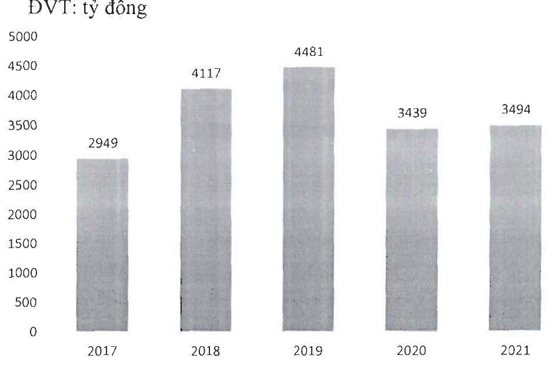
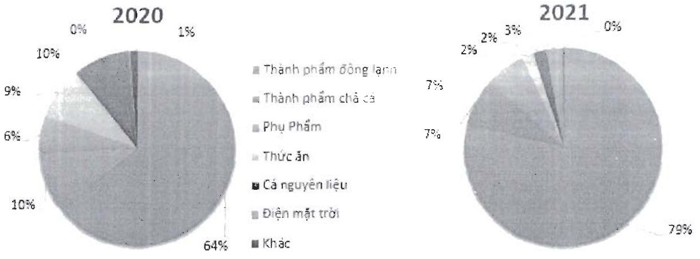

<table border=1 style='margin: auto; word-wrap: break-word;'><tr><td style='text-align: center; word-wrap: break-word;'>Chỉ tiêu</td><td style='text-align: center; word-wrap: break-word;'>ĐVT</td><td style='text-align: center; word-wrap: break-word;'>Năm 2020</td><td style='text-align: center; word-wrap: break-word;'>Năm 2021</td><td style='text-align: center; word-wrap: break-word;'>Tăng giảm trong năm 2021</td></tr><tr><td style='text-align: center; word-wrap: break-word;'>Số lượng lao động</td><td style='text-align: center; word-wrap: break-word;'>Người</td><td style='text-align: center; word-wrap: break-word;'>5.978</td><td style='text-align: center; word-wrap: break-word;'>5.413</td><td style='text-align: center; word-wrap: break-word;'>(565)</td></tr><tr><td style='text-align: center; word-wrap: break-word;'>Thu nhập bình quân đầu người</td><td style='text-align: center; word-wrap: break-word;'>Trưởng / người</td><td style='text-align: center; word-wrap: break-word;'>6.7</td><td style='text-align: center; word-wrap: break-word;'>7.0</td><td style='text-align: center; word-wrap: break-word;'>0.3</td></tr></table>

- Doanh thu thuần của toàn công ty trong năm 2021 đạt 3.494 tỷ đồng, tăng 1,6% so với cùng kì năm trước

Biểu đồ tăng trưởng doanh thu qua các năm:

Biểu đồ cơ cấu doanh thu:

