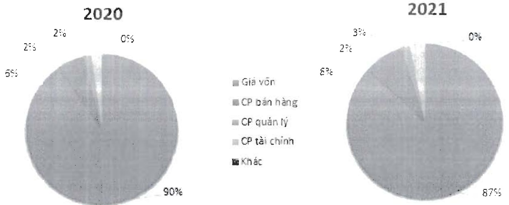

- Chi tiết doanh thu năm 2021

<table border=1 style='margin: auto; word-wrap: break-word;'><tr><td style='text-align: center; word-wrap: break-word;'>STT</td><td style='text-align: center; word-wrap: break-word;'>Doanh Thu</td><td style='text-align: center; word-wrap: break-word;'>Loại tiền</td><td style='text-align: center; word-wrap: break-word;'>Tỷ lệ 2020</td><td style='text-align: center; word-wrap: break-word;'>Tỷ lệ 2021</td></tr><tr><td style='text-align: center; word-wrap: break-word;'>1</td><td style='text-align: center; word-wrap: break-word;'>Thành phẩm đông lạnh</td><td style='text-align: center; word-wrap: break-word;'>VND</td><td style='text-align: center; word-wrap: break-word;'>63.88%</td><td style='text-align: center; word-wrap: break-word;'>78.90%</td></tr><tr><td style='text-align: center; word-wrap: break-word;'>2</td><td style='text-align: center; word-wrap: break-word;'>Thành phẩm chả cá</td><td style='text-align: center; word-wrap: break-word;'>VND</td><td style='text-align: center; word-wrap: break-word;'>10.21%</td><td style='text-align: center; word-wrap: break-word;'>7.52%</td></tr><tr><td style='text-align: center; word-wrap: break-word;'>3</td><td style='text-align: center; word-wrap: break-word;'>Phụ Phẩm</td><td style='text-align: center; word-wrap: break-word;'>VND</td><td style='text-align: center; word-wrap: break-word;'>6.05%</td><td style='text-align: center; word-wrap: break-word;'>6.60%</td></tr><tr><td style='text-align: center; word-wrap: break-word;'>4</td><td style='text-align: center; word-wrap: break-word;'>Thức ăn</td><td style='text-align: center; word-wrap: break-word;'>VND</td><td style='text-align: center; word-wrap: break-word;'>9.01%</td><td style='text-align: center; word-wrap: break-word;'>1.92%</td></tr><tr><td style='text-align: center; word-wrap: break-word;'>5</td><td style='text-align: center; word-wrap: break-word;'>Cá nguyên liệu</td><td style='text-align: center; word-wrap: break-word;'>VND</td><td style='text-align: center; word-wrap: break-word;'>9.35%</td><td style='text-align: center; word-wrap: break-word;'>2.07%</td></tr><tr><td style='text-align: center; word-wrap: break-word;'>6</td><td style='text-align: center; word-wrap: break-word;'>Điện mặt trời</td><td style='text-align: center; word-wrap: break-word;'>VND</td><td style='text-align: center; word-wrap: break-word;'>0.20%</td><td style='text-align: center; word-wrap: break-word;'>2.81%</td></tr><tr><td style='text-align: center; word-wrap: break-word;'>7</td><td style='text-align: center; word-wrap: break-word;'>Khác</td><td style='text-align: center; word-wrap: break-word;'>VND</td><td style='text-align: center; word-wrap: break-word;'>1.29%</td><td style='text-align: center; word-wrap: break-word;'>0.18%</td></tr><tr><td style='text-align: center; word-wrap: break-word;'></td><td style='text-align: center; word-wrap: break-word;'>Tổng cộng VND</td><td style='text-align: center; word-wrap: break-word;'></td><td style='text-align: center; word-wrap: break-word;'>100.00%</td><td style='text-align: center; word-wrap: break-word;'>100.00%</td></tr></table>

Doanh thu bán thành phẩm động lạnh vãn chiếm tỷ trọng cao nhất trong cơ cấu doanh thu của Navico chiếm 78,9%, tiếp đến là sản phẩm Chả cá, chiếm tỷ trọng 7,52%.

Về cơ cấu chi phí hoạt động

Biểu đồ cơ cấu chi phí hoạt động của Navico

