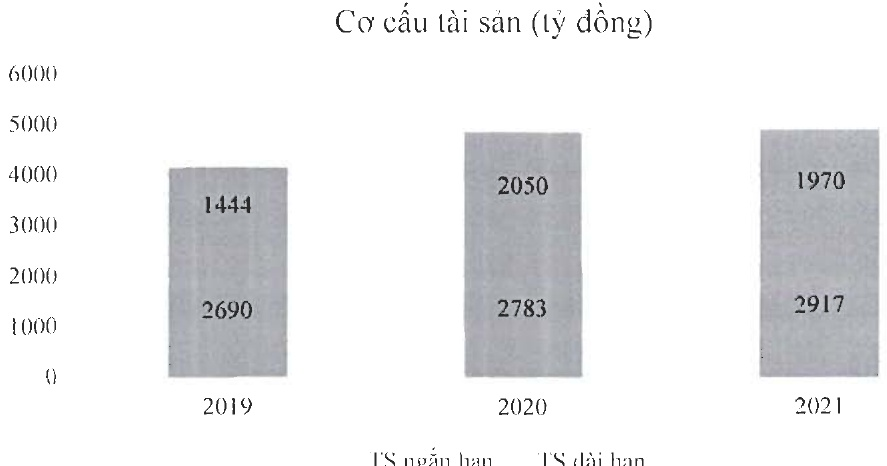
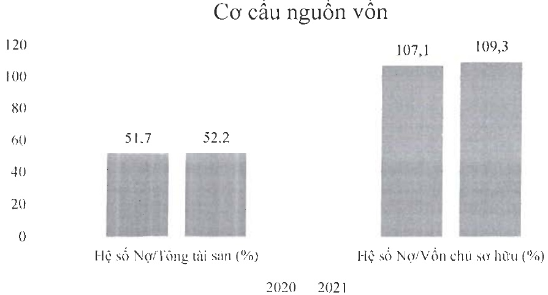
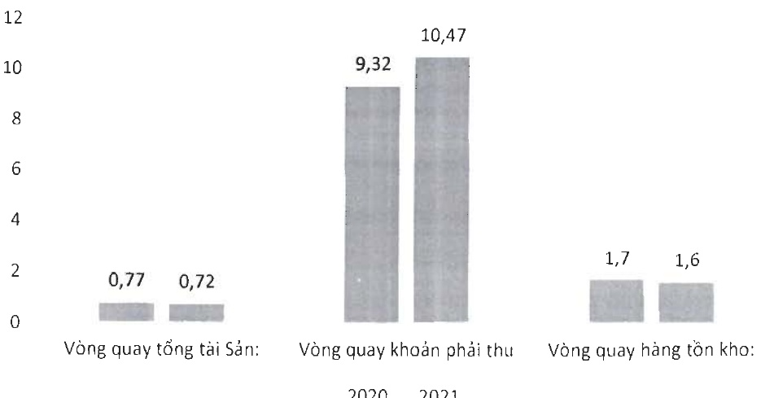

Trong đó, nợ ngắn hạn là 2.336 tỷ chiếm tỷ trọng chủ yếu là 91,5% trong tổng nợ phải trả Công ty luôn coi trọng công tác quản trị rủi ro nói chung và rủi ro thanh khoản nói riêng. Ban điều hành thường xuyên theo dõi yêu cầu về thanh toán hiện tại và dự kiến trong tương lai nhằm duy trì một lượng tiền cũng như các khoản vay ở mức phù hợp, giám sát các lường tiền phát sinh thực tế với dự kiến nhằm giảm thiểu ảnh hưởng do biến động dòng tiền của Công ty.

Một số chỉ tiêu về năng lực hoạt động

