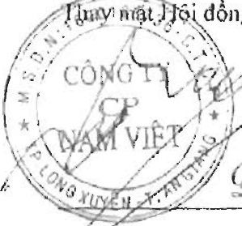
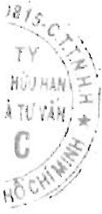
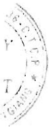

Phê duyệt Báo cáo tài chính

Hội đồng quản trị Công ty phê duyệt Báo cáo tài chính hợp nhất định kèm. Báo cáo tài chính hợp nhất đã phản ánh trung thực và hợp lý tình hình tài chính hợp nhất của Tập đoàn tại thời điểm ngày 31 tháng 12 năm 2021, cũng như kết quả hoạt động kinh doanh hợp nhất và tình hình lưu chuyển tiền tệ hợp nhất cho năm tài chính kết thúc cùng ngày, phù hợp với các Chuẩn mực Kế toán Việt Nam, Chế độ Kế toán doanh nghiệp Việt Nam và các quy định pháp lý có liên quan đến việc lập và trình bày Báo cáo tài chính hợp nhất.

Đỗ Lập. Nghiệp

Ngày 26 tháng 3 năm 2022

