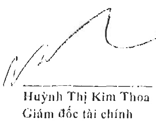
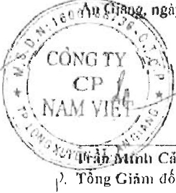

#### CÔNG TY CỔ PHẦN NAM VIỆT

<table border=1 style='margin: auto; word-wrap: break-word;'><tr><td style='text-align: center; word-wrap: break-word;'>CHỈ TIÊU</td><td style='text-align: center; word-wrap: break-word;'>Má số</td><td style='text-align: center; word-wrap: break-word;'>Thuyết minh</td><td style='text-align: center; word-wrap: break-word;'>Số cuối năm</td><td style='text-align: center; word-wrap: break-word;'>Số dầu năm</td></tr><tr><td style='text-align: center; word-wrap: break-word;'>D - VỐN CHỮ SỞ HỪU</td><td style='text-align: center; word-wrap: break-word;'>400</td><td style='text-align: center; word-wrap: break-word;'></td><td style='text-align: center; word-wrap: break-word;'>2.335.585.626.152</td><td style='text-align: center; word-wrap: break-word;'>2.333.974.303.420</td></tr><tr><td style='text-align: center; word-wrap: break-word;'>1. Vốn chủ số hữu</td><td style='text-align: center; word-wrap: break-word;'>410</td><td style='text-align: center; word-wrap: break-word;'></td><td style='text-align: center; word-wrap: break-word;'>2.335.585.626.152</td><td style='text-align: center; word-wrap: break-word;'>2.333.974.303.420</td></tr><tr><td style='text-align: center; word-wrap: break-word;'>1. Vốn góp của chủ số hữu</td><td style='text-align: center; word-wrap: break-word;'>411</td><td style='text-align: center; word-wrap: break-word;'>V.24</td><td style='text-align: center; word-wrap: break-word;'>1.275.396.250.000</td><td style='text-align: center; word-wrap: break-word;'>1.275.396.250.000</td></tr><tr><td style='text-align: center; word-wrap: break-word;'>- Cổ phiếu phổ thông có quyền biểu quyết</td><td style='text-align: center; word-wrap: break-word;'>411a</td><td style='text-align: center; word-wrap: break-word;'></td><td style='text-align: center; word-wrap: break-word;'>1.275.396.250.000</td><td style='text-align: center; word-wrap: break-word;'>1.275.396.250.000</td></tr><tr><td style='text-align: center; word-wrap: break-word;'>- Cổ phiếu ưu dãi</td><td style='text-align: center; word-wrap: break-word;'>411b</td><td style='text-align: center; word-wrap: break-word;'></td><td style='text-align: center; word-wrap: break-word;'>-</td><td style='text-align: center; word-wrap: break-word;'>-</td></tr><tr><td style='text-align: center; word-wrap: break-word;'>2. Thắng dự vốn cô phần</td><td style='text-align: center; word-wrap: break-word;'>412</td><td style='text-align: center; word-wrap: break-word;'>V.24</td><td style='text-align: center; word-wrap: break-word;'>21.489.209.100</td><td style='text-align: center; word-wrap: break-word;'>21.489.209.100</td></tr><tr><td style='text-align: center; word-wrap: break-word;'>3. Quyền chọn chuyển đối trái phiếu</td><td style='text-align: center; word-wrap: break-word;'>413</td><td style='text-align: center; word-wrap: break-word;'></td><td style='text-align: center; word-wrap: break-word;'>-</td><td style='text-align: center; word-wrap: break-word;'>-</td></tr><tr><td style='text-align: center; word-wrap: break-word;'>4. Vốn khác của chủ số hữu</td><td style='text-align: center; word-wrap: break-word;'>414</td><td style='text-align: center; word-wrap: break-word;'></td><td style='text-align: center; word-wrap: break-word;'>-</td><td style='text-align: center; word-wrap: break-word;'>-</td></tr><tr><td style='text-align: center; word-wrap: break-word;'>5. Cổ phiếu quỹ</td><td style='text-align: center; word-wrap: break-word;'>415</td><td style='text-align: center; word-wrap: break-word;'>V.24</td><td style='text-align: center; word-wrap: break-word;'>(27.587.629.848)</td><td style='text-align: center; word-wrap: break-word;'>(27.587.629.848)</td></tr><tr><td style='text-align: center; word-wrap: break-word;'>6. Chênh lệch đánh giá lại tài sản</td><td style='text-align: center; word-wrap: break-word;'>416</td><td style='text-align: center; word-wrap: break-word;'></td><td style='text-align: center; word-wrap: break-word;'>-</td><td style='text-align: center; word-wrap: break-word;'>-</td></tr><tr><td style='text-align: center; word-wrap: break-word;'>7. Chênh lệch lý giá hối doái</td><td style='text-align: center; word-wrap: break-word;'>417</td><td style='text-align: center; word-wrap: break-word;'></td><td style='text-align: center; word-wrap: break-word;'>-</td><td style='text-align: center; word-wrap: break-word;'>-</td></tr><tr><td style='text-align: center; word-wrap: break-word;'>8. Quỹ dầu tư phát triển</td><td style='text-align: center; word-wrap: break-word;'>418</td><td style='text-align: center; word-wrap: break-word;'></td><td style='text-align: center; word-wrap: break-word;'>-</td><td style='text-align: center; word-wrap: break-word;'>-</td></tr><tr><td style='text-align: center; word-wrap: break-word;'>9. Quỹ hỗ trợ sắp xếp doanh nghiệp</td><td style='text-align: center; word-wrap: break-word;'>419</td><td style='text-align: center; word-wrap: break-word;'></td><td style='text-align: center; word-wrap: break-word;'>-</td><td style='text-align: center; word-wrap: break-word;'>-</td></tr><tr><td style='text-align: center; word-wrap: break-word;'>10. Quỹ khác thuộc vốn chủ số hữu</td><td style='text-align: center; word-wrap: break-word;'>420</td><td style='text-align: center; word-wrap: break-word;'></td><td style='text-align: center; word-wrap: break-word;'>-</td><td style='text-align: center; word-wrap: break-word;'>-</td></tr><tr><td style='text-align: center; word-wrap: break-word;'>11. Lợi nhuận sau thuế chưa phản phối</td><td style='text-align: center; word-wrap: break-word;'>421</td><td style='text-align: center; word-wrap: break-word;'>V.24</td><td style='text-align: center; word-wrap: break-word;'>1.066.287.796.900</td><td style='text-align: center; word-wrap: break-word;'>1.064.676.474.168</td></tr><tr><td style='text-align: center; word-wrap: break-word;'>- Lợi nhuận sau thuế chưa phản phối lấy kế đến cuối kỳ trước</td><td style='text-align: center; word-wrap: break-word;'>421a</td><td style='text-align: center; word-wrap: break-word;'></td><td style='text-align: center; word-wrap: break-word;'>937.548.599.168</td><td style='text-align: center; word-wrap: break-word;'>1.064.676.474.168</td></tr><tr><td style='text-align: center; word-wrap: break-word;'>- Lợi nhuận sau thuế chưa phản phối kỳ này</td><td style='text-align: center; word-wrap: break-word;'>421b</td><td style='text-align: center; word-wrap: break-word;'></td><td style='text-align: center; word-wrap: break-word;'>128.739.197.732</td><td style='text-align: center; word-wrap: break-word;'>-</td></tr><tr><td style='text-align: center; word-wrap: break-word;'>12. Ngườn vốn dầu tư xây dựng cơ bản</td><td style='text-align: center; word-wrap: break-word;'>422</td><td style='text-align: center; word-wrap: break-word;'></td><td style='text-align: center; word-wrap: break-word;'>-</td><td style='text-align: center; word-wrap: break-word;'>-</td></tr><tr><td style='text-align: center; word-wrap: break-word;'>13. Lợi ích cổ đồng không kiểm soát</td><td style='text-align: center; word-wrap: break-word;'>429</td><td style='text-align: center; word-wrap: break-word;'></td><td style='text-align: center; word-wrap: break-word;'>-</td><td style='text-align: center; word-wrap: break-word;'>-</td></tr><tr><td style='text-align: center; word-wrap: break-word;'>II. Ngườn kinh phí và quỹ khác</td><td style='text-align: center; word-wrap: break-word;'>430</td><td style='text-align: center; word-wrap: break-word;'></td><td style='text-align: center; word-wrap: break-word;'>-</td><td style='text-align: center; word-wrap: break-word;'>-</td></tr><tr><td style='text-align: center; word-wrap: break-word;'>1. Ngườn kinh phí</td><td style='text-align: center; word-wrap: break-word;'>431</td><td style='text-align: center; word-wrap: break-word;'></td><td style='text-align: center; word-wrap: break-word;'>-</td><td style='text-align: center; word-wrap: break-word;'>-</td></tr><tr><td style='text-align: center; word-wrap: break-word;'>2. Ngườn kinh phí đã hình thành tài sản cổ định</td><td style='text-align: center; word-wrap: break-word;'>432</td><td style='text-align: center; word-wrap: break-word;'></td><td style='text-align: center; word-wrap: break-word;'>-</td><td style='text-align: center; word-wrap: break-word;'>-</td></tr><tr><td style='text-align: center; word-wrap: break-word;'>TỔNG CỘNG NGUỒN VỐN</td><td style='text-align: center; word-wrap: break-word;'>440</td><td style='text-align: center; word-wrap: break-word;'></td><td style='text-align: center; word-wrap: break-word;'>4.887.179.840.940</td><td style='text-align: center; word-wrap: break-word;'>4.834.079.659.323</td></tr></table>

60 Au Giang, ngày 20 tháng 3 năm 2022

Huỳnh Thị Kim Thoa

Giám đốc tài chính

Tổng Cảm Cảnh

). Tổng Giảm độc

