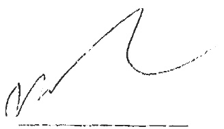
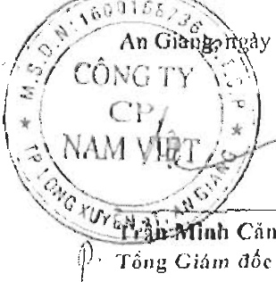

#### BÁO CÁO KẾT QUẢ HOẠT ĐỒNG KINH DOANH HỢP NHÁT Cho năm tài chính kết thúc ngày 31 tháng 12 năm 2021

Don vi tinh; VND

<table border=1 style='margin: auto; word-wrap: break-word;'><tr><td style='text-align: center; word-wrap: break-word;'>CHÍ TIÊU</td><td style='text-align: center; word-wrap: break-word;'>Mã số</td><td style='text-align: center; word-wrap: break-word;'>Thuyết minh</td><td style='text-align: center; word-wrap: break-word;'>Năm nay</td><td style='text-align: center; word-wrap: break-word;'>Năm trước</td></tr><tr><td style='text-align: center; word-wrap: break-word;'>1. Doanh thu bán hàng và cung cấp dịch vụ</td><td style='text-align: center; word-wrap: break-word;'>01</td><td style='text-align: center; word-wrap: break-word;'>VI.1</td><td style='text-align: center; word-wrap: break-word;'>3.504.425.921.790</td><td style='text-align: center; word-wrap: break-word;'>3.477.498.386.090</td></tr><tr><td style='text-align: center; word-wrap: break-word;'>2. Các khoản giảm trừ doanh thu</td><td style='text-align: center; word-wrap: break-word;'>02</td><td style='text-align: center; word-wrap: break-word;'>VI.2</td><td style='text-align: center; word-wrap: break-word;'>10.499.600.516</td><td style='text-align: center; word-wrap: break-word;'>38.834.026.406</td></tr><tr><td style='text-align: center; word-wrap: break-word;'>3. Doanh thu thuần về bán hàng và cung cấp dịch vụ</td><td style='text-align: center; word-wrap: break-word;'>10</td><td style='text-align: center; word-wrap: break-word;'></td><td style='text-align: center; word-wrap: break-word;'>3.493.926.321.274</td><td style='text-align: center; word-wrap: break-word;'>3.438.664.359.684</td></tr><tr><td style='text-align: center; word-wrap: break-word;'>4. Giá vốn hàng bán</td><td style='text-align: center; word-wrap: break-word;'>11</td><td style='text-align: center; word-wrap: break-word;'>VI.3</td><td style='text-align: center; word-wrap: break-word;'>2.940.612.855.979</td><td style='text-align: center; word-wrap: break-word;'>2.953.993.101.824</td></tr><tr><td style='text-align: center; word-wrap: break-word;'>5. Lợi nhuận góp về bán hàng và cung cấp dịch vụ</td><td style='text-align: center; word-wrap: break-word;'>20</td><td style='text-align: center; word-wrap: break-word;'></td><td style='text-align: center; word-wrap: break-word;'>553.313.465.295</td><td style='text-align: center; word-wrap: break-word;'>484.671.257.860</td></tr><tr><td style='text-align: center; word-wrap: break-word;'>6. Doanh thu hoạt động tài chính</td><td style='text-align: center; word-wrap: break-word;'>21</td><td style='text-align: center; word-wrap: break-word;'>VI.4</td><td style='text-align: center; word-wrap: break-word;'>41.027.271.027</td><td style='text-align: center; word-wrap: break-word;'>42.934.983.445</td></tr><tr><td style='text-align: center; word-wrap: break-word;'>7. Chỉ phí tài chính</td><td style='text-align: center; word-wrap: break-word;'>22</td><td style='text-align: center; word-wrap: break-word;'>VI.5</td><td style='text-align: center; word-wrap: break-word;'>115.345.794.726</td><td style='text-align: center; word-wrap: break-word;'>80.030.865.651</td></tr><tr><td style='text-align: center; word-wrap: break-word;'>Trong đó: chỉ phí lãi vay</td><td style='text-align: center; word-wrap: break-word;'>23</td><td style='text-align: center; word-wrap: break-word;'></td><td style='text-align: center; word-wrap: break-word;'>102.959.352.877</td><td style='text-align: center; word-wrap: break-word;'>61.916.606.514</td></tr><tr><td style='text-align: center; word-wrap: break-word;'>8. Phần lãi hoặc lỗ trong công ty liên doanh, liên kết</td><td style='text-align: center; word-wrap: break-word;'>24</td><td style='text-align: center; word-wrap: break-word;'>V.2b</td><td style='text-align: center; word-wrap: break-word;'>108.341.747</td><td style='text-align: center; word-wrap: break-word;'>(292.321.801)</td></tr><tr><td style='text-align: center; word-wrap: break-word;'>9. Chỉ phí bản hàng</td><td style='text-align: center; word-wrap: break-word;'>25</td><td style='text-align: center; word-wrap: break-word;'>VI.6</td><td style='text-align: center; word-wrap: break-word;'>280.956.940.056</td><td style='text-align: center; word-wrap: break-word;'>185.263.413.739</td></tr><tr><td style='text-align: center; word-wrap: break-word;'>10. Chỉ phí quản lý doanh nghiệp</td><td style='text-align: center; word-wrap: break-word;'>26</td><td style='text-align: center; word-wrap: break-word;'>VI.7</td><td style='text-align: center; word-wrap: break-word;'>56.474.052.865</td><td style='text-align: center; word-wrap: break-word;'>56.561.834.630</td></tr><tr><td style='text-align: center; word-wrap: break-word;'>11. Lợi nhuận thuần từ hoạt động kinh doanh</td><td style='text-align: center; word-wrap: break-word;'>30</td><td style='text-align: center; word-wrap: break-word;'></td><td style='text-align: center; word-wrap: break-word;'>141.672.290.422</td><td style='text-align: center; word-wrap: break-word;'>205.457.805.484</td></tr><tr><td style='text-align: center; word-wrap: break-word;'>12. Thu nhập khác</td><td style='text-align: center; word-wrap: break-word;'>31</td><td style='text-align: center; word-wrap: break-word;'>VI.8</td><td style='text-align: center; word-wrap: break-word;'>10.150.550.944</td><td style='text-align: center; word-wrap: break-word;'>35.047.702.141</td></tr><tr><td style='text-align: center; word-wrap: break-word;'>13. Chỉ phí khác</td><td style='text-align: center; word-wrap: break-word;'>32</td><td style='text-align: center; word-wrap: break-word;'>VI.9</td><td style='text-align: center; word-wrap: break-word;'>381.477.344</td><td style='text-align: center; word-wrap: break-word;'>873.665.396</td></tr><tr><td style='text-align: center; word-wrap: break-word;'>14. Lợi nhuận khác</td><td style='text-align: center; word-wrap: break-word;'>40</td><td style='text-align: center; word-wrap: break-word;'></td><td style='text-align: center; word-wrap: break-word;'>9.769.073.600</td><td style='text-align: center; word-wrap: break-word;'>34.174.036.745</td></tr><tr><td style='text-align: center; word-wrap: break-word;'>15. Tổng lợi nhuận kế toàn trước thuế</td><td style='text-align: center; word-wrap: break-word;'>50</td><td style='text-align: center; word-wrap: break-word;'></td><td style='text-align: center; word-wrap: break-word;'>151.441.364.022</td><td style='text-align: center; word-wrap: break-word;'>239.631.842.229</td></tr><tr><td style='text-align: center; word-wrap: break-word;'>16. Chỉ phí thuế thu nhập doanh nghiệp hiện hành</td><td style='text-align: center; word-wrap: break-word;'>51</td><td style='text-align: center; word-wrap: break-word;'>V.17</td><td style='text-align: center; word-wrap: break-word;'>21.003.885.652</td><td style='text-align: center; word-wrap: break-word;'>39.060.382.565</td></tr><tr><td style='text-align: center; word-wrap: break-word;'>17. Chỉ phí thuế thu nhập doanh nghiệp hoản lại</td><td style='text-align: center; word-wrap: break-word;'>52</td><td style='text-align: center; word-wrap: break-word;'>V.14, V.23</td><td style='text-align: center; word-wrap: break-word;'>1.698.280.638</td><td style='text-align: center; word-wrap: break-word;'>(1.598.831.265)</td></tr><tr><td style='text-align: center; word-wrap: break-word;'>18. Lợi nhuận sau thuế thu nhập doanh nghiệp</td><td style='text-align: center; word-wrap: break-word;'>60</td><td style='text-align: center; word-wrap: break-word;'></td><td style='text-align: center; word-wrap: break-word;'>128.739.197.732</td><td style='text-align: center; word-wrap: break-word;'>202.170.290.929</td></tr><tr><td style='text-align: center; word-wrap: break-word;'>19. Lợi nhuận sau thuế của công ty mẹ</td><td style='text-align: center; word-wrap: break-word;'>61</td><td style='text-align: center; word-wrap: break-word;'></td><td style='text-align: center; word-wrap: break-word;'>128.739.197.732</td><td style='text-align: center; word-wrap: break-word;'>202.170.290.929</td></tr><tr><td style='text-align: center; word-wrap: break-word;'>20. Lợi nhuận sau thuế của cổ đồng không kiểm soát</td><td style='text-align: center; word-wrap: break-word;'>62</td><td style='text-align: center; word-wrap: break-word;'></td><td style='text-align: center; word-wrap: break-word;'>-</td><td style='text-align: center; word-wrap: break-word;'>-</td></tr><tr><td style='text-align: center; word-wrap: break-word;'>21. Lãi cơ bản trên cổ phiếu</td><td style='text-align: center; word-wrap: break-word;'>70</td><td style='text-align: center; word-wrap: break-word;'>VI.10</td><td style='text-align: center; word-wrap: break-word;'>1.013</td><td style='text-align: center; word-wrap: break-word;'>1.590</td></tr><tr><td style='text-align: center; word-wrap: break-word;'>22. Lãi suy giảm trên cổ phiếu</td><td style='text-align: center; word-wrap: break-word;'>71</td><td style='text-align: center; word-wrap: break-word;'>VI.10</td><td style='text-align: center; word-wrap: break-word;'>1.013</td><td style='text-align: center; word-wrap: break-word;'>1.590</td></tr></table>

An Giáo ngày 20 tháng 3 năm 2022

Cao Thi Kim Thơ

Người lập

Huỳnh Thị Kim Thoa

Giám đốc tài chính

Báo cáo này phải được độc cùng với Bản thuyết mình Báo cáo tài chính hợp nhất