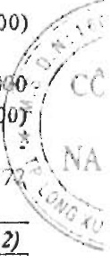

#### BÁO CÁO LƯU CHUYỄN TIỀN TỆ HỢP NHÁT (Theo phương pháp gián tiếp) Cho năm tài chính kết thúc ngày 31 tháng 12 năm 2021

<table border=1 style='margin: auto; word-wrap: break-word;'><tr><td style='text-align: center; word-wrap: break-word;'>CHI TIÊU</td><td style='text-align: center; word-wrap: break-word;'>Mã số</td><td style='text-align: center; word-wrap: break-word;'>Thuyết minh</td><td style='text-align: center; word-wrap: break-word;'>Năm nay</td><td style='text-align: center; word-wrap: break-word;'>Năm trước</td></tr><tr><td style='text-align: center; word-wrap: break-word;'>I. Lưu chuyển tiền từ hoạt động kinh doanh</td><td style='text-align: center; word-wrap: break-word;'></td><td style='text-align: center; word-wrap: break-word;'></td><td style='text-align: center; word-wrap: break-word;'></td><td style='text-align: center; word-wrap: break-word;'></td></tr><tr><td style='text-align: center; word-wrap: break-word;'>1. Lợi nhuận trước thuế</td><td style='text-align: center; word-wrap: break-word;'>01</td><td style='text-align: center; word-wrap: break-word;'></td><td style='text-align: center; word-wrap: break-word;'>151,441,364,022</td><td style='text-align: center; word-wrap: break-word;'>239,631,842,229</td></tr><tr><td style='text-align: center; word-wrap: break-word;'>2. Điều chính cho các khoản:</td><td style='text-align: center; word-wrap: break-word;'></td><td style='text-align: center; word-wrap: break-word;'></td><td style='text-align: center; word-wrap: break-word;'></td><td style='text-align: center; word-wrap: break-word;'></td></tr><tr><td style='text-align: center; word-wrap: break-word;'>- Khẩu hào tài sản cổ định và hất động sản đầu tư</td><td style='text-align: center; word-wrap: break-word;'>02</td><td style='text-align: center; word-wrap: break-word;'>V 10, V.11, V.12</td><td style='text-align: center; word-wrap: break-word;'>122,889,821,438</td><td style='text-align: center; word-wrap: break-word;'>89,772,285,186</td></tr><tr><td style='text-align: center; word-wrap: break-word;'>- Các khoản dự phòng</td><td style='text-align: center; word-wrap: break-word;'>03</td><td style='text-align: center; word-wrap: break-word;'>V2, V.7, V.8</td><td style='text-align: center; word-wrap: break-word;'>595,509,012</td><td style='text-align: center; word-wrap: break-word;'>13,225,423,868</td></tr><tr><td style='text-align: center; word-wrap: break-word;'>- Lải, lỗ chênh lệch tỷ giá hối đoái do đánh giá lại các khoản mục tiễn tệ có gốc ngoại tệ</td><td style='text-align: center; word-wrap: break-word;'>04</td><td style='text-align: center; word-wrap: break-word;'>V1.4, V1.5</td><td style='text-align: center; word-wrap: break-word;'>1,977,941,031</td><td style='text-align: center; word-wrap: break-word;'>(1,104,763,560)</td></tr><tr><td style='text-align: center; word-wrap: break-word;'>- Lải, lỗ từ hoạt động đầu tư</td><td style='text-align: center; word-wrap: break-word;'>05</td><td style='text-align: center; word-wrap: break-word;'>V1.5, V1.8</td><td style='text-align: center; word-wrap: break-word;'>(23,611,511,719)</td><td style='text-align: center; word-wrap: break-word;'>(30,505,383,197)</td></tr><tr><td style='text-align: center; word-wrap: break-word;'>- Chỉ phí lãi vay</td><td style='text-align: center; word-wrap: break-word;'>06</td><td style='text-align: center; word-wrap: break-word;'>V1.5</td><td style='text-align: center; word-wrap: break-word;'>102,959,352,877</td><td style='text-align: center; word-wrap: break-word;'>61,916,606,514</td></tr><tr><td style='text-align: center; word-wrap: break-word;'>- Các khoản điều chỉnh khác</td><td style='text-align: center; word-wrap: break-word;'>07</td><td style='text-align: center; word-wrap: break-word;'></td><td style='text-align: center; word-wrap: break-word;'>-</td><td style='text-align: center; word-wrap: break-word;'>-</td></tr><tr><td style='text-align: center; word-wrap: break-word;'>3. Lợi nhuận từ hoạt động kinh doanh trước thay đổi vốn lưu động</td><td style='text-align: center; word-wrap: break-word;'>08</td><td style='text-align: center; word-wrap: break-word;'></td><td style='text-align: center; word-wrap: break-word;'>356,252,476,661</td><td style='text-align: center; word-wrap: break-word;'>372,936,011,040</td></tr><tr><td style='text-align: center; word-wrap: break-word;'>- Tăng, giảm các khoản phải thu</td><td style='text-align: center; word-wrap: break-word;'>09</td><td style='text-align: center; word-wrap: break-word;'></td><td style='text-align: center; word-wrap: break-word;'>34,849,337,365</td><td style='text-align: center; word-wrap: break-word;'>(583,060,493,094)</td></tr><tr><td style='text-align: center; word-wrap: break-word;'>- Tăng, giảm hàng tốn kho</td><td style='text-align: center; word-wrap: break-word;'>10</td><td style='text-align: center; word-wrap: break-word;'></td><td style='text-align: center; word-wrap: break-word;'>120,871,071,337</td><td style='text-align: center; word-wrap: break-word;'>(317,021,091,919)</td></tr><tr><td style='text-align: center; word-wrap: break-word;'>- Tăng, giảm các khoản phải trả</td><td style='text-align: center; word-wrap: break-word;'>11</td><td style='text-align: center; word-wrap: break-word;'></td><td style='text-align: center; word-wrap: break-word;'>(111,451,377,871)</td><td style='text-align: center; word-wrap: break-word;'>689,893,900,968</td></tr><tr><td style='text-align: center; word-wrap: break-word;'>- Tăng, giảm chi phí trả trước</td><td style='text-align: center; word-wrap: break-word;'>12</td><td style='text-align: center; word-wrap: break-word;'></td><td style='text-align: center; word-wrap: break-word;'>(375,311,970)</td><td style='text-align: center; word-wrap: break-word;'>(7,291,368,471)</td></tr><tr><td style='text-align: center; word-wrap: break-word;'>- Tăng, giảm chúng khoản kinh doanh</td><td style='text-align: center; word-wrap: break-word;'>13</td><td style='text-align: center; word-wrap: break-word;'></td><td style='text-align: center; word-wrap: break-word;'>-</td><td style='text-align: center; word-wrap: break-word;'>-</td></tr><tr><td style='text-align: center; word-wrap: break-word;'>- Tiền lãi vay đã trả</td><td style='text-align: center; word-wrap: break-word;'>14</td><td style='text-align: center; word-wrap: break-word;'>V,19, V1.5</td><td style='text-align: center; word-wrap: break-word;'>(102,662,250,748)</td><td style='text-align: center; word-wrap: break-word;'>(62,170,079,706)</td></tr><tr><td style='text-align: center; word-wrap: break-word;'>- Thuế thu nhập doanh nghiệp đã nộp</td><td style='text-align: center; word-wrap: break-word;'>15</td><td style='text-align: center; word-wrap: break-word;'>V,17</td><td style='text-align: center; word-wrap: break-word;'>(46,949,495,499)</td><td style='text-align: center; word-wrap: break-word;'>(122,763,543,492)</td></tr><tr><td style='text-align: center; word-wrap: break-word;'>- Tiền thu khác từ hoạt động kinh doanh</td><td style='text-align: center; word-wrap: break-word;'>16</td><td style='text-align: center; word-wrap: break-word;'></td><td style='text-align: center; word-wrap: break-word;'>-</td><td style='text-align: center; word-wrap: break-word;'>-</td></tr><tr><td style='text-align: center; word-wrap: break-word;'>- Tiền chi khác cho hoạt động kinh doanh</td><td style='text-align: center; word-wrap: break-word;'>17</td><td style='text-align: center; word-wrap: break-word;'>V,22</td><td style='text-align: center; word-wrap: break-word;'>(65,000,000)</td><td style='text-align: center; word-wrap: break-word;'>(55,000,000)</td></tr><tr><td style='text-align: center; word-wrap: break-word;'>Lưu chuyển tiền thuần từ hoạt động kinh doanh</td><td style='text-align: center; word-wrap: break-word;'>20</td><td style='text-align: center; word-wrap: break-word;'></td><td style='text-align: center; word-wrap: break-word;'>250,469,449,275</td><td style='text-align: center; word-wrap: break-word;'>(29,531,664,674)</td></tr><tr><td style='text-align: center; word-wrap: break-word;'>II. Lưu chuyển tiền từ hoạt động đầu tư</td><td style='text-align: center; word-wrap: break-word;'></td><td style='text-align: center; word-wrap: break-word;'></td><td style='text-align: center; word-wrap: break-word;'></td><td style='text-align: center; word-wrap: break-word;'></td></tr><tr><td style='text-align: center; word-wrap: break-word;'>1. Tiền chỉ để mua sầm, xây dựng tài sản cổ định và các tài sản dải hạn khác</td><td style='text-align: center; word-wrap: break-word;'>21</td><td style='text-align: center; word-wrap: break-word;'>V,10, V,11, V,13, V,11</td><td style='text-align: center; word-wrap: break-word;'>(238,132,640,804)</td><td style='text-align: center; word-wrap: break-word;'>(604,994,747,157)</td></tr><tr><td style='text-align: center; word-wrap: break-word;'>2. Tiền thu từ thanh lý, nhượng bản tài sản có định và các tài sản dải hạn khác</td><td style='text-align: center; word-wrap: break-word;'>22</td><td style='text-align: center; word-wrap: break-word;'>V,9, V,10, V,12, V,18, V,11</td><td style='text-align: center; word-wrap: break-word;'>114,250,798,916</td><td style='text-align: center; word-wrap: break-word;'>126,005,596,053</td></tr><tr><td style='text-align: center; word-wrap: break-word;'>3. Tiền chỉ cho vay, mua các công cụ nợ của đơn vị khác</td><td style='text-align: center; word-wrap: break-word;'>23</td><td style='text-align: center; word-wrap: break-word;'>V,2a, V,5</td><td style='text-align: center; word-wrap: break-word;'>(1,083,883,462,027)</td><td style='text-align: center; word-wrap: break-word;'>(567,170,000,000)</td></tr><tr><td style='text-align: center; word-wrap: break-word;'>4. Tiền thu hồi cho vay, bán lại các công cụ nợ của đơn vị khác</td><td style='text-align: center; word-wrap: break-word;'>24</td><td style='text-align: center; word-wrap: break-word;'>V,2a, V,5</td><td style='text-align: center; word-wrap: break-word;'>759,117,462,027</td><td style='text-align: center; word-wrap: break-word;'>830,886,406,000</td></tr><tr><td style='text-align: center; word-wrap: break-word;'>5. Tiền chỉ đấu tư góp vốn vào đơn vị khác</td><td style='text-align: center; word-wrap: break-word;'>25</td><td style='text-align: center; word-wrap: break-word;'></td><td style='text-align: center; word-wrap: break-word;'>-</td><td style='text-align: center; word-wrap: break-word;'>(23,240,000,000)</td></tr><tr><td style='text-align: center; word-wrap: break-word;'>6. Tiền thu hồi đầu tư góp vốn vào đơn vị khác</td><td style='text-align: center; word-wrap: break-word;'>26</td><td style='text-align: center; word-wrap: break-word;'>V,2, V,6, V,1,5</td><td style='text-align: center; word-wrap: break-word;'>125,026,143,290</td><td style='text-align: center; word-wrap: break-word;'></td></tr><tr><td style='text-align: center; word-wrap: break-word;'>7. Tiền thu lãi cho vay, cổ tức và lợi nhuận được chia</td><td style='text-align: center; word-wrap: break-word;'>27</td><td style='text-align: center; word-wrap: break-word;'>V,6, V,1,4</td><td style='text-align: center; word-wrap: break-word;'>23,291,243,048</td><td style='text-align: center; word-wrap: break-word;'>33,135,078,772</td></tr><tr><td style='text-align: center; word-wrap: break-word;'>Lưu chuyển tiền thuần từ hoạt động đầu tư</td><td style='text-align: center; word-wrap: break-word;'>30</td><td style='text-align: center; word-wrap: break-word;'></td><td style='text-align: center; word-wrap: break-word;'>(300,330,455,550)</td><td style='text-align: center; word-wrap: break-word;'>(205,377,666,332)</td></tr></table>

