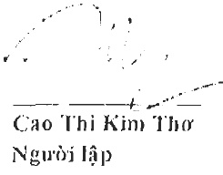
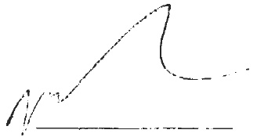
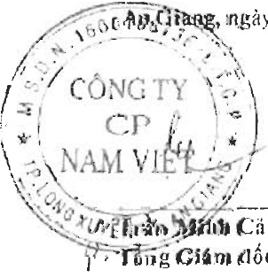
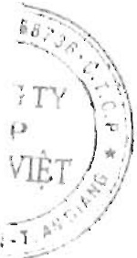

#### CÔNG TY CỔ PHẦN NAM VIỆT

Địa chỉ: 19D Trần Hưng Đạo, Phường Mỹ Quý, TP. Long Xuyên, Tinh An Giang

Cho năm tài chính kết thúc ngày 31 tháng 12 năm 2021

Báo cáo lưu chuyên tiêu tệ hợp nhất (tiếp theo)

<table border=1 style='margin: auto; word-wrap: break-word;'><tr><td style='text-align: center; word-wrap: break-word;'>CHỈ TIÊU</td><td style='text-align: center; word-wrap: break-word;'>Mã số</td><td style='text-align: center; word-wrap: break-word;'>Thuyết minh</td><td style='text-align: center; word-wrap: break-word;'>Năm nay</td><td style='text-align: center; word-wrap: break-word;'>Năm trước</td></tr><tr><td style='text-align: center; word-wrap: break-word;'>1. Tiền thu từ phát hành cổ phiếu, nhận vốn góp của chủ sở hữu</td><td style='text-align: center; word-wrap: break-word;'>31</td><td style='text-align: center; word-wrap: break-word;'></td><td style='text-align: center; word-wrap: break-word;'>-</td><td style='text-align: center; word-wrap: break-word;'>-</td></tr><tr><td style='text-align: center; word-wrap: break-word;'>2. Tiền trả lại vốn góp cho các chủ sở hữu, mua lại cổ phiếu của doanh nghiệp đã phát hành</td><td style='text-align: center; word-wrap: break-word;'>32</td><td style='text-align: center; word-wrap: break-word;'></td><td style='text-align: center; word-wrap: break-word;'>-</td><td style='text-align: center; word-wrap: break-word;'>-</td></tr><tr><td style='text-align: center; word-wrap: break-word;'>3. Tiền thu từ di vay</td><td style='text-align: center; word-wrap: break-word;'>33</td><td style='text-align: center; word-wrap: break-word;'>V.21, V.II</td><td style='text-align: center; word-wrap: break-word;'>4,740,806,006,826</td><td style='text-align: center; word-wrap: break-word;'>3,861,664,863,115</td></tr><tr><td style='text-align: center; word-wrap: break-word;'>4. Tiền trả nợ gốc vay</td><td style='text-align: center; word-wrap: break-word;'>34</td><td style='text-align: center; word-wrap: break-word;'>V.21</td><td style='text-align: center; word-wrap: break-word;'>(4,589,679,032,000)</td><td style='text-align: center; word-wrap: break-word;'>(3,417,294,881,699)</td></tr><tr><td style='text-align: center; word-wrap: break-word;'>5. Tiền trả nợ gốc thuê tài chính</td><td style='text-align: center; word-wrap: break-word;'>35</td><td style='text-align: center; word-wrap: break-word;'>V.21</td><td style='text-align: center; word-wrap: break-word;'>(36,099,447,685)</td><td style='text-align: center; word-wrap: break-word;'>(31,973,927,272)</td></tr><tr><td style='text-align: center; word-wrap: break-word;'>6. Cổ tức, lợi nhuận đã tra cho chủ sở hữu</td><td style='text-align: center; word-wrap: break-word;'>36</td><td style='text-align: center; word-wrap: break-word;'>V.20, V.24</td><td style='text-align: center; word-wrap: break-word;'>(66,196,903,789)</td><td style='text-align: center; word-wrap: break-word;'>(158,139,811,265)</td></tr><tr><td style='text-align: center; word-wrap: break-word;'>Lưu chuyển tiền thuần từ hoạt động tài chính</td><td style='text-align: center; word-wrap: break-word;'>40</td><td style='text-align: center; word-wrap: break-word;'></td><td style='text-align: center; word-wrap: break-word;'>48,830,623,352</td><td style='text-align: center; word-wrap: break-word;'>254,256,242,879</td></tr><tr><td style='text-align: center; word-wrap: break-word;'>Lưu chuyển tiền thuần trong năm</td><td style='text-align: center; word-wrap: break-word;'>50</td><td style='text-align: center; word-wrap: break-word;'></td><td style='text-align: center; word-wrap: break-word;'>(1,030,382,923)</td><td style='text-align: center; word-wrap: break-word;'>19,346,911,873</td></tr><tr><td style='text-align: center; word-wrap: break-word;'>Tiền và tuong dương tiền dầu năm</td><td style='text-align: center; word-wrap: break-word;'>60</td><td style='text-align: center; word-wrap: break-word;'>V.1</td><td style='text-align: center; word-wrap: break-word;'>43,798,851,185</td><td style='text-align: center; word-wrap: break-word;'>24,589,646,497</td></tr><tr><td style='text-align: center; word-wrap: break-word;'>Ảnh hương của thay đổi tỷ giá hối doái quy đổi ngoại tệ</td><td style='text-align: center; word-wrap: break-word;'>61</td><td style='text-align: center; word-wrap: break-word;'></td><td style='text-align: center; word-wrap: break-word;'>(67,386,645)</td><td style='text-align: center; word-wrap: break-word;'>(137,707,185)</td></tr><tr><td style='text-align: center; word-wrap: break-word;'>Tiền và tuong dương tiền cuối năm</td><td style='text-align: center; word-wrap: break-word;'>70</td><td style='text-align: center; word-wrap: break-word;'>V.1</td><td style='text-align: center; word-wrap: break-word;'>42,701,081,617</td><td style='text-align: center; word-wrap: break-word;'>43,798,851,185</td></tr></table>

Huỳnh Thị Kim Thoa

Giám đốc tài chính

Đo.Đo.Giang, ngày 20 tháng 3 năm 2022

Wießo Mün Cánh

Tổng Giám dốc

