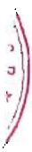

bị thu hẹp khiến dự thừa lao động, Navico đã và đang nỗ lực đầy mạnh sản xuất kinh doanh để tạo ra ngày càng nhiều việc làm, thu nhập; Xây dựng chính sách nhân sự và bổ trí lao động phù hợp để có thể ứng phó với các biến động về nhu cầu lao động. Xây dựng chính sách chăm lo cho người lao động thỏa đáng để giữ chân lao động giới, có được sự cống hiến và nỗ lực cao nhất từ người lao động.

#### Rủi ro tài chính:

- Rủi ro lãi suất: Với Navico, chi phí lãi vay bình quân năm qua chiếm 2.15% doanh thu thuần. Nguồn vốn lưu động phần lớn đến từ các khoản vay ngắn hạn ngân hàng. Vì vậy khi lãi suất có biến động đều ảnh hưởng trực tiếp đến hiệu quả hoạt động của công ty.

- Rũi ro tỷ giá hối đoái: Với việc xuất khẩu là hướng kinh doanh chính của Công ty và lượng ngoại tệ thu về chủ yếu là USD, thì việc biến động tỷ giá hối đoái tăng hoặc giảm đều có tác động trực tiếp đến doanh thu và lợi nhuận công ty.

#### Rủi ro môi trưởng:

- Nuôi và xuất khẩu cá tra ở địa bàn Đồng Bằng Sông Cừu Long đã và đang mang lại hiệu quả kinh tế cao và hứa hẹn tiêm năng phát triển lớn. Tuy vậy, những năm gần đây, tỷ lệ hao hụt khi nuôi cá tra ngày càng cao, thậm chí có ao nuôi cá hao hụt hơn 50%, ảnh hưởng đến hiệu quả kinh tế cho người nuôi. Nếu tiếp tục bỏ quên vấn đề bảo vệ môi trường thì tình trạng suy thoái môi trường do nuôi cá sẽ tác động mạnh đến nghề nuôi và là cản trở lớn nhất cho việc phát triển con cá tra trong thời gian tới.

##### Rủi ro khác:

- Những rủi ro khác bao gồm các rủi ro không thể dự đoán được như tình hình tăng giá vận chuyển, bảo quản hàng hóa, lưu kho... là những rủi ro có nguy cơ xảy ra thấp nhưng có tác động lớn đến tình hình kinh doanh của toàn Công ty.

