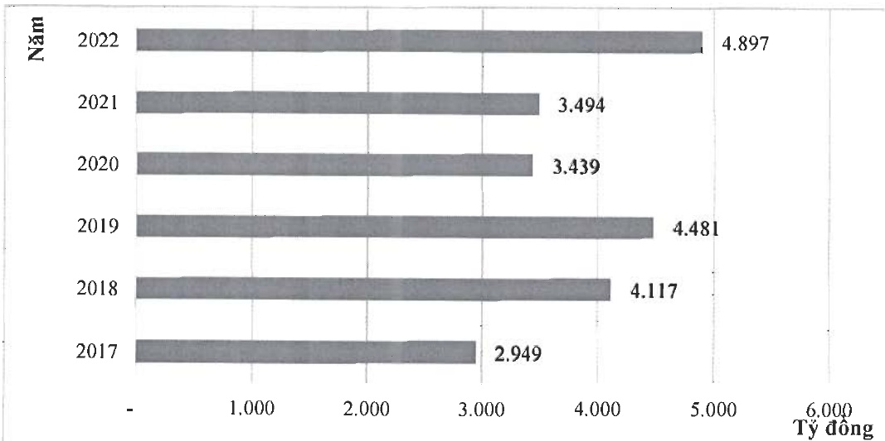
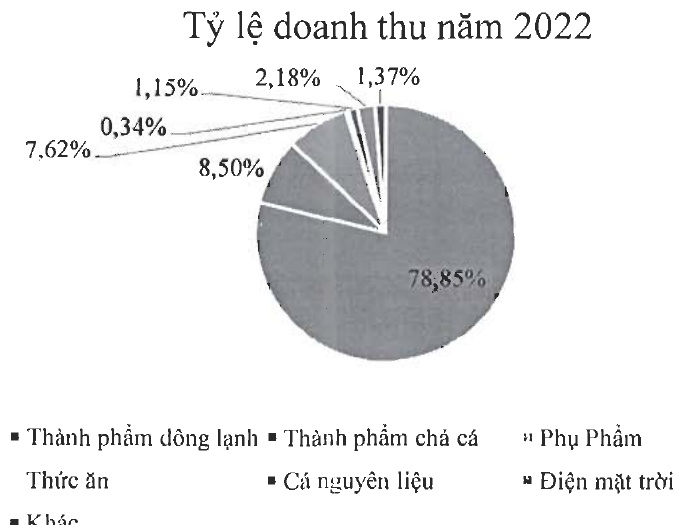

c- Biểu đồ doanh thu qua các năm:

d- Biểu đồ cơ cấu doanh thu năm 2022:

e- Về cơ cấu chi phí hoạt động

<table border=1 style='margin: auto; word-wrap: break-word;'><tr><td style='text-align: center; word-wrap: break-word;'>$ \sqrt{T} $</td><td style='text-align: center; word-wrap: break-word;'>Doanh Thu</td><td style='text-align: center; word-wrap: break-word;'>Loại tiền</td><td style='text-align: center; word-wrap: break-word;'>Tỷ lệ 2021</td><td style='text-align: center; word-wrap: break-word;'>Tỷ lệ 2022</td></tr><tr><td rowspan="4"></td><td style='text-align: center; word-wrap: break-word;'>Giá vốn</td><td style='text-align: center; word-wrap: break-word;'>VND</td><td style='text-align: center; word-wrap: break-word;'>86,65%</td><td style='text-align: center; word-wrap: break-word;'>84,35%</td></tr><tr><td style='text-align: center; word-wrap: break-word;'>CP bán hàng</td><td style='text-align: center; word-wrap: break-word;'>VND</td><td style='text-align: center; word-wrap: break-word;'>8,28%</td><td style='text-align: center; word-wrap: break-word;'>8,96%</td></tr><tr><td style='text-align: center; word-wrap: break-word;'>CP quản lý</td><td style='text-align: center; word-wrap: break-word;'>VND</td><td style='text-align: center; word-wrap: break-word;'>1,66%</td><td style='text-align: center; word-wrap: break-word;'>2,23%</td></tr><tr><td style='text-align: center; word-wrap: break-word;'>CP tài chính</td><td style='text-align: center; word-wrap: break-word;'>VND</td><td style='text-align: center; word-wrap: break-word;'>3,40%</td><td style='text-align: center; word-wrap: break-word;'>4,45%</td></tr><tr><td style='text-align: center; word-wrap: break-word;'>5</td><td style='text-align: center; word-wrap: break-word;'>Khác</td><td style='text-align: center; word-wrap: break-word;'>VND</td><td style='text-align: center; word-wrap: break-word;'>0,01%</td><td style='text-align: center; word-wrap: break-word;'>0,01%</td></tr><tr><td style='text-align: center; word-wrap: break-word;'></td><td style='text-align: center; word-wrap: break-word;'>Tổng cộng VND</td><td style='text-align: center; word-wrap: break-word;'></td><td style='text-align: center; word-wrap: break-word;'>100%</td><td style='text-align: center; word-wrap: break-word;'>100%</td></tr></table>