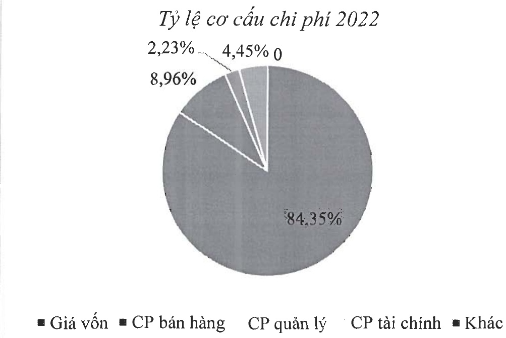

Giá vốn hàng bán văn là khoản mục chiếm tỷ trọng cao nhất trong cơ cấu chi phí của Navico. Chi phí giá vốn hàng bán trong năm 2022 chiếm 84,35% tổng chi phí, giảm nhẹ 2,3% trong cơ cấu chi phí so với năm 2021.

- Biểu đồ cơ cấu chi phí hoạt động của Navico

#### 1.2. Tình hình tài chính

##### a- Tình hình tài sản:

Tính đến 31/12/2022, giá trị tổng tài sản đạt 5.467 tỷ đồng, cao hơn 11,1% so với năm 2021. Tỷ trọng tài sản ngăn hạn chiếm 59,5% so với tổng tài sản, tương đương trong cơ cấu tài sản so với năm 2021.

Trong cơ cấu tài sản ngắn hạn, hàng tồn kho của Công ty chiếm tỷ trọng lớn nhất, đạt 71,6%, tiếp đến là các đầu tư tài chính ngắn hạn và khoản phải thu ngắn hạn, lần lượt chiếm 11% và 13,4%.

Đối với tài sản dài hạn, tài sản cố định là khoản mục chiếm tỷ trọng cao nhất, đạt 49,8%. Ngoài ra, các khoản tài sản dở dang dài hạn và mục đâu tư tài chính dài hạn cũng chiếm phần lớn trong cơ cấu tài sản dài hạn, tương ứng 40,5% và 3,4%.

Các chỉ tiêu về năng lực hoạt động của Navico trong năm 2022 có thay đổi so với năm 2021, trong đó:

Vòng quay tổng tài sản tăng tù 0,72 lên 0,95 vòng.

Vòng quay hàng tồn kho tăng từ 1,6 vòng lên 1,73 vòng.

Biểu đồ cơ cấu tài sản qua các năm