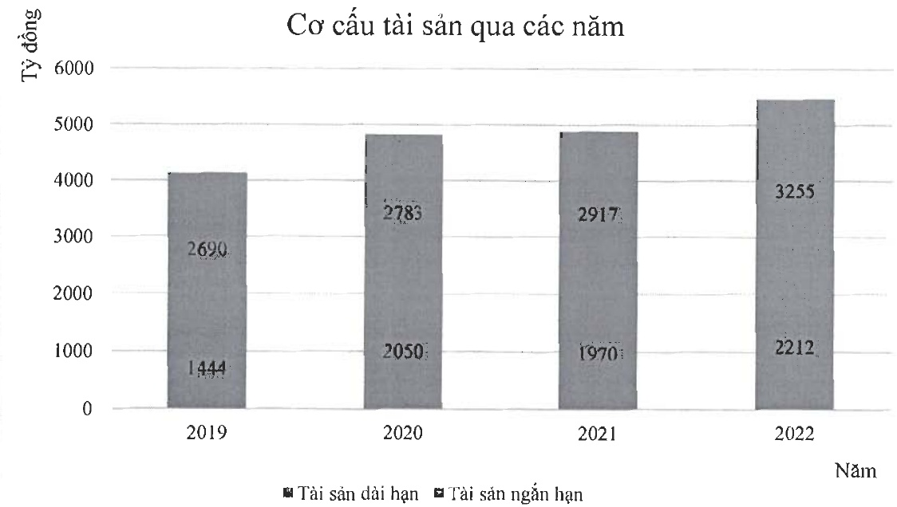

#### b- Tình hình ngữ phải trả

Tại thời điểm 31/12/2022, Tổng nợ phải trả của Công ty là 2.585 tỷ đồng, chiếm 47,3% cơ cấu nguồn vốn (nợ phải trả /tổng nguồn vốn).

Trong đó, nợ ngắn hạn là 2417,5 tỷ chiếm tỷ trọng chủ yếu là 93,5% trong tổng nợ phải trả Công ty luôn coi trọng công tác quản trị rủi ro nói chung và rủi ro thanh khoản nói riêng. Ban điều hành thường xuyên theo dõi yêu cầu về thanh toán hiện tại và dự kiến trong tương lai nhằm duy trì một lượng tiền cũng như các khoản vay ở mức phù hợp, giám sát các lường tiền phát sinh thực tế với dự kiến nhằm giảm thiểu ảnh hưởng do biến động dòng tiền của Công ty.

### c- Về ảnh hưởng của chênh lệch tỷ giá:

Công ty thực hiện một số các giao dịch có gốc ngoại tệ, theo đó, công ty sẽ chịu rủi ro khi có biến động về tỷ giá.

Công ty chủ yếu chịu ảnh hưởng của thay đổi tỷ giá của đồng USD.

d- Về ảnh hưởng của chênh lệch lãi vay

<table border=1 style='margin: auto; word-wrap: break-word;'><tr><td style='text-align: center; word-wrap: break-word;'>Chỉ tiêu</td><td style='text-align: center; word-wrap: break-word;'>Đơn vị tính</td><td style='text-align: center; word-wrap: break-word;'>2021</td><td style='text-align: center; word-wrap: break-word;'>2022</td></tr><tr><td style='text-align: center; word-wrap: break-word;'>Vay ngắn hạn</td><td style='text-align: center; word-wrap: break-word;'>Tỷ đồng</td><td style='text-align: center; word-wrap: break-word;'>1.837,5</td><td style='text-align: center; word-wrap: break-word;'>1.76</td></tr><tr><td style='text-align: center; word-wrap: break-word;'>Vay dài hạn</td><td style='text-align: center; word-wrap: break-word;'>Tỷ đồng</td><td style='text-align: center; word-wrap: break-word;'>210</td><td style='text-align: center; word-wrap: break-word;'></td></tr><tr><td style='text-align: center; word-wrap: break-word;'>Chi phí lãi vay</td><td style='text-align: center; word-wrap: break-word;'>Tỷ đồng</td><td style='text-align: center; word-wrap: break-word;'>103</td><td style='text-align: center; word-wrap: break-word;'>10</td></tr><tr><td style='text-align: center; word-wrap: break-word;'>Chi phí lãi vay/ Doanh thu thuần</td><td style='text-align: center; word-wrap: break-word;'>%</td><td style='text-align: center; word-wrap: break-word;'>2,95%</td><td style='text-align: center; word-wrap: break-word;'>2,15%</td></tr></table>

Năm 2022, lãi vay công ty phải trả là 105 tỷ đồng, gần tương đương so với năm 2021.

