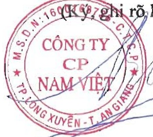

c. Hợp đồng hoặc giao dịch với người nội bộ: tính từ 01/01/2022 đến 31/12/2022:

Được trình bày ở mục VIII.1a, từ trang số 40-41 của Thuyết minh báo cáo tài chính kèm theo.

d. Đánh giá việc thực hiện các quy định về quản trị công ty: Về quản trị Công ty thực hiện theo các Quy định của pháp luật, luôn công khai, minh bạch, có hiệu quả.

F. BÁO CÁO TÀI CHÍNH

(Được trình bày ở phụ lục đính kèm)

XÁC NHẬN CỦA ĐẠI DIỆN THEO PHÁP

LUẬT CỦA CÔNG TY

160(k)7,ghi rõ,họ tên,đóng dấu)

TỔNG GIẢM ĐỐC

