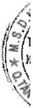
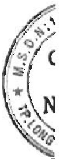

# BÁO CÁO CỦA HỘI ĐỒNG QUẬN TRỊ

Hội đồng quản trị Công ty Cổ phần Nam Việt (sau đây gọi tắt là "Công ty") trình bày báo cáo của mình cùng với Báo cáo tài chính hợp nhất cho năm tài chính kết thúc ngày 31 tháng 12 năm 2022 bao gồm Báo cáo tài chính của Công ty và các công ty con (gọi chung là "Tập đoàn").

##### Khái quát về Công ty

Công ty Cổ phần Nam Việt hoạt động theo Giấy chứng nhận đăng ký doanh nghiệp số 1600168736, đăng ký lần đầu ngày 02 tháng 10 năm 2006 và đăng ký thay đổi lần thứ 13 ngày 10 tháng 7 năm 2020 do Sở Kế hoạch và Đầu tư tinh An Giang cấp.

Trụ sở chính

Địa chỉ : Số 19D Trần Hưng Đạo, Phường Mỹ Quý, TP. Long Xuyên, Tình An Giang.

- Điện thoại : (84-296) 3834060

- Fax : (84-296) 3834054

Công ty có đơn vị trực thuộc là Nhà máy Đông lạnh Thủy sản Đại Tây Dương N.V - Chi nhánh Công ty Cổ phần Nam Việt, đặt tại Khu công nghiệp Thốt Nốt, Phường Thới Thuận, Quận Thốt Nốt, TP. Cần Thơ.

Hoạt động kinh doanh của Công ty là:

- Nuôi cá;

- Sản xuất bao bì giấy;

- In bao bì các loại;

- Sản xuất, chế biến và bảo quản thủy sản;

- Sản xuất dầu Bio-diesel;

- Chế biến dấu cá và bột cá;

- Mua bán cá, thủy sản;

- Bán buôn kim loại và quặng kim loại;

- Khai thác khoáng sản: Crômit, muối mỏ công nghiệp và kim loại màu (Sắt, đồng, chỉ, kẽm);

- Sản xuất và mua bán phân bón;

- Bán buôn hóa chất;

- Sản xuất, chế biến và mua bán thức ăn thùy sẵn;

- Lắp đặt hệ thống điện;

- Sản xuất và bán buôn thuốc thú y, thùy sản;

- Vận tải hàng hóa bằng đường bộ;

- Sản xuất điện năng lượng mặt trời;

- Truyền tải và phân phối điện;

- Xây dựng nhà đế ơ;

- Xây dựng nhà không để ở;

- Xây dựng công trình đường sắt;

- Xây dựng công trình đường bộ;

- Xây dựng công trình thủy;

- Xây dựng công trình khai khoáng;

- Xây dựng công trình chế biến, chế tạo;

- Sản xuất keo Gentaline và Glycerin (nguyên liệu để sản xuất vô con những chứa thuốc);

- Khách sạn, biết thụ hoặc căn hộ kinh doanh dịch vụ lưu trú ngắn ngày,

- Cho thuê nhà, đất không phải để ở như văn phòng, cửa hàng, trung tâm thương mại, nhà xưởng sản xuất, khu triển lãm và nhà kho.

