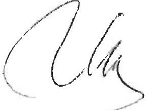
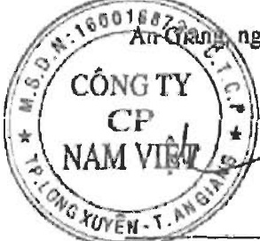

#### CÔNG TY CỔ PHẦN NAM VIỆT

Địa chỉ: 19D Trần Hưng Đạo, Phường Mỹ Quý, TP. Long Xuyên, Tinh An Giang BẢO CÁO TÀI CHÍNH HỌP NHẬT

Cho năm tài chính kết thúc ngày 31 tháng 12 năm 2022

Bảng cân đối kế toán hợp nhất (tiếp theo)

<table border=1 style='margin: auto; word-wrap: break-word;'><tr><td style='text-align: center; word-wrap: break-word;'>CHỈ TIỀU</td><td style='text-align: center; word-wrap: break-word;'>MỜS</td><td style='text-align: center; word-wrap: break-word;'>Thuyết minh</td><td style='text-align: center; word-wrap: break-word;'>Số cuối năm</td><td style='text-align: center; word-wrap: break-word;'>Số dầu năm</td></tr><tr><td style='text-align: center; word-wrap: break-word;'>D - VÓN CHỮ SỞ HỮU</td><td style='text-align: center; word-wrap: break-word;'>400</td><td style='text-align: center; word-wrap: break-word;'></td><td style='text-align: center; word-wrap: break-word;'>2.882.202.985.499</td><td style='text-align: center; word-wrap: break-word;'>2.335.585.626.152</td></tr><tr><td style='text-align: center; word-wrap: break-word;'>I. Vốn chủ sở hữu</td><td style='text-align: center; word-wrap: break-word;'>410</td><td style='text-align: center; word-wrap: break-word;'></td><td style='text-align: center; word-wrap: break-word;'>2.882.202.985.499</td><td style='text-align: center; word-wrap: break-word;'>2.335.585.626.152</td></tr><tr><td style='text-align: center; word-wrap: break-word;'>1. Vốn góp của chủ sở hữu</td><td style='text-align: center; word-wrap: break-word;'>411</td><td style='text-align: center; word-wrap: break-word;'>V.24</td><td style='text-align: center; word-wrap: break-word;'>1.275.396.250.000</td><td style='text-align: center; word-wrap: break-word;'>1.275.396.250.000</td></tr><tr><td style='text-align: center; word-wrap: break-word;'>- Cổ phiếu phổ thông có quyền biểu quyết</td><td style='text-align: center; word-wrap: break-word;'>411a</td><td style='text-align: center; word-wrap: break-word;'></td><td style='text-align: center; word-wrap: break-word;'>1.275.396.250.000</td><td style='text-align: center; word-wrap: break-word;'>1.275.396.250.000</td></tr><tr><td style='text-align: center; word-wrap: break-word;'>- Cổ phiếu ưu dãi</td><td style='text-align: center; word-wrap: break-word;'>411b</td><td style='text-align: center; word-wrap: break-word;'></td><td style='text-align: center; word-wrap: break-word;'>-</td><td style='text-align: center; word-wrap: break-word;'>-</td></tr><tr><td style='text-align: center; word-wrap: break-word;'>2. Thăng dư vốn cổ phần</td><td style='text-align: center; word-wrap: break-word;'>412</td><td style='text-align: center; word-wrap: break-word;'>V.24</td><td style='text-align: center; word-wrap: break-word;'>21.489.209.100</td><td style='text-align: center; word-wrap: break-word;'>21.489.209.100</td></tr><tr><td style='text-align: center; word-wrap: break-word;'>3. Quyền chọn chuyển đổi trái phiếu</td><td style='text-align: center; word-wrap: break-word;'>413</td><td style='text-align: center; word-wrap: break-word;'></td><td style='text-align: center; word-wrap: break-word;'>-</td><td style='text-align: center; word-wrap: break-word;'>-</td></tr><tr><td style='text-align: center; word-wrap: break-word;'>4. Vốn khác của chủ sở hữu</td><td style='text-align: center; word-wrap: break-word;'>414</td><td style='text-align: center; word-wrap: break-word;'></td><td style='text-align: center; word-wrap: break-word;'>-</td><td style='text-align: center; word-wrap: break-word;'>-</td></tr><tr><td style='text-align: center; word-wrap: break-word;'>5. Cổ phiếu quỹ</td><td style='text-align: center; word-wrap: break-word;'>415</td><td style='text-align: center; word-wrap: break-word;'>V.24</td><td style='text-align: center; word-wrap: break-word;'>(27.587.629.848)</td><td style='text-align: center; word-wrap: break-word;'>(27.587.629.848)</td></tr><tr><td style='text-align: center; word-wrap: break-word;'>6. Chênh lệch dánh giá lại tài sản</td><td style='text-align: center; word-wrap: break-word;'>416</td><td style='text-align: center; word-wrap: break-word;'></td><td style='text-align: center; word-wrap: break-word;'>-</td><td style='text-align: center; word-wrap: break-word;'>-</td></tr><tr><td style='text-align: center; word-wrap: break-word;'>7. Chênh lệch tỷ giá hối đoái</td><td style='text-align: center; word-wrap: break-word;'>417</td><td style='text-align: center; word-wrap: break-word;'></td><td style='text-align: center; word-wrap: break-word;'>-</td><td style='text-align: center; word-wrap: break-word;'>-</td></tr><tr><td style='text-align: center; word-wrap: break-word;'>8. Quỹ dầu tư phát triển</td><td style='text-align: center; word-wrap: break-word;'>418</td><td style='text-align: center; word-wrap: break-word;'></td><td style='text-align: center; word-wrap: break-word;'>-</td><td style='text-align: center; word-wrap: break-word;'>-</td></tr><tr><td style='text-align: center; word-wrap: break-word;'>9. Quỹ hỗ trợ sắp xếp doanh nghiệp</td><td style='text-align: center; word-wrap: break-word;'>419</td><td style='text-align: center; word-wrap: break-word;'></td><td style='text-align: center; word-wrap: break-word;'>-</td><td style='text-align: center; word-wrap: break-word;'>-</td></tr><tr><td style='text-align: center; word-wrap: break-word;'>10. Quỹ khác thuộc vốn chủ sở hữu</td><td style='text-align: center; word-wrap: break-word;'>420</td><td style='text-align: center; word-wrap: break-word;'></td><td style='text-align: center; word-wrap: break-word;'>-</td><td style='text-align: center; word-wrap: break-word;'>-</td></tr><tr><td style='text-align: center; word-wrap: break-word;'>11. Lợi nhuận sau thuế chưa phản phối</td><td style='text-align: center; word-wrap: break-word;'>421</td><td style='text-align: center; word-wrap: break-word;'>V.24</td><td style='text-align: center; word-wrap: break-word;'>1.612.905.156.247</td><td style='text-align: center; word-wrap: break-word;'>1.066.287.796.900</td></tr><tr><td style='text-align: center; word-wrap: break-word;'>- Lợi nhuận sau thuế chưa phản phối lấy kế đến cuối kỳ trước</td><td style='text-align: center; word-wrap: break-word;'>421a</td><td style='text-align: center; word-wrap: break-word;'></td><td style='text-align: center; word-wrap: break-word;'>1.001.595.627.796</td><td style='text-align: center; word-wrap: break-word;'>1.066.287.796.900</td></tr><tr><td style='text-align: center; word-wrap: break-word;'>- Lợi nhuận sau thuế chưa phản phối kỳ này</td><td style='text-align: center; word-wrap: break-word;'>421b</td><td style='text-align: center; word-wrap: break-word;'></td><td style='text-align: center; word-wrap: break-word;'>611.309.528.451</td><td style='text-align: center; word-wrap: break-word;'></td></tr><tr><td style='text-align: center; word-wrap: break-word;'>12. Nguồn vốn dầu tư xây dựng cơ bản</td><td style='text-align: center; word-wrap: break-word;'>422</td><td style='text-align: center; word-wrap: break-word;'></td><td style='text-align: center; word-wrap: break-word;'>-</td><td style='text-align: center; word-wrap: break-word;'></td></tr><tr><td style='text-align: center; word-wrap: break-word;'>13. Lợi ích cổ đồng không kiểm soát</td><td style='text-align: center; word-wrap: break-word;'>429</td><td style='text-align: center; word-wrap: break-word;'></td><td style='text-align: center; word-wrap: break-word;'>-</td><td style='text-align: center; word-wrap: break-word;'></td></tr><tr><td style='text-align: center; word-wrap: break-word;'>II. Nguồn kinh phí và quỹ khác</td><td style='text-align: center; word-wrap: break-word;'>430</td><td style='text-align: center; word-wrap: break-word;'></td><td style='text-align: center; word-wrap: break-word;'>-</td><td style='text-align: center; word-wrap: break-word;'></td></tr><tr><td style='text-align: center; word-wrap: break-word;'>1. Nguồn kinh phí</td><td style='text-align: center; word-wrap: break-word;'>431</td><td style='text-align: center; word-wrap: break-word;'></td><td style='text-align: center; word-wrap: break-word;'>-</td><td style='text-align: center; word-wrap: break-word;'></td></tr><tr><td style='text-align: center; word-wrap: break-word;'>2. Nguồn kinh phí đã hình thành tài sản cổ định</td><td style='text-align: center; word-wrap: break-word;'>432</td><td style='text-align: center; word-wrap: break-word;'></td><td style='text-align: center; word-wrap: break-word;'>-</td><td style='text-align: center; word-wrap: break-word;'></td></tr><tr><td style='text-align: center; word-wrap: break-word;'>TÔNG CỘNG NGUỒN VÔN</td><td style='text-align: center; word-wrap: break-word;'>440</td><td style='text-align: center; word-wrap: break-word;'></td><td style='text-align: center; word-wrap: break-word;'>5.467.653.137.750</td><td style='text-align: center; word-wrap: break-word;'>4.887.179.840.940</td></tr></table>

Nguyễn Hạ Thu Diểm

Người lập/Kế toán trưởng

An Gần ngày 26 tháng 3 năm 2023

Trần Minh Cảnh

Phó Tổng Giám đốc

