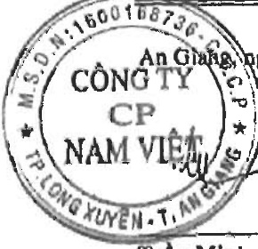

#### BÁO CÁO KẾT QUẢ HOẠT ĐỘNG KINH DOANH HỢP NHÁT Cho năm tài chính kết thúc ngày 31 tháng 12 năm 2022

Đơn vị tính: VND

<table border=1 style='margin: auto; word-wrap: break-word;'><tr><td style='text-align: center; word-wrap: break-word;'>CHỈ TIÊU</td><td style='text-align: center; word-wrap: break-word;'>Mã số</td><td style='text-align: center; word-wrap: break-word;'>Thuyết minh</td><td style='text-align: center; word-wrap: break-word;'>Năm nay</td><td style='text-align: center; word-wrap: break-word;'>Năm trước</td></tr><tr><td style='text-align: center; word-wrap: break-word;'>1. Doanh thu bán hàng và cung cấp dịch vụ</td><td style='text-align: center; word-wrap: break-word;'>01</td><td style='text-align: center; word-wrap: break-word;'>VI.1</td><td style='text-align: center; word-wrap: break-word;'>4,934,505,844,469</td><td style='text-align: center; word-wrap: break-word;'>3,504,425,921,790</td></tr><tr><td style='text-align: center; word-wrap: break-word;'>2. Các khoản giảm trừ doanh thu</td><td style='text-align: center; word-wrap: break-word;'>02</td><td style='text-align: center; word-wrap: break-word;'>VI.2</td><td style='text-align: center; word-wrap: break-word;'>37,858,804,031</td><td style='text-align: center; word-wrap: break-word;'>10,499,600,516</td></tr><tr><td style='text-align: center; word-wrap: break-word;'>3. Doanh thu thuần về bán hàng và cung cấp dịch vụ</td><td style='text-align: center; word-wrap: break-word;'>10</td><td style='text-align: center; word-wrap: break-word;'></td><td style='text-align: center; word-wrap: break-word;'>4,896,647,040,438</td><td style='text-align: center; word-wrap: break-word;'>3,493,926,321,274</td></tr><tr><td style='text-align: center; word-wrap: break-word;'>4. Giá vốn hàng bán</td><td style='text-align: center; word-wrap: break-word;'>11</td><td style='text-align: center; word-wrap: break-word;'>VI.3</td><td style='text-align: center; word-wrap: break-word;'>3,561,104,727,938</td><td style='text-align: center; word-wrap: break-word;'>2,940,612,855,979</td></tr><tr><td style='text-align: center; word-wrap: break-word;'>5. Lợi nhuận gộp về bán hàng và cung cấp dịch vụ</td><td style='text-align: center; word-wrap: break-word;'>20</td><td style='text-align: center; word-wrap: break-word;'></td><td style='text-align: center; word-wrap: break-word;'>1,335,542,312,500</td><td style='text-align: center; word-wrap: break-word;'>553,313,465,295</td></tr><tr><td style='text-align: center; word-wrap: break-word;'>6. Doanh thu hoạt động tài chính</td><td style='text-align: center; word-wrap: break-word;'>21</td><td style='text-align: center; word-wrap: break-word;'>VI.4</td><td style='text-align: center; word-wrap: break-word;'>79,671,732,816</td><td style='text-align: center; word-wrap: break-word;'>41,027,271,027</td></tr><tr><td style='text-align: center; word-wrap: break-word;'>7. Chỉ phí tài chính</td><td style='text-align: center; word-wrap: break-word;'>22</td><td style='text-align: center; word-wrap: break-word;'>VI.5</td><td style='text-align: center; word-wrap: break-word;'>188,158,406,601</td><td style='text-align: center; word-wrap: break-word;'>115,345,794,726</td></tr><tr><td style='text-align: center; word-wrap: break-word;'>Trong đó: chi phí lãi vay</td><td style='text-align: center; word-wrap: break-word;'>23</td><td style='text-align: center; word-wrap: break-word;'></td><td style='text-align: center; word-wrap: break-word;'>105,147,390,933</td><td style='text-align: center; word-wrap: break-word;'>102,959,352,877</td></tr><tr><td style='text-align: center; word-wrap: break-word;'>8. Phần lãi hoặc lỗ trong công ty liên doanh, liên kết</td><td style='text-align: center; word-wrap: break-word;'>24</td><td style='text-align: center; word-wrap: break-word;'>V.2b</td><td style='text-align: center; word-wrap: break-word;'>(54,568,646)</td><td style='text-align: center; word-wrap: break-word;'>108,341,747</td></tr><tr><td style='text-align: center; word-wrap: break-word;'>9. Chỉ phí bán hàng</td><td style='text-align: center; word-wrap: break-word;'>25</td><td style='text-align: center; word-wrap: break-word;'>VI.6</td><td style='text-align: center; word-wrap: break-word;'>378,198,470,565</td><td style='text-align: center; word-wrap: break-word;'>280,956,940,056</td></tr><tr><td style='text-align: center; word-wrap: break-word;'>10. Chỉ phí quản lý doanh nghiệp</td><td style='text-align: center; word-wrap: break-word;'>26</td><td style='text-align: center; word-wrap: break-word;'>VI.7</td><td style='text-align: center; word-wrap: break-word;'>94,215,760,513</td><td style='text-align: center; word-wrap: break-word;'>56,474,052,865</td></tr><tr><td style='text-align: center; word-wrap: break-word;'>11. Lợi nhuận thuần từ hoạt động kinh doanh</td><td style='text-align: center; word-wrap: break-word;'>30</td><td style='text-align: center; word-wrap: break-word;'></td><td style='text-align: center; word-wrap: break-word;'>754,586,838,991</td><td style='text-align: center; word-wrap: break-word;'>141,672,290,422</td></tr><tr><td style='text-align: center; word-wrap: break-word;'>12. Thu nhập khác</td><td style='text-align: center; word-wrap: break-word;'>31</td><td style='text-align: center; word-wrap: break-word;'>VI.8</td><td style='text-align: center; word-wrap: break-word;'>21,546,434,254</td><td style='text-align: center; word-wrap: break-word;'>10,150,550,944</td></tr><tr><td style='text-align: center; word-wrap: break-word;'>13. Chỉ phí khác</td><td style='text-align: center; word-wrap: break-word;'>32</td><td style='text-align: center; word-wrap: break-word;'>VI.9</td><td style='text-align: center; word-wrap: break-word;'>2,417,333,020</td><td style='text-align: center; word-wrap: break-word;'>381,477,344</td></tr><tr><td style='text-align: center; word-wrap: break-word;'>14. Lợi nhuận khác</td><td style='text-align: center; word-wrap: break-word;'>40</td><td style='text-align: center; word-wrap: break-word;'></td><td style='text-align: center; word-wrap: break-word;'>19,129,101,234</td><td style='text-align: center; word-wrap: break-word;'>9,769,073,600</td></tr><tr><td style='text-align: center; word-wrap: break-word;'>15. Tổng lợi nhuận kế toán trước thuế</td><td style='text-align: center; word-wrap: break-word;'>50</td><td style='text-align: center; word-wrap: break-word;'></td><td style='text-align: center; word-wrap: break-word;'>773,715,940,225</td><td style='text-align: center; word-wrap: break-word;'>151,441,364,022</td></tr><tr><td style='text-align: center; word-wrap: break-word;'>16. Chỉ phí thuế thu nhập doanh nghiệp hiện hành</td><td style='text-align: center; word-wrap: break-word;'>51</td><td style='text-align: center; word-wrap: break-word;'>V.17</td><td style='text-align: center; word-wrap: break-word;'>114,516,843,210</td><td style='text-align: center; word-wrap: break-word;'>21,003,885,652</td></tr><tr><td style='text-align: center; word-wrap: break-word;'>17. Chỉ phí thuế thu nhập doanh nghiệp hoản lại</td><td style='text-align: center; word-wrap: break-word;'>52</td><td style='text-align: center; word-wrap: break-word;'>V.14, V.23</td><td style='text-align: center; word-wrap: break-word;'>(14,546,137,332)</td><td style='text-align: center; word-wrap: break-word;'>1,698,280,638</td></tr><tr><td style='text-align: center; word-wrap: break-word;'>18. Lợi nhuận sau thuế thu nhập doanh nghiệp</td><td style='text-align: center; word-wrap: break-word;'>60</td><td style='text-align: center; word-wrap: break-word;'></td><td style='text-align: center; word-wrap: break-word;'>673,745,234,347</td><td style='text-align: center; word-wrap: break-word;'>128,739,197,732</td></tr><tr><td style='text-align: center; word-wrap: break-word;'>19. Lợi nhuận sau thuế của công ty mẹ</td><td style='text-align: center; word-wrap: break-word;'>61</td><td style='text-align: center; word-wrap: break-word;'></td><td style='text-align: center; word-wrap: break-word;'>673,745,234,347</td><td style='text-align: center; word-wrap: break-word;'>128,739,197,732</td></tr><tr><td style='text-align: center; word-wrap: break-word;'>20. Lợi nhuận sau thuế của cổ đông không kiểm soát</td><td style='text-align: center; word-wrap: break-word;'>62</td><td style='text-align: center; word-wrap: break-word;'></td><td style='text-align: center; word-wrap: break-word;'>-</td><td style='text-align: center; word-wrap: break-word;'>-</td></tr><tr><td style='text-align: center; word-wrap: break-word;'>21. Lãi cơ bản trên cổ phiếu</td><td style='text-align: center; word-wrap: break-word;'>70</td><td style='text-align: center; word-wrap: break-word;'>VI.9</td><td style='text-align: center; word-wrap: break-word;'>5,300</td><td style='text-align: center; word-wrap: break-word;'>1,013</td></tr><tr><td style='text-align: center; word-wrap: break-word;'>22. Lãi suy giảm trên cổ phiếu</td><td style='text-align: center; word-wrap: break-word;'>71</td><td style='text-align: center; word-wrap: break-word;'>VI.9</td><td style='text-align: center; word-wrap: break-word;'>5,300</td><td style='text-align: center; word-wrap: break-word;'>1,013</td></tr></table>

Nguyễn Hữu Thu Diễm

Người lập/Kế toán trưởng

Jăng ngày 26 tháng 3 năm 2023

Trần Minh Cảnh

Phó Tổng Giám đốc