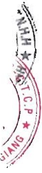

Tài sản cổ định hữu hình được khấu hao theo phương pháp đường thẳng dựa trên thời gian hữu dụng ước tính. Số năm khấu hao của các loại tài sản cổ định hữu hình như sau:

<table border=1 style='margin: auto; word-wrap: break-word;'><tr><td style='text-align: center; word-wrap: break-word;'>Tài sản cố định hữu hình được khấu hao theo phươn.</td></tr><tr><td style='text-align: center; word-wrap: break-word;'>ước tính. Số năm khấu hao của các loại tài sản cố định hữu hình như sau:</td></tr><tr><td style='text-align: center; word-wrap: break-word;'>Loại tài sản cố định</td></tr><tr><td style='text-align: center; word-wrap: break-word;'>Nhà cửa, vật kiến trúc</td></tr><tr><td style='text-align: center; word-wrap: break-word;'>Máy móc và thiết bị</td></tr><tr><td style='text-align: center; word-wrap: break-word;'>Phương tiện vận tải, truyền dẫn</td></tr><tr><td style='text-align: center; word-wrap: break-word;'>Thiết bị, dụng cụ quản lý</td></tr><tr><td style='text-align: center; word-wrap: break-word;'>Tài sản cố định hữu hình khác</td></tr></table>

### 11. Tài sản cổ định thuê tài chính

Thuê tài sản được phân loại là thuê tài chính nếu phần lớn rùi ro và lợi ích gắn liền với quyền sở hữu tài sản thuộc về người đi thuê. Tài sản cố định thuê tài chính được thể hiện theo nguyên giá trừ hao mòn lũy kế. Nguyên giá tài sản cố định thuê tài chính là giá thấp hơn giữa giá trị hợp lý của tài sản thuê tại thời điểm khởi đầu của hợp đồng thuê và giá trị hiện tại của khoản thanh toán tiền thuê tối thiếu. Tỷ lệ chiết khấu để tính giá trị hiện tại của khoản thanh toán tiền thuê tối thiểu cho việc thuê tài sản là lãi suất ngầm định trong hợp đồng thuê tài sản hoặc lãi suất ghi trong hợp đồng. Trong trường hợp không thể xác định được lãi suất ngầm định trong hợp đồng thuê thì sử dụng lãi suất tiền vay tại thời điểm khởi đầu việc thuê tài sản.

Tài sản cố định thuê tài chính được khấu hao theo phương pháp đường thẳng dựa trên thời gian hữu dụng ước tính. Trong trường hợp không chắc chắn Tập đoàn sẽ có quyền sở hữu tài sản khi hết hạn hợp đồng thuê thì tài sản cố định sẽ được khấu hao theo thời gian ngắn hơn giữa thời gian thuê và thời gian hữu dụng ước tính. Số năm khấu hao của máy móc và thiết bị thuê tài chính là 04 - 16 năm.

### 12. Tài sản cổ định vô hình

Tài sản cổ định vô hình được thể hiện theo nguyên giá trừ hao mòn lũy kế.

Nguyên giá tài sản cố định vô hình bao gồm toàn bộ các chi phí mà Tập đoàn phải bỏ ra để có được tài sản cố định tính đến thời điểm đưa tài sản đó vào trạng thái sản sáng sử dụng. Chi phí liên quan đến tài sản cố định vô hình phát sinh sau khi ghi nhận ban đầu được ghi nhận là chi phí sản xuất, kinh doanh trong kỳ trừ khi các chi phí này gắn liền với một tài sản cố định vô hình cụ thể và làm tăng lợi ích kinh tế từ các tài sản này.

Khi tài sản cố định vô hình được bán hay thanh lý, nguyên giá và giá trị hao mòn lũy kế được xóa sở và lãi, lỗ phát sinh do thanh lý được ghi nhận vào thu nhập hay chi phí trong năm.

Tài sản cố định vô hình của Tập đoàn bao gồm:

##### Quyền sử dụng đất

Quyền sử dụng đất là toàn bộ các chỉ phí thực tế Tập đoàn đã chỉ ra có liên quan trực tiếp tới đất sử dụng, bao gồm: tiền chỉ ra để có quyền sử dụng đất, chỉ phí cho đền bù, giải phóng mặt bằng, san lấp mặt bằng, lệ phí trước bạ,...

Quyền sử dụng đất của Tập đoàn được khấu hao theo phương pháp đường thẳng dựa trên thời hạn có quyền sử dụng đất, quyền sử dụng đất không thời hạn không tính khấu hao.

##### Chương trình phần mềm máy tính

Chỉ phí liên quan đến các chương trình phần mềm máy tính không phải là một bộ phận gắn kết với phần cứng có liên quan được vốn hoá. Nguyên giá của phần mềm máy tính là toàn bộ các chi phí mà Tập đoàn đã chi ra tính đến thời điểm đưa phần mềm vào sử dụng. Phần mềm máy tính được khấu hao theo phương pháp đường thẳng trong 03 - 06 năm.

