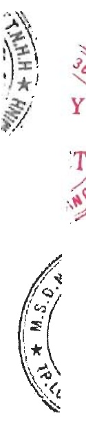

### 10. Tài sản cổ định hữu hình

Chi tiết tăng giảm tài sản cổ định hữu hình được trình bày ở phụ lục 01 đính kèm.

Một số tài sản cố định hữu hình có giá trị còn lại theo số sách là 81.902.396.115 VND (số đầu năm là 182.644.333.722 VND) đã được thể chấp đề đảm bảo cho các khoản vay của Tập đoàn tại Ngân hàng United Overseas Bank (xem thuyết minh số V.21).

### 11. Tài sản cổ định thuê tài chính

Tài sản cổ định thuê tài chính của Công ty là máy móc, thiết bị. Chi tiết phát sinh trong năm như sau:

<table border=1 style='margin: auto; word-wrap: break-word;'><tr><td style='text-align: center; word-wrap: break-word;'></td><td style='text-align: center; word-wrap: break-word;'>Nguyên giá</td><td style='text-align: center; word-wrap: break-word;'>Giá tri hao mòn</td><td style='text-align: center; word-wrap: break-word;'>Giá tri còn lai</td></tr><tr><td style='text-align: center; word-wrap: break-word;'>Số dầu năm</td><td style='text-align: center; word-wrap: break-word;'>279.980.613.422</td><td style='text-align: center; word-wrap: break-word;'>31.473.644.467</td><td style='text-align: center; word-wrap: break-word;'>248.506.968.955</td></tr><tr><td style='text-align: center; word-wrap: break-word;'>Thuê tài chính trong năm</td><td style='text-align: center; word-wrap: break-word;'>59.506.432.420</td><td style='text-align: center; word-wrap: break-word;'></td><td style='text-align: center; word-wrap: break-word;'></td></tr><tr><td style='text-align: center; word-wrap: break-word;'>Mua tại tài sản có định thuê tài chính</td><td style='text-align: center; word-wrap: break-word;'>(46.120.878.534)</td><td style='text-align: center; word-wrap: break-word;'>(16.452.160.899)</td><td style='text-align: center; word-wrap: break-word;'></td></tr><tr><td style='text-align: center; word-wrap: break-word;'>Khẩu hao trong năm</td><td style='text-align: center; word-wrap: break-word;'></td><td style='text-align: center; word-wrap: break-word;'>24.384.498.250</td><td style='text-align: center; word-wrap: break-word;'></td></tr><tr><td style='text-align: center; word-wrap: break-word;'>Số cuối năm</td><td style='text-align: center; word-wrap: break-word;'>293.366.167.308</td><td style='text-align: center; word-wrap: break-word;'>39.405.981.818</td><td style='text-align: center; word-wrap: break-word;'>253.960.185.490</td></tr></table>

### 12. Tài sản cổ định vô hình

<table border=1 style='margin: auto; word-wrap: break-word;'><tr><td style='text-align: center; word-wrap: break-word;'></td><td style='text-align: center; word-wrap: break-word;'>Quyên sử dụng đất</td><td style='text-align: center; word-wrap: break-word;'>Chương trình phân mềm máy tính</td><td style='text-align: center; word-wrap: break-word;'>Cộng</td></tr><tr><td style='text-align: center; word-wrap: break-word;'>Nguyên giá</td><td style='text-align: center; word-wrap: break-word;'>262.740.980.486</td><td style='text-align: center; word-wrap: break-word;'>280.991.000</td><td style='text-align: center; word-wrap: break-word;'>263.021.971.486</td></tr><tr><td style='text-align: center; word-wrap: break-word;'>Số dầu năm</td><td style='text-align: center; word-wrap: break-word;'>112.790.036.704</td><td style='text-align: center; word-wrap: break-word;'>-</td><td style='text-align: center; word-wrap: break-word;'>112.790.036.704</td></tr><tr><td style='text-align: center; word-wrap: break-word;'>Mua trong năm</td><td style='text-align: center; word-wrap: break-word;'>(171.558.033)</td><td style='text-align: center; word-wrap: break-word;'>-</td><td style='text-align: center; word-wrap: break-word;'>(171.558.033)</td></tr><tr><td style='text-align: center; word-wrap: break-word;'>Giám do Nhà nước thu hồi</td><td style='text-align: center; word-wrap: break-word;'>375.359.459.157</td><td style='text-align: center; word-wrap: break-word;'>280.991.000</td><td style='text-align: center; word-wrap: break-word;'>375.640.450.157</td></tr><tr><td style='text-align: center; word-wrap: break-word;'>Số cuối năm</td><td style='text-align: center; word-wrap: break-word;'>643.380.000</td><td style='text-align: center; word-wrap: break-word;'>280.991.000</td><td style='text-align: center; word-wrap: break-word;'>924.371.000</td></tr><tr><td style='text-align: center; word-wrap: break-word;'>Trong đó:</td><td style='text-align: center; word-wrap: break-word;'></td><td style='text-align: center; word-wrap: break-word;'></td><td style='text-align: center; word-wrap: break-word;'></td></tr><tr><td style='text-align: center; word-wrap: break-word;'>Đã khấu hao hết nhưng vẫn còn sử dụng</td><td style='text-align: center; word-wrap: break-word;'>18.503.161.605</td><td style='text-align: center; word-wrap: break-word;'>280.991.000</td><td style='text-align: center; word-wrap: break-word;'>18.784.152.605</td></tr><tr><td style='text-align: center; word-wrap: break-word;'>Khẩu hao trong năm</td><td style='text-align: center; word-wrap: break-word;'>4.617.252.532</td><td style='text-align: center; word-wrap: break-word;'>-</td><td style='text-align: center; word-wrap: break-word;'>4.617.252.532</td></tr><tr><td style='text-align: center; word-wrap: break-word;'>Số cuối năm</td><td style='text-align: center; word-wrap: break-word;'>23.120.414.137</td><td style='text-align: center; word-wrap: break-word;'>280.991.000</td><td style='text-align: center; word-wrap: break-word;'>23.401.405.137</td></tr><tr><td style='text-align: center; word-wrap: break-word;'>Giá trị còn lại</td><td style='text-align: center; word-wrap: break-word;'>244.237.818.881</td><td style='text-align: center; word-wrap: break-word;'>-</td><td style='text-align: center; word-wrap: break-word;'>244.237.818.881</td></tr><tr><td style='text-align: center; word-wrap: break-word;'>Số dầu năm</td><td style='text-align: center; word-wrap: break-word;'>352.239.045.020</td><td style='text-align: center; word-wrap: break-word;'>-</td><td style='text-align: center; word-wrap: break-word;'>352.239.045.020</td></tr><tr><td style='text-align: center; word-wrap: break-word;'>Trong đó:</td><td style='text-align: center; word-wrap: break-word;'></td><td style='text-align: center; word-wrap: break-word;'></td><td style='text-align: center; word-wrap: break-word;'></td></tr><tr><td style='text-align: center; word-wrap: break-word;'>Tạm thời không sử dụng Đang chờ thanh lý</td><td style='text-align: center; word-wrap: break-word;'>-</td><td style='text-align: center; word-wrap: break-word;'>-</td><td style='text-align: center; word-wrap: break-word;'>-</td></tr></table>

Một số tài sản cố định vô hình có giá trị còn lại theo số sách là 101.395.819.859 VND (số đầu năm là 103.664.809.048 VND) đã được thể chấp để đảm bảo cho các khoản vay của Tập đoàn tại Ngân hàng TMCP Sài Gòn Hà Nội, Ngân hàng TMCP Ngoại thương Việt Nam và Ngân hàng TMCP Đầu tư và Phát triển Việt Nam (xem thuyết minh số V.21).

