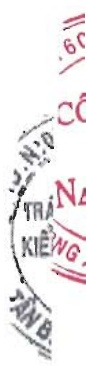

(*) Các thành viên chủ chốt này được miễn nhiệm từ ngày 30 tháng 6 năm 2021 nên công bố giao dịch chi trong 6 tháng đầu năm 2021.

Cam kết báo lãnh

ng Doãn Tói dùng tài sản cá nhân để bảo đảm cho khoản vay của Tập đoàn tại Ngân hàng United Overseas Bank (xem thuyết minh số V.21).

Công nợ với các thành viên quản lý chủ chốt và các cá nhân có liên quan với các thành viên quản lý chủ chốt

Công ngữ với các thành viên quản lý chủ chốt và các cá nhân có liên quan với các thành viên quản lý chủ chốt được trình bày tại các thuyết minh số V.15, V.19, V.20 và V.21a.

Thu nhập của các thành viên quản lý chủ chốt và Ban kiếm toàn nội bộ

<table border=1 style='margin: auto; word-wrap: break-word;'><tr><td style='text-align: center; word-wrap: break-word;'>Năm nay</td><td style='text-align: center; word-wrap: break-word;'>Công tụu nhập</td></tr><tr><td style='text-align: center; word-wrap: break-word;'>Ông Đỗ Lập Nghiệp – Chủ tịch Hội đồng quản trị kiểm Phó Tổng Giám Đốc</td><td style='text-align: center; word-wrap: break-word;'>717.466.358</td></tr><tr><td style='text-align: center; word-wrap: break-word;'>Ông Doản Tới – Phó Chủ tịch Hội đồng quản trị kiểm Tổng Giám đốc</td><td style='text-align: center; word-wrap: break-word;'>354.926.158</td></tr><tr><td style='text-align: center; word-wrap: break-word;'>Bà Dương Thị Kim Hương – Phó Tổng Giám đốc</td><td style='text-align: center; word-wrap: break-word;'>113.397.531</td></tr><tr><td style='text-align: center; word-wrap: break-word;'>Ông Trần Minh Cảnh – Thành viên Hội đồng quản trị kiểm Phó Tổng Giám đốc</td><td style='text-align: center; word-wrap: break-word;'>791.134.897</td></tr><tr><td style='text-align: center; word-wrap: break-word;'>Ông Nguyễn Văn Vỹ – Phó Tổng Giám đốc</td><td style='text-align: center; word-wrap: break-word;'>582.443.323</td></tr><tr><td style='text-align: center; word-wrap: break-word;'>Ông Nguyễn Thanh Liêm – Phó Tổng Giám đốc - Bồ nhiệm ngày 09/03/2022</td><td style='text-align: center; word-wrap: break-word;'>435.322.731</td></tr><tr><td style='text-align: center; word-wrap: break-word;'>Ông Nguyễn Văn Dương - Giám Đốc Tài Chính - Bồ nhiệm ngày 21/03/2022</td><td style='text-align: center; word-wrap: break-word;'>414.466.748</td></tr><tr><td style='text-align: center; word-wrap: break-word;'>Bà Đỗ Thị Thanh Thùy - Thành viên Hội đồng quản trị kiểm thành viên ủy ban kiểm</td><td rowspan="2">516.163.731</td></tr><tr><td style='text-align: center; word-wrap: break-word;'>toán - Bồ nhiệm TV HDQT ngày 11/06/2022</td></tr><tr><td style='text-align: center; word-wrap: break-word;'>Bà Huỳnh Thị Kim Thoa - Giám đốc tài chính kiểm Kế toàn trường - Miễn nhiệm ngày</td><td rowspan="2">171.963.680</td></tr><tr><td style='text-align: center; word-wrap: break-word;'>21/03/2022</td></tr><tr><td style='text-align: center; word-wrap: break-word;'>Bà Nguyễn Hà Thu Diễm - Kế toàn trường - Bồ nhiệm ngày 21/03/2022</td><td style='text-align: center; word-wrap: break-word;'>478.414.173</td></tr><tr><td style='text-align: center; word-wrap: break-word;'>Bà Nguyễn Thị Minh Ý - Thành viên độc lập kiểm Chủ tịch ủy ban kiểm toán</td><td style='text-align: center; word-wrap: break-word;'>120.000.000</td></tr></table>

Bản thuyết minh này là một bộ phận hợp thành và phải được cứng với Báo cáo tài chính hợp nhất

