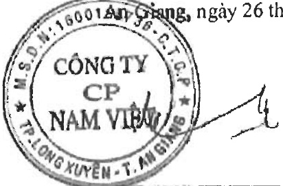

Giá hàng hóa, dịch vụ cung cấp cho các bên liên quan khác là giá thỏa thuận. Việc mua hàng hóa, dịch vụ từ các bên liên quan khác được thực hiện theo giá thỏa thuận.

Công nợ với các bên liên quan khác

Công nợ với các bên liên quan khác được trình bày tại các thuyết minh số V.3, V.4, V.6, V.15 và V16.

##### Thông tin về bộ phận

Thông tin bộ phận được trình bày theo lĩnh vực kinh doanh và khu vực địa lý. Báo cáo bộ phận chính yếu là theo khu vực địa lý dựa trên cơ cấu tổ chức và quản lý nội bộ và hệ thống Báo cáo tài chính nội bộ của Tập đoàn.

### 2a. Thông tin về khu vực địa lý

Chi tiết doanh thu thuần về bán hàng và cung cấp dịch vụ ra bên ngoài theo khu vực địa lý dựa trên vị trí của khách hàng như sau:

<table border=1 style='margin: auto; word-wrap: break-word;'><tr><td style='text-align: center; word-wrap: break-word;'></td><td style='text-align: center; word-wrap: break-word;'>Nam nay</td><td style='text-align: center; word-wrap: break-word;'>Nam trước</td></tr><tr><td style='text-align: center; word-wrap: break-word;'>Xuất khẩu</td><td style='text-align: center; word-wrap: break-word;'>3.419.425.721.133</td><td style='text-align: center; word-wrap: break-word;'>2.390.892.068.871</td></tr><tr><td style='text-align: center; word-wrap: break-word;'>Trong nước</td><td style='text-align: center; word-wrap: break-word;'>1.477.221.319.305</td><td style='text-align: center; word-wrap: break-word;'>1.103.034.252.403</td></tr><tr><td style='text-align: center; word-wrap: break-word;'>Cộng</td><td style='text-align: center; word-wrap: break-word;'>4.896.647.040.438</td><td style='text-align: center; word-wrap: break-word;'>3.493.926.321.274</td></tr></table>

Tập đoàn không thực hiện theo dõi các thông tin về kết quả kinh doanh, tài sản cổ định và các tài sản dài hạn khác và giá trị các khoản chỉ phí lớn không bằng tiền của bộ phận theo khu vực địa lý dựa trên vị trí của khách hàng.

### 2b. Thông tin về lĩnh vực kinh doanh

Hoạt động của Tập đoàn chủ yếu nằm trong một lĩnh vực kinh doanh chính là sản xuất chế biến thủy sản chiếm tỷ lệ 96% trên tổng doanh thu của Tập đoàn (năm trước 96%).

### 3. Sự kiện phát sinh sau ngày kết thúc năm tài chính

Trong giai đoạn từ ngày 31 tháng 01 năm 2023 đến ngày 28 tháng 02 năm 2023, Tập đoàn đã phát hành thành công 6.000.000 cổ phiếu phổ thông theo chương trình lựa chọn người lao động (ESOP) cho 54 cán bộ công nhân viên Tập đoàn với giá bán là 10.000 VND/cổ phiếu.

Ngoài sự kiện nêu trên, không có sự kiện trọng yếu nào khác phát sinh sau ngày kết thúc năm tài chính yếu cầu phải điều chỉnh số liệu hoặc công bố trên Báo cáo tài chính hợp nhất.

Nguyễn Hà Thu Diểm

Người lập/Kế toán trưởng

Trần Minh Cảnh

Phó Tổng Giám đốc