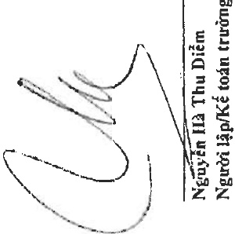
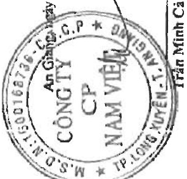

Địa chỉ: 19D Trần Hưng Đạo, Phường Mỹ Quý, TP. Long Xuyên, Tinh An Giang

BẢO CẢO TÀI CHÍNH HOP NHẬT

Don vi tinh: VND

Cho năm tài chính kết thúc ngày 31 tháng 12 năm 2022

Phụ lục 01: Băng tăng, giảm tải sản cổ định hữu hình

Nguyên giá

Số đâu năm

Đầu tư xây dựng cơ bản hoàn thành

Mua lại tài sản cổ định thuê tài chính

Thanh lý, nhượng bản

Nha của, May móc Rương tiến 1 miết bị. Tân sân cổ omu vật kiến trúc và thiết bị vận tải, truyền đản dụng cụ quản lý hữu hình khác Cộng

369.579.321.547 964.681.400.330 131.375.578.874 14.478.832.340 103.909.144.638 1.584.024.277.729

1.000.236.046 37.431.108.803 6.208.658.541 2.485.585.437 2.517.145.455 48.642.498.236

919.503.792 5.198.534.568 1.165.851.022 8.284.125.428

46.120.878.534 46.120.878.534 46.120.878.534

(86.752.532.566) (452.068.409) 107.592.141.115 1.599.867.178.952

370.579.557.593 962.400.358.893 142.330.703.574 16.964.417.777

Đã khâu hao hết nhưng vẫn còn sử dụng

Chờ thanh lý

Khâu hao trong năm

Mua lại tài sản cổ định thuê tài chính

Thanh lý, nhượng bản

Số cuối năm

11.845.577.122

73.974.620.844

62.408.869.176

306.808.937.544

61.590.062.000

59.958.685.920

5.118.840.655

3.832.942.479

68.050.468.128

61.600.795.806

553.401.717.110

Tạm thời chưa sử dụng

Dang chờ thanh lý

An Găng (or "An Găng" ) may be 26 tháng 3 năm 2023

Phó Tổng Giám đốc