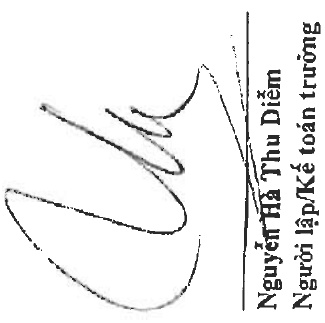
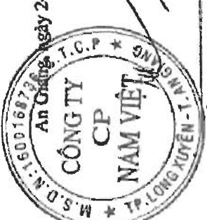

Địa chỉ: 19D Trần Hưng Đạo, Phường Mỹ Quý, TP. Long Xuyên, Tình An Giang

BẢO CÁO TÀI CHÍNH HỢP NHẬT

Cho năm tài chính kết thúc ngày 31 tháng 12 năm 2022

Phụ lục 02: Băng tăng, giảm vay và ngư thuê tài chính ngắn hạn

Vay ngắn hạn ngân hàng

Vay ngắn hạn các tỗ chức khác

<table border=1 style='margin: auto; word-wrap: break-word;'><tr><td style='text-align: center; word-wrap: break-word;'>Sô tiền vay phát sinh</td><td colspan="3">Kết chuyên từ vay</td><td colspan="3">Sô tiền vay đã trả</td></tr><tr><td style='text-align: center; word-wrap: break-word;'>Số đầu năm</td><td style='text-align: center; word-wrap: break-word;'>trong năm</td><td style='text-align: center; word-wrap: break-word;'>và nợ dài hạn</td><td style='text-align: center; word-wrap: break-word;'>Chênh lệch tỷ giá</td><td style='text-align: center; word-wrap: break-word;'>trong năm</td><td colspan="2">Số cuối năm</td></tr><tr><td style='text-align: center; word-wrap: break-word;'>1.239.577.442.880</td><td style='text-align: center; word-wrap: break-word;'>4.548.066.249.144</td><td style='text-align: center; word-wrap: break-word;'>-</td><td style='text-align: center; word-wrap: break-word;'>(6.527.261.640)</td><td style='text-align: center; word-wrap: break-word;'>(4.383.227.431.018)</td><td colspan="2">1.397.888.999.366</td></tr><tr><td style='text-align: center; word-wrap: break-word;'>5.733.808.210</td><td style='text-align: center; word-wrap: break-word;'>3.760.000.000</td><td style='text-align: center; word-wrap: break-word;'>-</td><td style='text-align: center; word-wrap: break-word;'>-</td><td style='text-align: center; word-wrap: break-word;'>(3.920.000.000)</td><td colspan="2">5.573.808.210</td></tr><tr><td style='text-align: center; word-wrap: break-word;'>525.410.473.400</td><td style='text-align: center; word-wrap: break-word;'>157.800.000.000</td><td style='text-align: center; word-wrap: break-word;'>-</td><td style='text-align: center; word-wrap: break-word;'>-</td><td style='text-align: center; word-wrap: break-word;'>(377.313.550.000)</td><td colspan="2">305.896.923.400</td></tr><tr><td style='text-align: center; word-wrap: break-word;'>19.101.519.996</td><td style='text-align: center; word-wrap: break-word;'>-</td><td style='text-align: center; word-wrap: break-word;'>9.999.999.996</td><td style='text-align: center; word-wrap: break-word;'>-</td><td style='text-align: center; word-wrap: break-word;'>(19.101.519.996)</td><td colspan="2">9.999.999.996</td></tr><tr><td style='text-align: center; word-wrap: break-word;'>47.690.218.189.</td><td style='text-align: center; word-wrap: break-word;'>-</td><td style='text-align: center; word-wrap: break-word;'>55.347.826.849</td><td style='text-align: center; word-wrap: break-word;'>-</td><td style='text-align: center; word-wrap: break-word;'>(53.150.450.659)</td><td colspan="2">49.887.594.379</td></tr><tr><td style='text-align: center; word-wrap: break-word;'>1.837.513.462.675</td><td style='text-align: center; word-wrap: break-word;'>4.709.626.249.144</td><td style='text-align: center; word-wrap: break-word;'>65.347.826.845</td><td style='text-align: center; word-wrap: break-word;'>(6.527.261.640)</td><td style='text-align: center; word-wrap: break-word;'>(4.836.712.951.673)</td><td colspan="2">1.769.247.325.351</td></tr></table>

Vay ngắn hạn các cá nhân

Trái phiếu thường ngắn hạn

Vay dài hạn đến hạn trả

Nợ thuê tài chính đến hạn trả

Nói phiếu thương dài hạn đến hạn trà

An Găng ngày 26 tháng 3 năm 2023

316

NG

CF

MV

YEN

