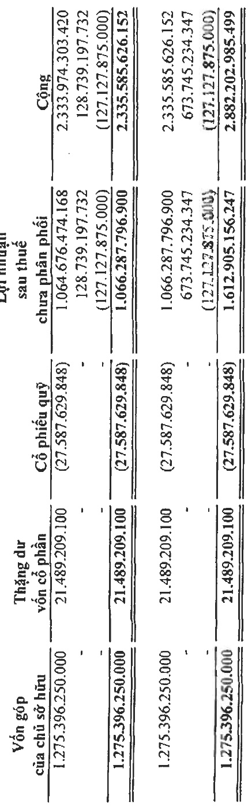
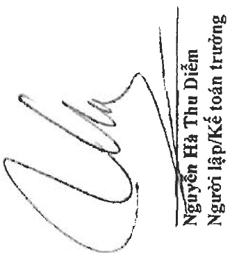
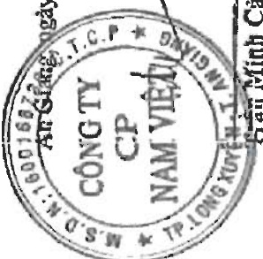
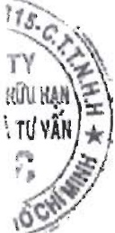

Địa chỉ: 19D Trần Hưng Đạo, Phường Mỹ Quý, TP. Long Xuyên, Tinh An Giang

BẢO CÁO TÀI CHÍNH HOP NHẤT

Cho năm tài chính kết thúc ngày 31 tháng 12 năm 2022

Phụ lục 03: Bảng đối chiếu biến động của vốn chủ sở hữu

Don vi tính: VND

Số dư đâu năm trước

Lợi nhuận trong năm trước

Chia cổ tức, lợi nhuận trong năm trước

Số dư cuối năm trước

Sô du đâu năm nay

Lợi nhuận trong năm nay

Chia cổ tục, lợi nhuận trong năm nay

Số dư cuối năm nay

Phú Minh Cảnh

Phó Tổng Giám độc

