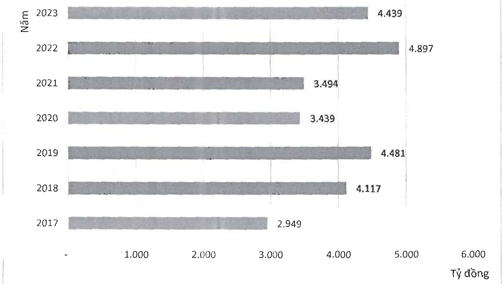
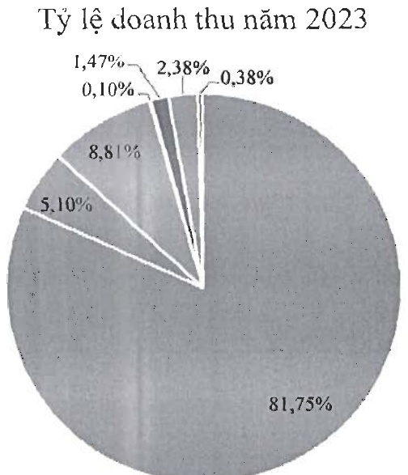

d- Biểu đồ cơ cấu doanh thu năm 2023:

Thành phẩm động lưu : Thành phẩm chá cá

Phụ Phẩm

Thức ăn

- Cá nguyên liệu

Điện mặt trời

- Khác

e- Về cơ cấu chi phí hoạt động

<table border=1 style='margin: auto; word-wrap: break-word;'><tr><td style='text-align: center; word-wrap: break-word;'>STT</td><td style='text-align: center; word-wrap: break-word;'>Doanh Thu</td><td style='text-align: center; word-wrap: break-word;'>Loại tiền</td><td style='text-align: center; word-wrap: break-word;'>Tỷ lệ 2022</td><td style='text-align: center; word-wrap: break-word;'>Tỷ lệ 2023</td></tr><tr><td style='text-align: center; word-wrap: break-word;'>1</td><td style='text-align: center; word-wrap: break-word;'>Giá vốn</td><td style='text-align: center; word-wrap: break-word;'>VND</td><td style='text-align: center; word-wrap: break-word;'>84,35%</td><td style='text-align: center; word-wrap: break-word;'>90,29%</td></tr><tr><td style='text-align: center; word-wrap: break-word;'>2</td><td style='text-align: center; word-wrap: break-word;'>CP bán hàng</td><td style='text-align: center; word-wrap: break-word;'>VND</td><td style='text-align: center; word-wrap: break-word;'>8,96%</td><td style='text-align: center; word-wrap: break-word;'>4,27%</td></tr></table>