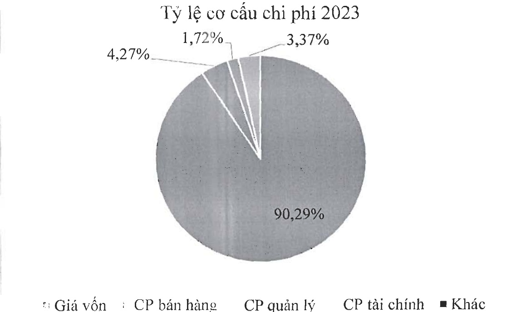

<table border=1 style='margin: auto; word-wrap: break-word;'><tr><td style='text-align: center; word-wrap: break-word;'>3</td><td style='text-align: center; word-wrap: break-word;'>CP quản lý</td><td style='text-align: center; word-wrap: break-word;'>VND</td><td style='text-align: center; word-wrap: break-word;'>2,23%</td><td style='text-align: center; word-wrap: break-word;'>1,71%</td></tr><tr><td style='text-align: center; word-wrap: break-word;'>4</td><td style='text-align: center; word-wrap: break-word;'>CP tài chính</td><td style='text-align: center; word-wrap: break-word;'>VND</td><td style='text-align: center; word-wrap: break-word;'>4,45%</td><td style='text-align: center; word-wrap: break-word;'>3,73%</td></tr><tr><td style='text-align: center; word-wrap: break-word;'>5</td><td style='text-align: center; word-wrap: break-word;'>Khác</td><td style='text-align: center; word-wrap: break-word;'>VND</td><td style='text-align: center; word-wrap: break-word;'>0.01%</td><td style='text-align: center; word-wrap: break-word;'></td></tr><tr><td style='text-align: center; word-wrap: break-word;'></td><td style='text-align: center; word-wrap: break-word;'>Tổng cộng VND</td><td style='text-align: center; word-wrap: break-word;'></td><td style='text-align: center; word-wrap: break-word;'>100%</td><td style='text-align: center; word-wrap: break-word;'>100%</td></tr></table>

Giá vốn hàng bán vẫn là khoản mục chiếm tỷ trọng cao nhất trong cơ cấu chi phí của Navico. Chỉ phí giá vốn hàng bán trong năm 2023 chiếm 90,29% tổng chi phí

- Biểu đồ cơ cấu chi phí hoạt động của Navico

#### 1.2 Tình hình tài chính

##### a- Tình hình tài sản:

Tính đến 31/12/2023, giá trị tổng tài sản đạt 5.112 tỷ đồng, giảm 6,5 % so với năm 2022. Tỷ trọng tài sản ngắn hạn chiếm 57,7% so với tổng tài sản, thay đổi không đáng kể so với năm 2022.

Trong cơ cấu tài sản ngắn hạn, hàng tồn kho của Công ty chiếm tỷ trọng lớn nhất, tương đương 79,5%, tiếp đến là các khoản phải thu ngắn hạn chiếm 12,4%.

Đối với tài sản dài hạn, tài sản cố định là khoản mục chiếm tỷ trọng cao nhất, đạt 47,6%. Ngoài ra, các khoản tài sản dở dang dài hạn và mục đâu tư tài chính dài hạn cũng chiếm phần lớn trong cơ cấu tài sản dài hạn, tương ứng 42,3% và 3,3%.

Các chỉ tiêu về năng lực hoạt động của Navico trong năm 2023 thay đổi không đáng kể so với năm 2022, trong đó:

Vòng quay tổng tài sản từ 0,95 thành 0,84 vòng.

Vòng quay hàng tồn kho từ 1,73 thành 1,71 vòng.