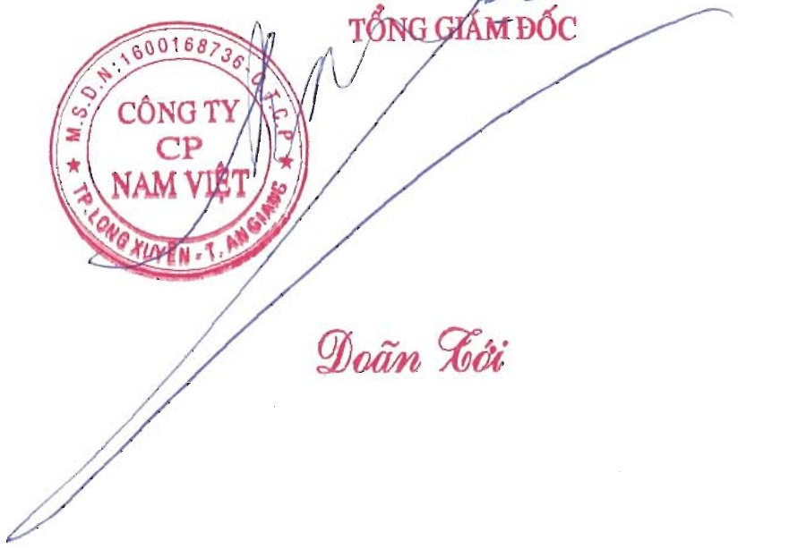

d. Đánh giá việc thực hiện các quy định về quản trị công ty: Về quản trị Công ty thực hiện theo các Quy định của pháp luật, luôn công khai, minh bạch, có hiệu quả.

F.BÁO CÁO TÀI CHÍNH

(Được trình bày ở phụ lục đính kèm)

# XÁC NHẬN CỦA ĐẠI DIỆN THEO PHÁP LUẬT CỦA CÔNG TY (Ký, ghi rõ họ tên, đóng dấu)

Doãn Kôi

PHỤ LỤC BÁO CÁO TÀI CHÍNH (Báo cáo tài chính hợp nhất 2023, đã được kiểm toán)

