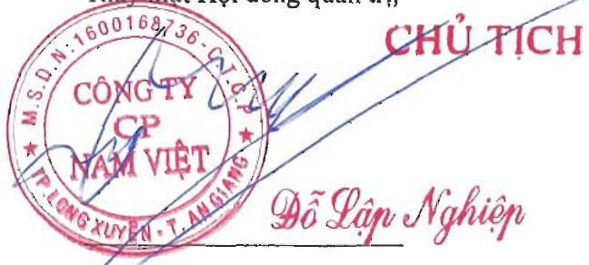

Ban Tổng Giám đốc đảm bảo các số kế toán thích hợp được lưu giữ đầy đủ để phản ánh tính hình tài chính của Tập đoàn với mức độ chính xác hợp lý tại bất kỳ thời điểm nào và các số sách kế toán tuân thủ chế độ kế toán áp dụng. Ban Tổng Giám đốc cũng chịu trách nhiệm bảo vệ an toàn tài sản của Tập đoàn và do đó đã thực hiện các biện pháp thích hợp để ngăn chặn và phát hiện các hành vi gian lận và các vị phạm khác.

Ban Tổng Giám đốc cam kết đã tuân thủ các yêu cầu nêu trên trong việc lập Báo cáo tài chính hợp nhất.

##### Phê duyệt Báo cáo tài chính

Hội đồng quản trị Công ty phê duyệt Báo cáo tài chính hợp nhất đính kèm. Báo cáo tài chính hợp nhất đã phản ánh trung thực và hợp lý tình hình tài chính hợp nhất của Tập đoàn tại thời điểm ngày 31 tháng 12 năm 2023, cũng như kết quả hoạt động kinh doanh hợp nhất và tình hình lưu chuyển tiền tệ hợp nhất cho năm tài chính kết thúc cùng ngày, phù hợp với các chuẩn mực kế toán Việt Nam, Chế độ Kế toán doanh nghiệp Việt Nam và các quy định pháp lý có liên quan đến việc lập và trình bày Báo cáo tài chính hợp nhất.

Thay mặt Hội đồng quản trị,

Ngày 29 tháng 3 năm 2024

