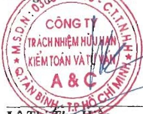

Tel: +84 (028) 3547 2972 kttv@a-c.com.vn

Tel: +84 (024) 3736 7879 kttv.hn@a-c.com.vn

Tel: +84 (0258) 246 5151 kttv.nt@a-c.com.vn

Tel: +84 (0292) 376 4995 kttv.ct@a-c.com.vn

www.a-c.com.vn

Số: 1.0832/24/TC-AC

# BÁO CÁO KIỂM TOÁN ĐỘC LẬP

## Kinh gửi: CÁC CÓ ĐÔNG, HỘI ĐÔNG QUẢN TRỊ VÀ BAN TỔNG GIÁM ĐỐC CÔNG TY CỐ PHÀN NAM VIỆT

Chúng tôi đã kiểm toán Báo cáo tài chính hợp nhất kèm theo của Công ty Cổ phần Nam Việt (sau đây gọi tắt là "Công ty") và các công ty con (gọi chung là "Tập đoàn"), được lập ngày 29 tháng 3 năm 2024, từ trang 06 đến trang 47, bao gồm Bảng cân đối kế toán hợp nhất tại ngày 31 tháng 12 năm 2023, Báo cáo kết quả hoạt động kinh doanh hợp nhất, Báo cáo lưu chuyển tiền tệ hợp nhất cho năm tài chính kết thúc cùng ngày và Bản thuyết minh Báo cáo tài chính hợp nhất.

##### Trách nhiệm của Ban Tổng Giám đốc

Ban Tổng Giám độc Công ty chịu trách nhiệm về việc lập và trình bày trung thực và hợp lý Báo cáo tài chính hợp nhất của Tập đoàn theo các chuẩn mực kế toán Việt Nam, Chế độ Kế toán doanh nghiệp Việt Nam và các quy định pháp lý có liên quan đến việc lập và trình bày Báo cáo tài chính hợp nhất và chịu trách nhiệm về kiểm soát nội bộ mà Ban Tổng Giám độc xác định là cần thiết để đảm bảo cho việc lập và trình bày Báo cáo tài chính hợp nhất không có sai sót trọng yếu do gian lận hoặc nhầm lẫn.

##### Trách nhiệm của Kiểm toán viên

Trách nhiệm của chúng tôi là đưa ra ý kiến về Báo cáo tài chính hợp nhất dựa trên kết quả của cuộc kiểm toán. Chúng tôi đã tiến hành kiểm toán theo các chuẩn mực kiểm toán Việt Nam. Các chuẩn mực này yêu cầu chúng tôi tuân thủ chuẩn mực và các quy định về đạo đức nghề nghiệp, lập kế hoạch và thực hiện cuộc kiểm toán để đạt được sự đảm bảo hợp lý về việc liệu Báo cáo tài chính hợp nhất của Tập đoàn có còn sai sót trọng yếu hay không.

Công việc kiểm toán bao gồm thực hiện các thủ tục nhằm thu thập các bằng chứng kiểm toán về các số liệu và thuyết minh trên Báo cáo tài chính hợp nhất. Các thủ tục kiểm toán được lựa chọn dựa trên xét đoán của kiểm toán viên, bao gồm đánh giá rủi ro có sai sót trọng yếu trong Báo cáo tài chính hợp nhất do gian lận hoặc nhằm lẫn. Khi thực hiện đánh giá các rủi ro này, kiểm toán viên đã xem xét kiểm soát nội bộ của Tập đoàn liên quan đến việc lập và trình bày Báo cáo tài chính hợp nhất trung thực, hợp lý nhằm thiết kế các thủ tục kiểm toán phù hợp với tình hình thực tế, tuy nhiên không nhằm mục đích đưa ra ý kiến về hiệu quả của kiểm soát nội bộ của Tập đoàn. Công việc kiểm toán cũng bao gồm đánh giá tính thích hợp của các chính sách kế toán được áp dụng và tính hợp lý của các ước tính kế toán của Ban Tổng Giám đốc cũng như đánh giá việc trình bày tổng thể Báo cáo tài chính hợp nhất.

Chúng tôi tin tưởng rằng các bằng chứng kiểm toán mà chúng tôi đã thu thập được là dày đủ và thích hợp để làm cơ sở cho ý kiến kiểm toán của chúng tôi.

##### Ý kiến của Kiểm toán viên

Theo ý kiến của chúng tôi, Báo cáo tài chính hợp nhất đã phản ánh trung thực và hợp lý, trên các khía cạnh trọng yếu tinh hình tài chính hợp nhất của Tập đoàn tại ngày 31 tháng 12 năm 2023, cũng như kết quả hoạt động kinh doanh hợp nhất và tình hình lưu chuyển tiền tệ hợp nhất cho năm tài chính kết thúc cùng ngày, phù hợp với các chuẩn mực kế toán Việt Nam, Chế độ Kế toán doanh nghiệp Việt Nam và các quy định pháp lý có liên quan đến việc lập và trình bày Báo cáo tài chính hợp nhất.

Công ty NHỮ KIỂM TOÁN VÀ TỪ VĂN A&C

Lê Thị Thọ Hiên

Thành viên Ban Giám đốc

Số Giấy CND KHN kiêm toán: 0095-2023-008-1

Người được ủy quyền

TP. Hồ Chí Minh, ngày 29 tháng 3 năm 2024

Nguyễn Thị Ngọc Quỳnh

Kiểm toán viên

Số Giấy CNDKHẢN kiểm toán: 0327-2023-008-1

