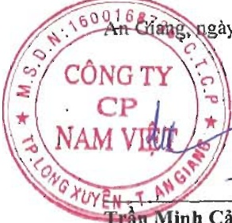

#### CÔNG TY CỔ PHẦN NAM VIỆT

<table border=1 style='margin: auto; word-wrap: break-word;'><tr><td style='text-align: center; word-wrap: break-word;'>CHỈ TIÊU</td><td style='text-align: center; word-wrap: break-word;'>Mã số</td><td style='text-align: center; word-wrap: break-word;'>Thuyết minh</td><td style='text-align: center; word-wrap: break-word;'>Số cuối năm</td><td style='text-align: center; word-wrap: break-word;'>Số đầu năm</td></tr><tr><td style='text-align: center; word-wrap: break-word;'>D-</td><td style='text-align: center; word-wrap: break-word;'>VÓN CHỮ SỞ HỮU</td><td style='text-align: center; word-wrap: break-word;'>400</td><td style='text-align: center; word-wrap: break-word;'>2.847.866.755.609</td><td style='text-align: center; word-wrap: break-word;'>2.882.202.985.499</td></tr><tr><td style='text-align: center; word-wrap: break-word;'>I.</td><td style='text-align: center; word-wrap: break-word;'>Vốn chủ sở hữu</td><td style='text-align: center; word-wrap: break-word;'>410</td><td style='text-align: center; word-wrap: break-word;'>2.847.866.755.609</td><td style='text-align: center; word-wrap: break-word;'>2.882.202.985.499</td></tr><tr><td style='text-align: center; word-wrap: break-word;'>1.</td><td style='text-align: center; word-wrap: break-word;'>Vốn góp của chủ sở hữu</td><td style='text-align: center; word-wrap: break-word;'>411</td><td style='text-align: center; word-wrap: break-word;'>V.24</td><td style='text-align: center; word-wrap: break-word;'>1.275.396.250.000</td></tr><tr><td style='text-align: center; word-wrap: break-word;'>-</td><td style='text-align: center; word-wrap: break-word;'>Cổ phiếu phổ thông có quyền biểu quyết</td><td style='text-align: center; word-wrap: break-word;'>411a</td><td style='text-align: center; word-wrap: break-word;'>1.335.396.250.000</td><td style='text-align: center; word-wrap: break-word;'>1.275.396.250.000</td></tr><tr><td style='text-align: center; word-wrap: break-word;'>-</td><td style='text-align: center; word-wrap: break-word;'>Cổ phiếu ưu đãi</td><td style='text-align: center; word-wrap: break-word;'>411b</td><td style='text-align: center; word-wrap: break-word;'>-</td><td style='text-align: center; word-wrap: break-word;'>-</td></tr><tr><td style='text-align: center; word-wrap: break-word;'>2.</td><td style='text-align: center; word-wrap: break-word;'>Thăng dư vốn cổ phần</td><td style='text-align: center; word-wrap: break-word;'>412</td><td style='text-align: center; word-wrap: break-word;'>V.24</td><td style='text-align: center; word-wrap: break-word;'>21.489.209.100</td></tr><tr><td style='text-align: center; word-wrap: break-word;'>3.</td><td style='text-align: center; word-wrap: break-word;'>Quyền chọn chuyển đổi trái phiếu</td><td style='text-align: center; word-wrap: break-word;'>413</td><td style='text-align: center; word-wrap: break-word;'>-</td><td style='text-align: center; word-wrap: break-word;'>-</td></tr><tr><td style='text-align: center; word-wrap: break-word;'>4.</td><td style='text-align: center; word-wrap: break-word;'>Vốn khác của chủ sở hữu</td><td style='text-align: center; word-wrap: break-word;'>414</td><td style='text-align: center; word-wrap: break-word;'>-</td><td style='text-align: center; word-wrap: break-word;'>-</td></tr><tr><td style='text-align: center; word-wrap: break-word;'>5.</td><td style='text-align: center; word-wrap: break-word;'>Cổ phiếu quỹ</td><td style='text-align: center; word-wrap: break-word;'>415</td><td style='text-align: center; word-wrap: break-word;'>V.24</td><td style='text-align: center; word-wrap: break-word;'>(27.587.629.848)</td></tr><tr><td style='text-align: center; word-wrap: break-word;'>6.</td><td style='text-align: center; word-wrap: break-word;'>Chênh lệch đánh giá lại tài sản</td><td style='text-align: center; word-wrap: break-word;'>416</td><td style='text-align: center; word-wrap: break-word;'>-</td><td style='text-align: center; word-wrap: break-word;'>-</td></tr><tr><td style='text-align: center; word-wrap: break-word;'>7.</td><td style='text-align: center; word-wrap: break-word;'>Chênh lệch tỷ giá hối đoái</td><td style='text-align: center; word-wrap: break-word;'>417</td><td style='text-align: center; word-wrap: break-word;'>-</td><td style='text-align: center; word-wrap: break-word;'>-</td></tr><tr><td style='text-align: center; word-wrap: break-word;'>8.</td><td style='text-align: center; word-wrap: break-word;'>Quỹ đầu tư phát triển</td><td style='text-align: center; word-wrap: break-word;'>418</td><td style='text-align: center; word-wrap: break-word;'>-</td><td style='text-align: center; word-wrap: break-word;'>-</td></tr><tr><td style='text-align: center; word-wrap: break-word;'>9.</td><td style='text-align: center; word-wrap: break-word;'>Quỹ hỗ trợ sắp xếp doanh nghiệp</td><td style='text-align: center; word-wrap: break-word;'>419</td><td style='text-align: center; word-wrap: break-word;'>-</td><td style='text-align: center; word-wrap: break-word;'>-</td></tr><tr><td style='text-align: center; word-wrap: break-word;'>10.</td><td style='text-align: center; word-wrap: break-word;'>Quỹ khác thuộc vốn chủ sở hữu</td><td style='text-align: center; word-wrap: break-word;'>420</td><td style='text-align: center; word-wrap: break-word;'>-</td><td style='text-align: center; word-wrap: break-word;'>-</td></tr><tr><td style='text-align: center; word-wrap: break-word;'>11.</td><td style='text-align: center; word-wrap: break-word;'>Lợi nhuận sau thuế chưa phân phối</td><td style='text-align: center; word-wrap: break-word;'>421</td><td style='text-align: center; word-wrap: break-word;'>V.24</td><td style='text-align: center; word-wrap: break-word;'>1.612.905.156.247</td></tr><tr><td style='text-align: center; word-wrap: break-word;'>-</td><td style='text-align: center; word-wrap: break-word;'>Lợi nhuận sau thuế chưa phân phối lũy kế đến cuối kỳ trước</td><td style='text-align: center; word-wrap: break-word;'>421a</td><td style='text-align: center; word-wrap: break-word;'>1.479.377.281.247</td><td style='text-align: center; word-wrap: break-word;'>1.612.905.156.247</td></tr><tr><td style='text-align: center; word-wrap: break-word;'>-</td><td style='text-align: center; word-wrap: break-word;'>Lợi nhuận sau thuế chưa phân phối kỳ này</td><td style='text-align: center; word-wrap: break-word;'>421b</td><td style='text-align: center; word-wrap: break-word;'>39.191.645.110</td><td style='text-align: center; word-wrap: break-word;'>-</td></tr><tr><td style='text-align: center; word-wrap: break-word;'>12.</td><td style='text-align: center; word-wrap: break-word;'>Nguồn vốn đầu tư xây dựng cơ bản</td><td style='text-align: center; word-wrap: break-word;'>422</td><td style='text-align: center; word-wrap: break-word;'>-</td><td style='text-align: center; word-wrap: break-word;'>-</td></tr><tr><td style='text-align: center; word-wrap: break-word;'>13.</td><td style='text-align: center; word-wrap: break-word;'>Lợi ích cổ đồng không kiểm soát</td><td style='text-align: center; word-wrap: break-word;'>429</td><td style='text-align: center; word-wrap: break-word;'>-</td><td style='text-align: center; word-wrap: break-word;'>-</td></tr><tr><td style='text-align: center; word-wrap: break-word;'>II.</td><td style='text-align: center; word-wrap: break-word;'>Nguồn kinh phí và quỹ khác</td><td style='text-align: center; word-wrap: break-word;'>430</td><td style='text-align: center; word-wrap: break-word;'>-</td><td style='text-align: center; word-wrap: break-word;'>-</td></tr><tr><td style='text-align: center; word-wrap: break-word;'>1.</td><td style='text-align: center; word-wrap: break-word;'>Nguồn kinh phí</td><td style='text-align: center; word-wrap: break-word;'>431</td><td style='text-align: center; word-wrap: break-word;'>-</td><td style='text-align: center; word-wrap: break-word;'>-</td></tr><tr><td style='text-align: center; word-wrap: break-word;'>2.</td><td style='text-align: center; word-wrap: break-word;'>Nguồn kinh phí đã hình thành tài sản cổ định</td><td style='text-align: center; word-wrap: break-word;'>432</td><td style='text-align: center; word-wrap: break-word;'>-</td><td style='text-align: center; word-wrap: break-word;'>-</td></tr><tr><td colspan="2">TỔNG CỘNG NGUỒN VỐN</td><td style='text-align: center; word-wrap: break-word;'>440</td><td style='text-align: center; word-wrap: break-word;'>5.112.670.123.139</td><td style='text-align: center; word-wrap: break-word;'>5.467.653.137.750</td></tr></table>

Nguyễn Hà Thu Diễm

Người lập/Kế toán trưởng

đăng, ngày 29 tháng 3 năm 2024

Trân Minh Cảnh

Phó Tổng Giám đốc

