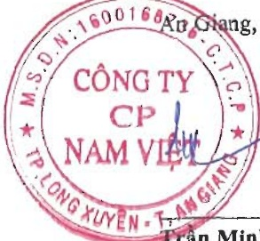

#### BÁO CÁO KẾT QUẢ HOẠT ĐỘNG KINH DOANH HỢP NHẤT Cho năm tài chính kết thúc ngày 31 tháng 12 năm 2023

Đơn vị tính: VND

<table border=1 style='margin: auto; word-wrap: break-word;'><tr><td style='text-align: center; word-wrap: break-word;'></td><td style='text-align: center; word-wrap: break-word;'>CHÍ TIÊU</td><td style='text-align: center; word-wrap: break-word;'>Mã số</td><td style='text-align: center; word-wrap: break-word;'>Thuyết minh</td><td style='text-align: center; word-wrap: break-word;'>Năm nay</td><td style='text-align: center; word-wrap: break-word;'>Năm trước</td></tr><tr><td style='text-align: center; word-wrap: break-word;'>1.</td><td style='text-align: center; word-wrap: break-word;'>Doanh thu bán hàng và cung cấp dịch vụ</td><td style='text-align: center; word-wrap: break-word;'>01</td><td style='text-align: center; word-wrap: break-word;'>VI.1</td><td style='text-align: center; word-wrap: break-word;'>4.461.787.494.846</td><td style='text-align: center; word-wrap: break-word;'>4.934.505.844.469</td></tr><tr><td style='text-align: center; word-wrap: break-word;'>2.</td><td style='text-align: center; word-wrap: break-word;'>Các khoản giảm trừ doanh thu</td><td style='text-align: center; word-wrap: break-word;'>02</td><td style='text-align: center; word-wrap: break-word;'>VI.2</td><td style='text-align: center; word-wrap: break-word;'>22.664.861.966</td><td style='text-align: center; word-wrap: break-word;'>37.858.804.031</td></tr><tr><td style='text-align: center; word-wrap: break-word;'>3.</td><td style='text-align: center; word-wrap: break-word;'>Doanh thu thuần về bán hàng và cung cấp dịch vụ</td><td style='text-align: center; word-wrap: break-word;'>10</td><td style='text-align: center; word-wrap: break-word;'></td><td style='text-align: center; word-wrap: break-word;'>4.439.122.632.880</td><td style='text-align: center; word-wrap: break-word;'>4.896.647.040.438</td></tr><tr><td style='text-align: center; word-wrap: break-word;'>4.</td><td style='text-align: center; word-wrap: break-word;'>Giá vốn hàng bán</td><td style='text-align: center; word-wrap: break-word;'>11</td><td style='text-align: center; word-wrap: break-word;'>VI.3</td><td style='text-align: center; word-wrap: break-word;'>3.991.672.291.149</td><td style='text-align: center; word-wrap: break-word;'>3.561.104.727.938</td></tr><tr><td style='text-align: center; word-wrap: break-word;'>5.</td><td style='text-align: center; word-wrap: break-word;'>Lợi nhuận gộp về bán hàng và cung cấp dịch vụ</td><td style='text-align: center; word-wrap: break-word;'>20</td><td style='text-align: center; word-wrap: break-word;'></td><td style='text-align: center; word-wrap: break-word;'>447.450.341.731</td><td style='text-align: center; word-wrap: break-word;'>1.335.542.312.500</td></tr><tr><td style='text-align: center; word-wrap: break-word;'>6.</td><td style='text-align: center; word-wrap: break-word;'>Doanh thu hoạt động tài chính</td><td style='text-align: center; word-wrap: break-word;'>21</td><td style='text-align: center; word-wrap: break-word;'>VI.4</td><td style='text-align: center; word-wrap: break-word;'>32.100.008.584</td><td style='text-align: center; word-wrap: break-word;'>79.671.732.816</td></tr><tr><td style='text-align: center; word-wrap: break-word;'>7.</td><td style='text-align: center; word-wrap: break-word;'>Chi phí tài chính</td><td style='text-align: center; word-wrap: break-word;'>22</td><td style='text-align: center; word-wrap: break-word;'>VI.5</td><td style='text-align: center; word-wrap: break-word;'>164.570.703.519</td><td style='text-align: center; word-wrap: break-word;'>188.158.406.601</td></tr><tr><td style='text-align: center; word-wrap: break-word;'></td><td style='text-align: center; word-wrap: break-word;'>Trong đó: chi phí lãi vay</td><td style='text-align: center; word-wrap: break-word;'>23</td><td style='text-align: center; word-wrap: break-word;'></td><td style='text-align: center; word-wrap: break-word;'>137.293.023.317</td><td style='text-align: center; word-wrap: break-word;'>105.147.390.933</td></tr><tr><td style='text-align: center; word-wrap: break-word;'>8.</td><td style='text-align: center; word-wrap: break-word;'>Phần lãi hoặc lỗ trong công ty liên doanh, liên kết</td><td style='text-align: center; word-wrap: break-word;'>24</td><td style='text-align: center; word-wrap: break-word;'>V.2b</td><td style='text-align: center; word-wrap: break-word;'>(4.023.233.887)</td><td style='text-align: center; word-wrap: break-word;'>(54.568.646)</td></tr><tr><td style='text-align: center; word-wrap: break-word;'>9.</td><td style='text-align: center; word-wrap: break-word;'>Chi phí bán hàng</td><td style='text-align: center; word-wrap: break-word;'>25</td><td style='text-align: center; word-wrap: break-word;'>VI.6</td><td style='text-align: center; word-wrap: break-word;'>188.416.893.163</td><td style='text-align: center; word-wrap: break-word;'>378.198.470.565</td></tr><tr><td style='text-align: center; word-wrap: break-word;'>10.</td><td style='text-align: center; word-wrap: break-word;'>Chi phí quản lý doanh nghiệp</td><td style='text-align: center; word-wrap: break-word;'>26</td><td style='text-align: center; word-wrap: break-word;'>VI.7</td><td style='text-align: center; word-wrap: break-word;'>75.715.825.411</td><td style='text-align: center; word-wrap: break-word;'>94.215.760.513</td></tr><tr><td style='text-align: center; word-wrap: break-word;'>11.</td><td style='text-align: center; word-wrap: break-word;'>Lợi nhuận thuần từ hoạt động kinh doanh</td><td style='text-align: center; word-wrap: break-word;'>30</td><td style='text-align: center; word-wrap: break-word;'></td><td style='text-align: center; word-wrap: break-word;'>46.823.694.335</td><td style='text-align: center; word-wrap: break-word;'>754.586.838.991</td></tr><tr><td style='text-align: center; word-wrap: break-word;'>12.</td><td style='text-align: center; word-wrap: break-word;'>Thu nhập khác</td><td style='text-align: center; word-wrap: break-word;'>31</td><td style='text-align: center; word-wrap: break-word;'>VI.8</td><td style='text-align: center; word-wrap: break-word;'>20.002.753.189</td><td style='text-align: center; word-wrap: break-word;'>21.546.434.254</td></tr><tr><td style='text-align: center; word-wrap: break-word;'>13.</td><td style='text-align: center; word-wrap: break-word;'>Chi phí khác</td><td style='text-align: center; word-wrap: break-word;'>32</td><td style='text-align: center; word-wrap: break-word;'>VI.9</td><td style='text-align: center; word-wrap: break-word;'>2.329.412.280</td><td style='text-align: center; word-wrap: break-word;'>2.417.333.020</td></tr><tr><td style='text-align: center; word-wrap: break-word;'>14.</td><td style='text-align: center; word-wrap: break-word;'>Lợi nhuận khác</td><td style='text-align: center; word-wrap: break-word;'>40</td><td style='text-align: center; word-wrap: break-word;'></td><td style='text-align: center; word-wrap: break-word;'>17.673.340.909</td><td style='text-align: center; word-wrap: break-word;'>19.129.101.234</td></tr><tr><td style='text-align: center; word-wrap: break-word;'>15.</td><td style='text-align: center; word-wrap: break-word;'>Tổng lợi nhuận kế toán trước thuế</td><td style='text-align: center; word-wrap: break-word;'>50</td><td style='text-align: center; word-wrap: break-word;'></td><td style='text-align: center; word-wrap: break-word;'>64.497.035.244</td><td style='text-align: center; word-wrap: break-word;'>773.715.940.225</td></tr><tr><td style='text-align: center; word-wrap: break-word;'>16.</td><td style='text-align: center; word-wrap: break-word;'>Chi phí thuế thu nhập doanh nghiệp hiện hành</td><td style='text-align: center; word-wrap: break-word;'>51</td><td style='text-align: center; word-wrap: break-word;'>V.17</td><td style='text-align: center; word-wrap: break-word;'>20.555.729.657</td><td style='text-align: center; word-wrap: break-word;'>114.516.843.210</td></tr><tr><td style='text-align: center; word-wrap: break-word;'>17.</td><td style='text-align: center; word-wrap: break-word;'>Chi phí thuế thu nhập doanh nghiệp hoãn lại</td><td style='text-align: center; word-wrap: break-word;'>52</td><td style='text-align: center; word-wrap: break-word;'>V.14, V.23</td><td style='text-align: center; word-wrap: break-word;'>4.749.660.477</td><td style='text-align: center; word-wrap: break-word;'>(14.546.137.332)</td></tr><tr><td style='text-align: center; word-wrap: break-word;'>18.</td><td style='text-align: center; word-wrap: break-word;'>Lợi nhuận sau thuế thu nhập doanh nghiệp</td><td style='text-align: center; word-wrap: break-word;'>60</td><td style='text-align: center; word-wrap: break-word;'></td><td style='text-align: center; word-wrap: break-word;'>39.191.645.110</td><td style='text-align: center; word-wrap: break-word;'>673.745.234.347</td></tr><tr><td style='text-align: center; word-wrap: break-word;'>19.</td><td style='text-align: center; word-wrap: break-word;'>Lợi nhuận sau thuế của công ty mẹ</td><td style='text-align: center; word-wrap: break-word;'>61</td><td style='text-align: center; word-wrap: break-word;'></td><td style='text-align: center; word-wrap: break-word;'>39.191.645.110</td><td style='text-align: center; word-wrap: break-word;'>673.745.234.347</td></tr><tr><td style='text-align: center; word-wrap: break-word;'>20.</td><td style='text-align: center; word-wrap: break-word;'>Lợi nhuận sau thuế của cổ đồng không kiểm soát</td><td style='text-align: center; word-wrap: break-word;'>62</td><td style='text-align: center; word-wrap: break-word;'></td><td style='text-align: center; word-wrap: break-word;'>-</td><td style='text-align: center; word-wrap: break-word;'>-</td></tr><tr><td style='text-align: center; word-wrap: break-word;'>21.</td><td style='text-align: center; word-wrap: break-word;'>Lãi cơ bản trên cổ phiêu</td><td style='text-align: center; word-wrap: break-word;'>70</td><td style='text-align: center; word-wrap: break-word;'>VI.10</td><td style='text-align: center; word-wrap: break-word;'>293</td><td style='text-align: center; word-wrap: break-word;'>5.300</td></tr><tr><td style='text-align: center; word-wrap: break-word;'>22.</td><td style='text-align: center; word-wrap: break-word;'>Lãi suy giảm trên cổ phiêu</td><td style='text-align: center; word-wrap: break-word;'>71</td><td style='text-align: center; word-wrap: break-word;'>VI.10</td><td style='text-align: center; word-wrap: break-word;'>293</td><td style='text-align: center; word-wrap: break-word;'>5.300</td></tr></table>

168 Rư Giang, ngày 29 tháng 3 năm 2024

Nguyễn Hà Thu Diễm

Người lập/Kế toán trưởng

Trân Minh Cảnh

Phó Tổng Giám đốc

